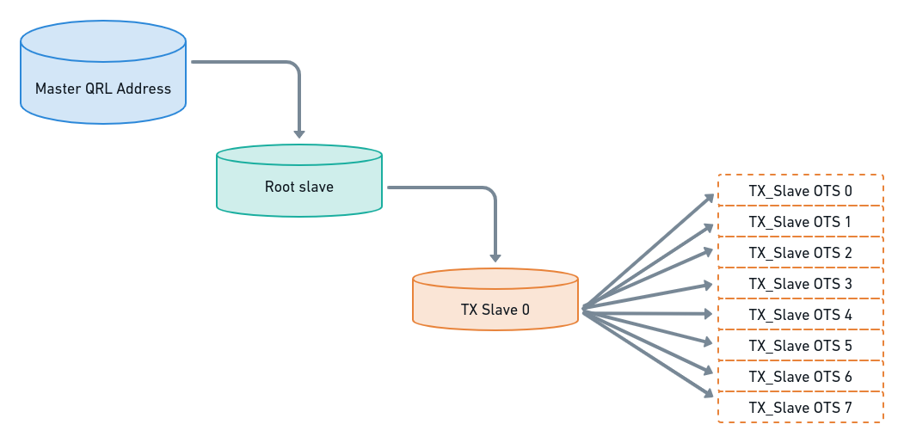

import Tabs from '@theme/Tabs';
import TabItem from '@theme/TabItem';

Interaction with wallet functions is simplified with the use of the walletd-rest-proxy, allowing typical REST API calls to be made to the 
QRL node. This proxy eliminates any need to interact with the GRPC functions, allowing typical CURL calls to be utilized making interaction 
with wallet functions simple.


Interaction with wallet functions is simplified with the use of the walletd-rest-proxy, allowing typical REST API calls to be made to the 
QRL node. This proxy eliminates any need to interact with the GRPC functions, allowing typical CURL calls to be utilized making interaction with wallet functions simple.


#### Automatic Slave transactions 

The `wallets-rest-proxy` provides an automatic slave system, where new slaves are generated under a `root_slave` with a 3rd layer of recursion 
of merkle trees under a single private key. This allows a nearly unlimited amount of outgoing transactions, where new slaves are automatically generated when all previous 
tier 3 slave OTS keys are used.

:::info Automatic Slave Transaction Diagram 


Any `walletd-rest-proxy` function that utilizes slaves will use this automatic slave system. *The address will need to be initially setup using 
the [`AddNewAddressWithSlaves`](#addnewaddresswithslaves) function*.

:::

:::tip
The `qrl_walletd` API is available with the base QRL Python package install. 
This system also uses the [QRL walletd-rest-proxy](https://github.com/theQRL/walletd-rest-proxy) to make automatic wallet management simple.
:::

## `walletd-rest-proxy` General Info

By default the `walletd-rest-proxy` expects there to be a QRL node running on the localhost with default ports available.

- Wallet API on `19010` 


By default the API expects there to be a QRL node running on the localhost with port `19009` available. 
This [configuration setting](https://github.com/theQRL/QRL/blob/353b32aeb3897c7ffb50c9a5759091928f493f1d/src/qrl/core/config.py#L121) can be 
overridden with the `self.public_api_server = "127.0.0.1:19009"` directive.


The wallet daemon will by default create the wallet file at `~/.qrl/walletd.json`.

### Requirements

- QRL Node, fully synced.
- QRL `Walletd-RestProxy`
- golang v1.8 or greater

:::tip
The `qrl_walletd` API is installed with the base [QRL Node](/use/node). Follow [this guide](/use/node/installation) to install the tools and get started.
:::

## Getting Started

Running the wallet daemon is simple. Once you have met the requirements above, follow the steps below, ensuring the `wallet-rest-proxy` stays 
running as this will allow interaction with the GRPC node.


#### Run the QRL Wallet Daemon `qrl_walletd`

```bash
qrl_walletd
````

#### Install the `walletd-rest-proxy`

**GO Install**

```bash
go install github.com/theqrl/walletd-rest-proxy/generated@latest
````

**Manual Install** 

Clone walletd-rest-proxy from the repo hosted at https://github.com/theQRL/walletd-rest-proxy 

```bash
git clone github.com/theQRL/walletd-rest-proxy
```

```bash
cd walletd-rest-proxy
```

```bash
go build
```

#### Start the wallet-rest-proxy 

```bash
./walletd-rest-proxy -serverIPPort 127.0.0.1:5359 -walletServiceEndpoint 127.0.0.1:19010
```

This will expose port `5359` for typical REST connections.

:::info
The QRL wallet Daemon loads the `walletd.json` file into memory. To use another wallet file, the `qrl_walletd` daemon must be restarted with the correct file 
located in the `~/.qrl/walletd.json` location.
:::

### Install the `walletd-rest-proxy`

Install the package using the golang tools or manually by cloning the repository. 

#### **GO Install**

```bash
go install github.com/theqrl/walletd-rest-proxy/generated@latest
````

#### **Manual Install** 

Clone walletd-rest-proxy from the repo hosted at https://github.com/theQRL/walletd-rest-proxy 

```bash
git clone github.com/theQRL/walletd-rest-proxy
```

Enter the directory and build the package.

```bash
cd walletd-rest-proxy
```

```bash
go build
```

### Start the wallet-rest-proxy 

This will expose port `5359` for typical REST connections, connecting the the wallet API running on port `19010` from the QRL node.

```bash
~/go/bin/walletd-rest-proxy -serverIPPort 127.0.0.1:5359 -walletServiceEndpoint 127.0.0.1:19010
```

**OR**

```bash
./walletd-rest-proxy -serverIPPort 127.0.0.1:5359 -walletServiceEndpoint 127.0.0.1:19010
```

:::info
Running the `wallet-rest-proxy` in a [screen session](https://linux.die.net/man/1/screen) is a simple way to run the proxy on a Unix system, 
allowing one to disconnect from the console leaving the proxy running.

```bash
screen -Sdm wallet-rest-proxy ./walletd-rest-proxy -serverIPPort 127.0.0.1:5359 -walletServiceEndpoint 127.0.0.1:19010
``` 
:::

---


## AddNewAddress 

Adds new randomly generated address to the wallet located at `~/.qrl/walletd.json`. 


#### AddNewAddress Request

| **Parameter** | **Type** | **Description** |
| --- | --- | --- |
| height | UInt64 | Height of the newly generated XMSS tree |
| hash_function | String | Hash function for XMSS. Possible values are shake128, shake256 |

#### AddNewAddress Response

| **Parameter** | **Type** | **Description** |
| --- | --- | --- |
| code | UInt32 | Error Code. Only appears if any exception is triggered. |
| error | String | Error Message. Only appears if any exception is triggered. |


#### AddNewAddress Response Data

| **Parameter** | **Type** | **Description** |
| --- | --- | --- |
| address | String | Return the newly added QRL address |


<Tabs
    defaultValue="usage"
    className="unique-tabs"
    groupId="addnewaddress"
    values={[
        {label: 'Usage', value: 'usage', className: 'red'},
        {label: 'code', value: 'code'},
    ]}>

<TabItem value="usage" >


This function will create a single address with no slave keys. For use when outgoing transactions will not exceed addresses tree height. 

By default this will generate a new address with:

- OTS key height `{"height": 10}` or $1,024$ outgoing transactions
- Using the `{"hash_function": "shake_128"}`

The newly generated address will be added to the `~/.qrl/walletd.json` file. This file will be created if not existing.

> This address is limited to the initial OTS height given when generated.

</TabItem>

<TabItem value="code" label="Code">

Code examples below use the default values, change as needed.

<Tabs
    defaultValue="shreq"
    className="unique-tabs"
    groupId="addnewaddress-code"
    values={[
        {label: 'Curl Request', value: 'shreq'},
        {label: 'JS Request', value: 'jsreq'},
        {label: 'Python Request', value: 'pyreq'},
        {label: 'Response', value: 'resp'},
        {label: 'Error', value: 'err'},
    ]}>
<TabItem value="shreq" label="Curl Request" default>

```bash
curl -XPOST http://127.0.0.1:5359/api/AddNewAddress \
     -d '{"height": 10, "hash_function": "shake128"}'
```

</TabItem>
<TabItem value="jsreq" label="Request" default>

```js {5}
const util = require('util');
const exec = util.promisify(require('child_process').exec);

async function addNewAddress() {
  const { stdout, stderr } = await exec(`curl -XPOST http://127.0.0.1:5359/api/AddNewAddress \
                                              -d '{  "height": 10, "hash_function": "shake128"}'`);
  if (stderr) {
    console.error(`error: ${stderr}`);
  }
  return stdout;
}

addNewAddress().then(function(generatedAddress){
  const QRLaddress = JSON.parse(generatedAddress);
  console.log(QRLaddress)
})
```

</TabItem>
<TabItem value="pyreq" label="Python Request" default>

```py {5}
import json
import requests

payload = {"height": 10, "hash_function": "shake128"}
newAddress = requests.post("http://127.0.0.1:5359/api/AddNewAddress", data=json.dumps(payload))

print(newAddress.text)

```

</TabItem>
<TabItem value="resp" label="Response" default>

```json
{
  "address": "Q01050031f634740f73b9c3928f36e525e75498b490497be9e1ed87ccd8860eba35a005819d0c3f"
}
```

</TabItem>
<TabItem value="err" label="Error" default>

```json title="Odd height given (19) must be even between 6 - 18"
{
  "code": 1,
  "error": "For BDS traversal, H - K must be even, with H > K >= 2!"
}
```

```json title="Incorrect hash function given"
{ 
  "code": 1, 
  "error": "XMSS does not support this hash function!"
}
```
</TabItem>
</Tabs>

#### Optional Configurations

| Configuration | Default | Notes |
| :---: | :---: | :---: | 
| `height` | `10` | **Min**: `6`, **Max**: `18` |
| `hash_function` | `shake128` | **Options**: `shake128`, `sha256`, `sha2_256` |

:::note 
Higher tree heights may take longer to generate.
:::


</TabItem>
</Tabs>
<br />

---


## AddNewAddressWithSlaves


Adds a new address into the `~/.qrl/walletd.json` wallet file, generates and transmits slave transaction to the chain. 

 
:::info
This command will create an unlimited address, re-generating slave keys as needed. Additionally the system will preserve 5 OTS keys from each 
slave to ensure there are no lost funds with this system.
:::

#### AddNewAddress Request

| **Parameter** | **Type** | **Description** |
| --- | --- | --- |
| height | UInt64 | Height of the newly generated XMSS tree (Min 8) |
| number_of_slaves | UInt64 | Number of slaves to be generated (Max 100, Default 3) |
| hash_function | String | Hash function for XMSS. Possible values are shake128, shake256, sha2_256. |

#### AddNewAddress Response

| **Parameter** | **Type** | **Description** |
| --- | --- | --- |
| code | UInt32 | Error Code. Only appears if any exception is triggered. |
| error | String | Error Message. Only appears if any exception is triggered. |


#### AddNewAddress Response Data

| **Parameter** | **Type** | **Description** |
| --- | --- | --- |
| address | String | Return the newly added QRL address |


<Tabs
    defaultValue="usage"
    className="unique-tabs"
    groupId="addnewaddresswithslaves"
    values={[
        {label: 'Usage', value: 'usage'},
        {label: 'code', value: 'code'},
    ]}>

<TabItem value="usage">

#### Automatic OTS Key System

When used with a wallet API transaction that utilizes slave OTS keys, like [RelayTransferTxnBySlave](#relaytransfertxnbyslave)
the API will generate new slave keys when needed using the [RelaySlaveTxnBySlave](#relayslavetxnbyslave) function.


:::note
Use this function to generate an address to use the automatic OTS key system. 
:::

By default this will generate a new address with: 

- Tree height 10 `{"height": 10}` or $1,024$ outgoing transactions
- Three slave keys each with height 10 `{"number_of_slaves":3}` 
- Using the shake-128 hash function  `{"hash_function": "shake_128"}` 
- The first five slave OTS keys will be preserved, beginning at `{"index": 5}`
  - Keys `{0 - 4}` are saved for backup or recovery for each slave generated.

This address and slave keys will be added to the \~/.qrl/walletd.json file, *this file will be created if not existing*.


</TabItem>

<TabItem value="code" label="Code">

The examples below are using the default address values. Change as needed.

<Tabs
    defaultValue="shreq"
    className="unique-tabs"
    groupId="addnewaddresswithslaves-code"
    values={[
        {label: 'Curl Request', value: 'shreq'},
        {label: 'JS Request', value: 'jsreq'},
        {label: 'Python Request', value: 'pyreq'},
        {label: 'Response', value: 'resp'},
        {label: 'Error', value: 'err'},
    ]}>

<TabItem value="shreq" label="Curl Request" default>

```bash
curl -XPOST http://127.0.0.1:5359/api/AddNewAddressWithSlaves \
     -d '{"height": 10,  "number_of_slaves": 3, "hash_function": "shake128" }'
```

</TabItem>    
<TabItem value="jsreq" label="Request" default>

```js {5} 
const util = require('util');
const exec = util.promisify(require('child_process').exec);

async function addNewAddressWithSlaves() {
  const { stdout, stderr } = await exec(`curl -XPOST http://127.0.0.1:5359/api/AddNewAddressWithSlaves \
                                              -d '{ "height": 10,  
                                                    "number_of_slaves": 3, 
                                                    "hash_function": "shake128" }'`);
  if (stderr) {
    console.error(`error: ${stderr}`);
  }
  return stdout;
}

addNewAddressWithSlaves().then(function(generatedAddress){
  const QRLaddress = JSON.parse(generatedAddress);
  console.log(QRLaddress)
})
```

</TabItem>
<TabItem value="pyreq" label="Python Request" default>

```py {5}
import json
import requests

payload = {"height": 10, "number_of_slaves": 3, "hash_function": "shake128"}
newAddressWithSlaves = requests.post("http://127.0.0.1:5359/api/AddNewAddressWithSlaves", data=json.dumps(payload))

print(newAddressWithSlaves.text)

```

</TabItem>
<TabItem value="resp" label="Response" default>

```json 
{
  "address":"Q0103006fa2d29c4acb9bc192581694a616d394f7ef2f35dd5ab5a4dddd865740a3f3293e54c560"
}
```

</TabItem>
<TabItem value="err" label="Error" default>

```json title="Odd height given (19) must be even between 6 - 18"
{
  "code": 1,
  "error": "For BDS traversal, H - K must be even, with H > K >= 2!"
}
```

```json title="Incorrect hash function given"
{ 
  "code": 1, 
  "error": "XMSS does not support this hash function!"
}
```

```json title="Number greater than 100 given for slave count"
{
  "code":1,
  "error":"Number of slaves cannot be more than 100"
}
```

</TabItem>
</Tabs>

#### Optional Configurations 

| Configuration | Default | Notes |
| :---: | :---: | :---: | 
| `height` | `10` | **Min**: `6`, **Max**: `18` |
| `number_of_slaves` | `3` | **Min**: `1`, **Max**: `100` | 
| `hash_function` | `shake128` | **Options**: `shake128`, `sha256`, `sha2_256` |


</TabItem>
</Tabs>
<br />

---


## IsValidAddress

Check if a QRL address is valid. Returns `{"valid": "True"}` if the QRL Address is valid. 

#### IsValidAddress Request

| **Parameter** | **Type** | **Description** |
| --- | --- | --- |
| address | String | QRL Address |

#### IsValidAddress Response

| **Parameter** | **Type** | **Description** |
| --- | --- | --- |
| code | UInt32 | Error Code. Only appears if any exception is triggered. |
| error | String | Error Message. Only appears if any exception is triggered. |

#### IsValidAddress Response Data

| **Parameter** | **Type** | **Description** |
| --- | --- | --- |
| valid | String | Returns True for valid QRL address otherwise False. |


<Tabs
    defaultValue="usage"
    className="unique-tabs"
    groupId="isvalidaddress"
    values={[
        {label: 'Usage', value: 'usage'},
        {label: 'code', value: 'code'},
    ]}>

<TabItem value="usage">

This function requires a QRL address to lookup. 
Validates the public address given meets all requirements and is valid to be used as recipient of a transaction.


:::note
`IsValidAddress` expects a `Q` hex address format, example: `Q0103006fa2d29c4acb9bc192581694a616d394f7ef2f35dd5ab5a4dddd865740a3f3293e54c560` 
:::

</TabItem>

<TabItem value="code" label="Code">

Example code below. Enter details for the address to lookup  `{"address": ""}`.

<Tabs
    defaultValue="shreq"
    className="unique-tabs"
    groupId="isvalidaddress-code"
    values={[
        {label: 'Curl Request', value: 'shreq'},
        {label: 'JS Request', value: 'jsreq'},
        {label: 'Python Request', value: 'pyreq'},
        {label: 'Response', value: 'resp'},
        {label: 'Error', value: 'err'},
    ]}>
<TabItem value="shreq" label="Curl Request" default>

```bash
curl -XPOST http://127.0.0.1:5359/api/IsValidAddress \
     -d '{"address": "Q010500dacbf29a83ef6832bcf16f0592adb15313836228a873a7b8eed1c354c4414a206ad38728"}'
```
</TabItem>    
<TabItem value="jsreq" label="Request" default>

```js {} 
const util = require('util');
const exec = util.promisify(require('child_process').exec);

async function isValidAddress() {
  const { stdout, stderr } = await exec(`curl -XPOST http://127.0.0.1:5359/api/IsValidAddress \
                                              -d '{"address": "Q010500dacbf29a83ef6832bcf16f0592adb15313836228a873a7b8eed1c354c4414a206ad38728"}'`);
  if (stderr) {
    console.error(`error: ${stderr}`);
  }
  return stdout;
}

isValidAddress().then(function(address){
  const QRLaddress = JSON.parse(address);
  console.log(QRLaddress)
})
```
</TabItem>
<TabItem value="pyreq" label="Python Request" default>

```py {}
import json
import requests

payload = {"address": "Q010500dacbf29a83ef6832bcf16f0592adb15313836228a873a7b8eed1c354c4414a206ad38728"}
validAddress = requests.post("http://127.0.0.1:5359/api/IsValidAddress", data=json.dumps(payload))

print(validAddress.text)

```
</TabItem>
<TabItem value="resp" label="Response" default>

```json 
{
  "valid":"True"
}
```
</TabItem>
<TabItem value="err" label="Error" default>

```json title="Invalid QRL address"
{
  "code":1,
  "error":"Invalid QRL Address",
  "valid":"False"
}
```
</TabItem>
</Tabs>

#### Required Data 

| Configuration | Default | Notes |
| :---: | :---: | :---: | 
| `address` | N/A | Provide QRL address in Q Hex format. |


</TabItem>
</Tabs>
<br />

---

## ListAddresses

Lists all addresses located in the `~/.qrl/walletd.json` file loaded into the walletd-rest-proxy.

#### ListAddresses Response

| **Parameter** | **Type** | **Description** |
| --- | --- | --- |
| code | UInt32 | Error Code. Only appears if any exception is triggered. |
| error | String | Error Message. Only appears if any exception is triggered. |

#### ListAddresses Response Data

| **Parameter** | **Type** | **Description** |
| --- | --- | --- |
| addresses | String | Return list of addresses added into your wallet |


<Tabs
    defaultValue="usage"
    className="unique-tabs"
    groupId="listaddresses"
    values={[
        {label: 'Usage', value: 'usage'},
        {label: 'code', value: 'code'},
    ]}>

<TabItem value="usage">

Returns an array of public addresses found in the `walletd.json` wallet file.

:::note
This function will return results from the `walletd.json` file located in the default location when the `walletd-rest-proxy` was started.
Any manual changes to this file will require the proxy to be restarted to pickup the changes. 
:::

</TabItem>

<TabItem value="code" label="Code">

<Tabs
    defaultValue="shreq"
    className="unique-tabs"
    groupId="listaddresses-code"
    values={[
        {label: 'Curl Request', value: 'shreq'},
        {label: 'JS Request', value: 'jsreq'},
        {label: 'Python Request', value: 'pyreq'},
        {label: 'Response', value: 'resp'},
        {label: 'Error', value: 'err'},
    ]}>
<TabItem value="shreq" label="Curl Request" default>

```bash
curl -XGET http://127.0.0.1:5359/api/ListAddresses
```

</TabItem>    
<TabItem value="jsreq" label="Request" default>

```js {} 
const util = require('util');
const exec = util.promisify(require('child_process').exec);

async function listAddresses() {
  const { stdout, stderr } = await exec(`curl -XGET http://127.0.0.1:5359/api/ListAddresses`)
  if (stderr) {
    console.error(`error: ${stderr}`);
  }
  return stdout;
}

listAddresses().then(function(addresses){
  const QRLaddressList = JSON.parse(addresses);
  console.log(QRLaddressList)
})
```
</TabItem>
<TabItem value="pyreq" label="Python Request" default>

```py {}
import json
import requests

listAddresses = requests.get("http://127.0.0.1:5359/api/ListAddresses")

print(json.loads(listAddresses.text))

```
</TabItem>
<TabItem value="resp" label="Response" default>

```json
{
  "addresses": [
    "Q010400ea706c30ae0fbefb7d20c502d5133c8d08f916bfe5fb5eee7363c8560389d70786cc5168",
    "Q010300bd584ed189f16a402bcd6a78063eaa2b392bd8848f6bc414cba1f681b62e770dc63ccca4",
    "Q010300fe36d9928d12b36b07db783859eb6eb5647479191a35bf877c7bb405989109fe14882fd5",
    "Q010500a590c37f94dbbf42bd272fba83c4fa5bcb58c55e61ec6a81625227367d5257e1a9d6dea7",
    "Q010500a05b83696c2fe909ccceb209cf2a965b934f4f3c105bcaf6650af02fe8841394fbae54e2",
    "Q0105002b9b849b4ae4d2297a2a0f98f46a08bb692e83ec2451610961fb0d6f0513e026daf10bf3"
  ]
}
```
</TabItem>
<TabItem value="err" label="Error" default>

```json title="Invalid POST data sent"
Method Not Allowed
```

</TabItem>
</Tabs>

</TabItem>
</Tabs>
<br />

---

## RemoveAddress

Permanently remove a given address, including all private and slave keys, from the `walletd.json` file.

:::danger This action is irreversible and potentially destructive! 
Backup the address keys prior file to removing using the [GetRecoverySeeds](#getrecoveryseeds) function.
:::

#### RemoveAddress Request

| **Parameter** | **Type** | **Description** |
| --- | --- | --- |
| address | String | QRL address to be removed from the wallet |

#### RemoveAddress Response

| **Parameter** | **Type** | **Description** |
| --- | --- | --- |
| code | UInt32 | Error Code. Only appears if any exception is triggered. |
| error | String | Error Message. Only appears if any exception is triggered. |


<Tabs
    defaultValue="usage"
    className="unique-tabs"
    groupId="removeaddress"
    values={[
        {label: 'Usage', value: 'usage'},
        {label: 'code', value: 'code'},
    ]}>

<TabItem value="usage">

Removes given address from the the `walletd.json` wallet file. Requires a QRL address that exists in the `~/.qrl/walletd.json` file.

:::note
Replace the `{"address": ""}` with the address to be removed. This action is permanent. 
::: 

</TabItem>

<TabItem value="code" label="Code">


<Tabs
    defaultValue="shreq"
    className="unique-tabs"
    groupId="removeaddress-code"
    values={[
        {label: 'Curl Request', value: 'shreq'},
        {label: 'JS Request', value: 'jsreq'},
        {label: 'Python Request', value: 'pyreq'},
        {label: 'Response', value: 'resp'},
        {label: 'Error', value: 'err'},
    ]}>
<TabItem value="shreq" label="Curl Request" default>

```bash
curl -XPOST http://127.0.0.1:5359/api/RemoveAddress \
     -d '{"address": "Q010500dacbf29a83ef6832bcf16f0592adb15313836228a873a7b8eed1c354c4414a206ad38728"}'
```
</TabItem>    
<TabItem value="jsreq" label="Request" default>

```js {} 
const util = require('util');
const exec = util.promisify(require('child_process').exec);

async function removeAddress() {
  const { stdout, stderr } = await exec(`curl -XPOST http://127.0.0.1:5359/api/RemoveAddress \
                                              -d '{"address": "Q010500dacbf29a83ef6832bcf16f0592adb15313836228a873a7b8eed1c354c4414a206ad38728"}'`);
  if (stderr) {
    console.error(`error: ${stderr}`);
  }
  return stdout;
}

removeAddress().then(function(response){
  const removeResp = JSON.parse(response);
  console.log(removeResp)
})
```
</TabItem>
<TabItem value="pyreq" label="Python Request" default>

```py {}
import json
import requests

payload = {"address": "Q010500dacbf29a83ef6832bcf16f0592adb15313836228a873a7b8eed1c354c4414a206ad38728"}
removeAddress = requests.post("http://127.0.0.1:5359/api/RemoveAddress", data=json.dumps(payload))

print(removeAddress.text)

```
</TabItem>
<TabItem value="resp" label="Response" default>

```json 
{}
```

:::info
Gives an empty array `{}` on successful removal of the address from the wallet. 
:::

</TabItem>
<TabItem value="err" label="Error" default>

```json title="Address Not Found in walletd.json file"
{"code":1,"error":"No such address found"}
```
</TabItem>
</Tabs>

#### Required Data

| Configuration | Default | Notes |
| :---: | :---: | :---: |
| `address` | N/A | Provide QRL address in $Q$ Hex format |

</TabItem>
</Tabs>
<br />

---


## EncryptWallet

Encrypts the QRL wallet using the passphrase given. 

#### EncryptWallet Request

| **Parameter** | **Type** | **Description** |
| --- | --- | --- |
| passphrase | String| Passphrase to encrypt the wallet |

#### EncryptWallet Response

| **Parameter** | **Type** | **Description** |
| --- | --- | --- |
| code | UInt32 | Error Code. Only appears if any exception is triggered. |
| error | String | Error Message. Only appears if any exception is triggered. |

<Tabs
    defaultValue="usage"
    className="unique-tabs"
    groupId="encryptwallet"
    values={[
        {label: 'Usage', value: 'usage'},
        {label: 'code', value: 'code'},
    ]}>

<TabItem value="usage">

Secure the walletd.json file by encrypting it using the EncryptWallet function which will result in an AES encrypted `/home/$USER/.qrl/walletd.json` file. 

Further interaction with the wallet will require the file is decrypted first using the [Unlock Wallet Function](#unlockwallet) and by [Locking](#lockwallet) locking it after complete, rendering it encrypt ed again, removing the passphrase from memory.

</TabItem>

<TabItem value="code" label="Code">


<Tabs
    defaultValue="shreq"
    className="unique-tabs"
    groupId="encryptwallet-code"
    values={[
        {label: 'Curl Request', value: 'shreq'},
        {label: 'JS Request', value: 'jsreq'},
        {label: 'Python Request', value: 'pyreq'},
        {label: 'Response', value: 'resp'},
        {label: 'Error', value: 'err'},
    ]}>
<TabItem value="shreq" label="Curl Request" default>

```bash
curl -XPOST http://127.0.0.1:5359/api/EncryptWallet \
     -d '{"passphrase": "demo123"}'
```
</TabItem>    
<TabItem value="jsreq" label="Request" default>

```js {} 
const util = require('util');
const exec = util.promisify(require('child_process').exec);

async function encryptWallet() {
  const { stdout, stderr } = await exec(`curl -XPOST http://127.0.0.1:5359/api/EncryptWallet \
                                              -d '{"passphrase": "demo123"}'`);
  if (stderr) {
    console.error(`error: ${stderr}`);
  }
  return stdout;
}

encryptWallet().then(function(response){
  const encryptResp = JSON.parse(response);
  console.log(encryptResp)
})
```
</TabItem>
<TabItem value="pyreq" label="Python Request" default>

```py {}
import json
import requests

payload = {"passphrase": "demo123"}
encryptWallet = requests.post("http://127.0.0.1:5359/api/EncryptWallet", data=json.dumps(payload))

print(encryptWallet.text)

```
</TabItem>
<TabItem value="resp" label="Response" default>

```json 
{}
```
:::info
Response is a blank array `{}` if successful.
:::

</TabItem>
<TabItem value="err" label="Error" default>

```json title="Wallet Alreaady Encrypted "
{ "code": 1, "error": "Wallet Already Encrypted" }
```
To change the encryption passphrase use the [`ChangePassphrase`](#changepassphrase) function.


```json title="Passphrase Missing "
{"code":1,"error":"Missing Passphrase"}
```


</TabItem>
</Tabs>

#### Required Data

| Configuration | Default | Notes |
| :---: | :---: | :---: |
| `passphrase` | N/A | Provide passphrase in string format |

</TabItem>
</Tabs>
<br />

---


## LockWallet

Lock a previously [encrypted wallet file](#encryptwallet). 

#### LockWallet Response

| **Parameter** | **Type** | **Description** |
| --- | --- | --- |
| code | UInt32 | Error Code. Only appears if any exception is triggered. |
| error | String | Error Message. Only appears if any exception is triggered. |


<Tabs
    defaultValue="usage"
    className="unique-tabs"
    groupId="lockwallet"
    values={[
        {label: 'Usage', value: 'usage'},
        {label: 'code', value: 'code'},
    ]}>

<TabItem value="usage">

Using the previously set encryption passphrase, lock the wallet and remove stored passphrase from memory.

:::note
After locking the wallet the passphrase is required to unlock.
:::


</TabItem>

<TabItem value="code" label="Code">

<Tabs
    defaultValue="shreq"
    className="unique-tabs"
    groupId="lockwallet-code"
    values={[
        {label: 'Curl Request', value: 'shreq'},
        {label: 'JS Request', value: 'jsreq'},
        {label: 'Python Request', value: 'pyreq'},
        {label: 'Response', value: 'resp'},
        {label: 'Error', value: 'err'},
    ]}>
<TabItem value="shreq" label="Curl Request" default>

```bash
curl -XGET http://127.0.0.1:5359/api/LockWallet
```
</TabItem>    
<TabItem value="jsreq" label="Request" default>

```js {} 
const util = require('util');
const exec = util.promisify(require('child_process').exec);

async function lockWallet() {
  const { stdout, stderr } = await exec(`curl -XGET http://127.0.0.1:5359/api/LockWallet`);
  if (stderr) {
    console.error(`error: ${stderr}`);
  }
  return stdout;
}

lockWallet().then(function(response){
  const lockResp = JSON.parse(response);
  console.log(lockResp)
})
```
</TabItem>
<TabItem value="pyreq" label="Python Request" default>

```py {}
import json
import requests

lockWallet = requests.get("http://127.0.0.1:5359/api/LockWallet")

print(lockWallet.text)

```
</TabItem>
<TabItem value="resp" label="Response" default>

```json 
{}
```
:::info
Response is a blank array `{}` if successful.
:::

</TabItem>
<TabItem value="err" label="Error" default>

```json title="Unencrypted wallet"
{"code":1,"error":"You cannot lock an unencrypted Wallet"}
```

Encrypt the wallet first using the [`EncryptWallet`](#encryptwallet) function.

</TabItem>
</Tabs>


</TabItem>
</Tabs>
<br />

---

## UnlockWallet

Unlock an encrypted, and locked wallet using the encryption passphrase established with the [EncryptWallet](#encryptwallet) function.

#### UnlockWallet Request

| **Parameter** | **Type** | **Description** |
| --- | --- | --- |
| passphrase | String | Passphrase to unlock the wallet |

#### UnlockWallet Response

| **Parameter** | **Type** | **Description** |
| --- | --- | --- |
| code | UInt32 | Error Code. Only appears if any exception is triggered. |
| error | String | Error Message. Only appears if any exception is triggered. |


<Tabs
    defaultValue="usage"
    className="unique-tabs"
    groupId="unlockwallet"
    values={[
        {label: 'Usage', value: 'usage'},
        {label: 'code', value: 'code'},
    ]}>

<TabItem value="usage">

Using the previously set encryption passphrase, unlock the wallet allowing transactions to be signed using addresses in the wallet.


</TabItem>

<TabItem value="code" label="Code">


<Tabs
    defaultValue="shreq"
    className="unique-tabs"
    groupId="unlockwallet-code"
    values={[
        {label: 'Curl Request', value: 'shreq'},
        {label: 'JS Request', value: 'jsreq'},
        {label: 'Python Request', value: 'pyreq'},
        {label: 'Response', value: 'resp'},
        {label: 'Error', value: 'err'},
    ]}>
<TabItem value="shreq" label="Curl Request" default>

```bash
curl -XPOST http://127.0.0.1:5359/api/UnlockWallet \
     -d '{"passphrase": "demo123"}'
```
</TabItem>    
<TabItem value="jsreq" label="Request" default>

```js {} 
const util = require('util');
const exec = util.promisify(require('child_process').exec);

async function unlockWallet() {
  const { stdout, stderr } = await exec(`curl -XPOST http://127.0.0.1:5359/api/UnlockWallet \
                                              -d '{"passphrase": "demo123"}'`);
  if (stderr) {
    console.error(`error: ${stderr}`);
  }
  return stdout;
}

unlockWallet().then(function(response){
  const unlockResp = JSON.parse(response);
  console.log(unlockResp)
})
```
</TabItem>
<TabItem value="pyreq" label="Python Request" default>

```py {}
import json
import requests

payload = {"passphrase": "demo123"}
unlockWallet = requests.post("http://127.0.0.1:5359/api/UnlockWallet", data=json.dumps(payload))

print(unlockWallet.text)

```
</TabItem>
<TabItem value="resp" label="Response" default>

```json 
{}
```
:::info
Response is a blank array `{}` if successful.
:::

</TabItem>
<TabItem value="err" label="Error" default>

```json title="Wrong Passphrase given"
{"code":1,"error":"Error during decryption. Likely due to invalid password: 'utf-8' codec can't decode byte 0xf5 in position 2: invalid start byte"}
```

</TabItem>
</Tabs>

#### Required Data

| Configuration | Default | Notes |
| :---: | :---: | :---: |
| `passphrase` | N/A | Provide passphrase in string format |


</TabItem>
</Tabs>
<br />

---


## GetRecoverySeeds


Print out the recovery seeds, or secret keys for the given QRL address.

:::note
The address must exist in the wallet.
:::

#### GetRecoverySeeds Request

| **Parameter** | **Type** | **Description** |
| --- | --- | --- |
| address | String | QRL Address |

#### GetRecoverySeeds Response

| **Parameter** | **Type** | **Description** |
| --- | --- | --- |
| code | UInt32 | Error Code. Only appears if any exception is triggered. |
| error | String | Error Message. Only appears if any exception is triggered. |

#### GetRecoverySeeds Response Data

| **Parameter** | **Type** | **Description** |
| --- | --- | --- |
| hexseed | String | Hexseed for the given address |
| mnemonic | String | Mnemonic words for the given address |


<Tabs
    defaultValue="usage"
    className="unique-tabs"
    groupId="getrecoveryseeds"
    values={[
        {label: 'Usage', value: 'usage'},
        {label: 'code', value: 'code'},
    ]}>

<TabItem value="usage">

Returns the backup or recovery seeds for the address given. 

</TabItem>

<TabItem value="code" label="Code">


<Tabs
    defaultValue="shreq"
    className="unique-tabs"
    groupId="getrecoveryseeds-code"
    values={[
        {label: 'Curl Request', value: 'shreq'},
        {label: 'JS Request', value: 'jsreq'},
        {label: 'Python Request', value: 'pyreq'},
        {label: 'Response', value: 'resp'},
        {label: 'Error', value: 'err'},
    ]}>
<TabItem value="shreq" label="Curl Request" default>

```bash
curl -XPOST http://127.0.0.1:5359/api/GetRecoverySeeds \
     -d '{"address": "Q01050047fb1286d6e02afcf014b367ac00fb944235ee814bca26c82665631367fe583d17198f59"}'
```
</TabItem>    
<TabItem value="jsreq" label="Request" default>

```js {} 
const util = require('util');
const exec = util.promisify(require('child_process').exec);

async function getRecoverySeeds() {
  const { stdout, stderr } = await exec(`curl -XPOST http://127.0.0.1:5359/api/GetRecoverySeeds \
                                              -d '{"address": "Q01050047fb1286d6e02afcf014b367ac00fb944235ee814bca26c82665631367fe583d17198f59"}'`);
  if (stderr) {
    console.error(`error: ${stderr}`);
  }
  return stdout;
}

getRecoverySeeds().then(function(response){
  const recoverySeeds = JSON.parse(response);
  console.log(recoverySeeds)
})
```
</TabItem>
<TabItem value="pyreq" label="Python Request" default>

```py {}
import json
import requests

payload = {"address": "Q01050047fb1286d6e02afcf014b367ac00fb944235ee814bca26c82665631367fe583d17198f59"}
getRecoverySeeds = requests.post("http://127.0.0.1:5359/api/GetRecoverySeeds", data=json.dumps(payload))

print(getRecoverySeeds.text)

```
</TabItem>
<TabItem value="resp" label="Response" default>

```json 
{
  "hexseed":"010500d0da4abe86b358d91b3eb32fd01739bb6147ba97efdcb2ba455150d21d0c44d2453df3f181ba0512d2daa25a42e70a7a",
  "mnemonic":"absorb filled span pit salute holy full munich donate creek sore jaw rubble behalf rose likely swine climax either belong spin spain effect career dock dose longer patron bath code peter pinch took policy"
}
```
</TabItem>
<TabItem value="err" label="Error" default>

```json title="No Address Found in wallet file"
{"code": 1, "error": "No such address found in wallet"}
```

</TabItem>
</Tabs>

#### Required Data

| Configuration | Default | Notes |
| :---: | :---: | :---: |
| `address` | N/A | Provide QRL address in $Q$ Hex format |


</TabItem>
</Tabs>
<br />

---

## GetWalletInfo

Print info on the wallet.

#### GetWalletInfo Response

| **Parameter** | **Type** | **Description** |
| --- | --- | --- |
| code | UInt32 | Error Code. Only appears if any exception is triggered. |
| error | String | Error Message. Only appears if any exception is triggered. |


#### GetWalletInfo Response Data

| **Parameter** | **Type** | **Description** |
| --- | --- | --- |
| version | UInt32 | Wallet version number |
| address\_count | UInt64 | Number of addresses into the wallet |
| is\_encrypted | Boolean | True if wallet is already encryptedFalse if wallet is not encrypted |


<Tabs
    defaultValue="usage"
    className="unique-tabs"
    groupId="getwalletinfo"
    values={[
        {label: 'Usage', value: 'usage'},
        {label: 'code', value: 'code'},
    ]}>

<TabItem value="usage">

Returns JSON array of information on the wallet located at `/home/$USER/.qrl/walletd.json`

- Wallet Version
- Address count
- Encryption 

</TabItem>

<TabItem value="code" label="Code">

<Tabs
    defaultValue="shreq"
    className="unique-tabs"
    groupId="getwalletinfo-code"
    values={[
        {label: 'Curl Request', value: 'shreq'},
        {label: 'JS Request', value: 'jsreq'},
        {label: 'Python Request', value: 'pyreq'},
        {label: 'Response', value: 'resp'},
        {label: 'Error', value: 'err'},
    ]}>
<TabItem value="shreq" label="Curl Request" default>

```bash
curl -XGET http://127.0.0.1:5359/api/GetWalletInfo
```
</TabItem>    
<TabItem value="jsreq" label="Request" default>

```js {} 
const util = require('util');
const exec = util.promisify(require('child_process').exec);

async function getWalletInfo() {
  const { stdout, stderr } = await exec(`curl -XGET http://127.0.0.1:5359/api/GetWalletInfo`);
  if (stderr) {
    console.error(`error: ${stderr}`);
  }
  return stdout;
}

getWalletInfo().then(function(response){
  const willetInfo = JSON.parse(response);
  console.log(willetInfo)
})
```
</TabItem>
<TabItem value="pyreq" label="Python Request" default>

```py {}
import json
import requests

getWalletInfo = requests.get("http://127.0.0.1:5359/api/GetWalletInfo")

print(getWalletInfo.text)

```
</TabItem>
<TabItem value="resp" label="Response" default>

```json 
{"version":1,"address_count":"10","is_encrypted":true}
```
</TabItem>
<TabItem value="err" label="Error" default>

```json title="Encrypted wallet, unlock using passphrase."
{ "code": 1, "error": "Failed: Passphrase Missing"}
```

</TabItem>
</Tabs>


</TabItem>
</Tabs>
<br />

---

## RelayTransferTxn

Send or Transfer funds from a QRL address in the wallet to another QRL address. 
This function will use the root OTS keys for the address. 


#### RelayTransferTxn Request

| **Parameter** | **Type** | **Description** |
| --- | --- | --- |
| addresses\_to | String | Array of receiver&#39;s addresses |
| amounts | UInt64 | Array of amounts in Shor to be received by receiver. Must be in same order as of addresses\_to |
| fee | UInt64 | Transaction Fee in Shor |
| master\_address | String | This is an optional field, only need to be filled with QRL address, if the transaction is signed from slave address. |
| signer\_address | String | QRL Address signing the transaction. QRL Address must be already added into wallet. |
| ots\_index | UInt64 | One Time Signature Index to be used to sign the transaction. |

#### RelayTransferTxn Response

| **Parameter** | **Type** | **Description** |
| --- | --- | --- |
| code | UInt32 | Error Code. Only appears if any exception is triggered. |
| error | String | Error Message. Only appears if any exception is triggered. |

#### RelayTransferTxn Response Data

| **Parameter** | **Type** | **Description** |
| --- | --- | --- |
| tx  | Transaction | Return the transaction that has been relayed to the network. |


<Tabs
    defaultValue="usage"
    className="unique-tabs"
    groupId="relaytransfertxn"
    values={[
        {label: 'Usage', value: 'usage'},
        {label: 'code', value: 'code'},
    ]}>

<TabItem value="usage">

Use this function to send QRL from an address contained in the `/home/$USER/.qrl/walletd.json` file to another QRL address given, up to 100 recipients per transaction.

You must provide the `ots_index` for the transaction, keeping track of keys that have already been used to avoid any attempted key reuse.

:::note
For a more flexible address allowing additional levels of OTS slave keys, use an address created with the [AddNewAddressWithSlaves](#addnewaddresswithslaves) and the [RelayTransferTxnBySlave](#relaytransfertxnbyslave) function. 
:::

</TabItem>

<TabItem value="code" label="Code">


<Tabs
    defaultValue="shreq"
    className="unique-tabs"
    groupId="relaytransfertxn-code"
    values={[
        {label: 'Curl Request', value: 'shreq'},
        {label: 'JS Request', value: 'jsreq'},
        {label: 'Python Request', value: 'pyreq'},
        {label: 'Response', value: 'resp'},
        {label: 'Error', value: 'err'},
    ]}>
<TabItem value="shreq" label="Curl Request" default>

```bash
curl -XPOST http://127.0.0.1:5359/api/RelayTransferTxn \
     -d '{"addresses_to": ["Q0103007f44eb8e11de8a0a6d69c21088245951bdb77637a082b713abbf9bdf35f13ac2c8d58d55",  "Q010300010e65015a34e2711c3ffc9bde650f7361fde192c5845df991da56940ff411cfd155ddaf"],
        "amounts": [10000, 100000],
        "fee": 10000,
        "master_address": "",
        "signer_address": "Q0103001330b82645e43fa1cc0aa1e00f269c2aa8ec76cce87175b7e4099723913d50f7d87e9187",
        "ots_index": 1
      }'
```
</TabItem>    
<TabItem value="jsreq" label="Request" default>

```js {} 
const util = require('util');
const exec = util.promisify(require('child_process').exec);

async function relayTransferTxn() {
  const { stdout, stderr } = await exec(`curl -XPOST http://127.0.0.1:5359/api/RelayTransferTxn \
                                              -d '{ "addresses_to": ["Q0103007f44eb8e11de8a0a6d69c21088245951bdb77637a082b713abbf9bdf35f13ac2c8d58d55",  "Q010300010e65015a34e2711c3ffc9bde650f7361fde192c5845df991da56940ff411cfd155ddaf"],
                                                    "amounts": [10000, 100000],
                                                    "fee": 10000,
                                                    "master_address": "",
                                                    "signer_address": "Q0103001330b82645e43fa1cc0aa1e00f269c2aa8ec76cce87175b7e4099723913d50f7d87e9187",
                                                    "ots_index": 1 }'`);
  if (stderr) {
    console.error(`error: ${stderr}`);
  }
  return stdout;
}

relayTransferTxn().then(function(response){
  const transferTxnResp = JSON.parse(response);
  console.log(transferTxnResp)
})
```
</TabItem>
<TabItem value="pyreq" label="Python Request" default>

```py {}
import json
import requests

payload = { "addresses_to": ["Q0103007f44eb8e11de8a0a6d69c21088245951bdb77637a082b713abbf9bdf35f13ac2c8d58d55",  "Q010300010e65015a34e2711c3ffc9bde650f7361fde192c5845df991da56940ff411cfd155ddaf"],
            "amounts": [10000, 100000],
            "fee": 10000,
            "master_address": "",
            "signer_address": "Q0103001330b82645e43fa1cc0aa1e00f269c2aa8ec76cce87175b7e4099723913d50f7d87e9187",
            "ots_index": 1 }
relayTransferTxn = requests.post("http://127.0.0.1:5359/api/RelayTransferTxn", data=json.dumps(payload))

print(relayTransferTxn.text)

```

</TabItem>
<TabItem value="resp" label="Response" default>

```json 
{
  "tx": {
    "fee": "10000",
    "public_key": "010300faa706115b185d2f61f6d73d5757afca9c754427123518c609d9385b8eb596ceff366223c611fd5d9488583228632e437b8526364ebbbbf22a273260863b4a6c",
    "signature": "0000000145c8bd3e912adccc0bfededc2e4c1a38bb1b7a871b411bc823343a0eb6c7b787b3475c5eb608905dcb9aa9fc50d48a21eb76aa652b2b7618818b63edb2e08a72cd7b24f9f7961022185850143036b294b555109e3d2557d3e7b64eb72696eb30910fa0fbf426bdd97e28bfd2bcca1411cdc9066cf4c647b138ef97d64e7850236054492af96eb8cf6f57737e2985223adee12e8d8473f39406b9a0981b138a33376a0e5b23207b4bfb007d5d88884436e6e3fc3786e7e7c56e9596d31318f14c963fc5bab4f571dbd6caf770557a2960a90da830d79cd29214a4da75c7b14dd29c37d345990e6b4c80b99ea825372341928a7c8bb9ee99a9bd55fe1306e782a628538b7af2739edaca7a4eb8e2b0561f35e4577da377ef8d776ad960d184afa635e3a86d59f060ef5d45d8a44a0d99ff3a67ae98dbb53aeeaeed7ff84692dadec02e0ffabd8228ee7af533c35843d2454ecbbfca48df2eb39646146318f80088a2c00a902c9673402353b0f01df0c2d3a90a0e20889ecc66a0410e4768496066d1687496bb71a14759ce79f9ef7d8c6269693cf5cd377c097949807acc492e240a725c0afeb0da5f6e11daa832287ae2e7c358e63d85cb34941b3b6f5ca62d3e4e96ae93a4d9fefa57974e7faf897cd9e83acd59c5c1cd569903feb2a55831bc96210c356391aa59c5cc1ff0a762659ba298d1e076ad48c41bfb615781c2057250a764c3edbd4a4624107db0192ca95cde923156e95e7ccc4958d72ccb5df3888986d7ebefd4b85d8ca4564bd0d3da6b0885ff9f84a1c77a7670c351336771f5498d8331875c31f3e737211bbd23ac841803bb645e6ac350844e3e48dbc3f89ab195f104ae36da44e6e0199b330ed52d54555a8e19249318cd962e11719b5fac286ab0ae10c7edd92ba88e82aa8cee4b42f203d3e754063a1d52b25af273795415e9bb3df644cd43d277755b126621f71987fb2fd9c7037ea4c61ac58070ef37094a156411c7f431780ccc7ad4c5529c4b3e413724a0713001061c781e2c3872bf71a9f9bc8f47b09819b2f01b514a8bf1bd4ec7e12d5a309889084d12fad5fd048007fba28df119df9dc81ac62d0964b41373c5553ec72ed6d38b3d63f69e3995162b2ec736cf73ae60822ec708a4f7fd13a1e3357350efa4e59f67a0b5c8b5b9844b52f8ee14b8b2f5cfbea356228ff7af34c58173382b127ae1f8369439cbba8a20fd36eabb3ad5be05ef7dfdb41f5cb39cc2c7f1e0394352b100158674d4425300584db4a345fd5f88baa530e188d1b639eb2733ea478504aa1caab7ead30eb430f82f2fa839f975fb139aca66a17d0b76bb0c7cf0e073b62fcf443c0bfa4b9d700d9cdc1b897954abad9227ca5ca02c1312b6fe52fb92aadbca9b4920d5501b336ebd9811ce296856555e3eadc2e521c27d91fd315417e397031a231c6b134f1e1f6eeeb092525d9730ae559401a1b89fd329c127d02f7877bfce6fb394880053ca654b61edb0248f340d29d8619a633e5685fe480022f4860aa8f1375a35d22ec17f6183f7f75a48c14539890f16a840019a9e98923611e4ad7f945439315fedaf363f726b74e3c294dedc9af4dc716999084b212cc93f22e596d9391a10d92df740e2788b0ee98012cde5d6473b9ae0e9ad1dde5bf280a7b5a3a8fc4b7130699ba46bd22384d1daf8570864f10a1581e378fd6b2b99e9ecc9142cc6316e96dc8df2536628b4ee79f27890436cb02801462201c04bcecde750713ec18dd2dceb162e3718996b97e65c14c5624cf79a029c05168d92127120a841a9cc57d7a57c89028de6c7fdece4b2465facb5ca0d7e7a58a5d28d078cba944b2264194cd631ddd515c9bf4d87445e7351479ea74520e79ca2310cf8e51509c199ce485c3ff788f3751e4ec4c9ca1f55f9468e11ea0e337692dd6fe12286b7486b7cc40beb768cd37e6c45b30e5a2829a6a2eb78cdf95deb724d37cd399a6a5f0fe0351810f133d1f7f5fd3b90f0058b3fa043177b49e4c7d966d7b0dc1e4da1d224199048b54e9abda3d857c7ed714eebd61e244a0d8a85c30e58c66f5bcea994d431bd8f7ffeea2bdaf3a03308f7731051de309be3bd5fdb8bf149d979c5573f76145f62896e9acb9199d5b1fd83a045f78aa8e1df305ffc87044585d488d10c39f1342dd1c5663ab519d839547eb2c855b559f3c4a4cc2b4684bfd0a041d51ad2d031b52a56a02ca1057311249f4a824d8cbf8cf0a402a4e900369a523c6ffb78b07b2b7a3d84629cca40f3686933f5efae26f12645e8e9d4c4822add289b940587fccf51c11f7f8174a77604ac7c22044070f0d0d13ce80e404b9321fa355deaf1fa10d6af853bc6e3ba337745e141454bf17c41f4ba6ea1b3ce4df48e7d185f3f232d1a53fbb86f91d312812145ecd77b1e4555db5c4e6d23b3551dfd4d0b62d26724780739cec609f6a5de623286c29e9fd8b5181bda471a9c5be37994def5bd16f10e4ce8d0fb952ffe322b651cb1e7ff0eacc21eb6247e8c6ed14dc758fd59bc0d7c1fc4e1955656380c892852c5e6509f3747cc49b7679ef051c2d899a443a284e27529c0911ccf56ea9ac4b2940bf00eea49dac52b2ec549fd76ca9179686da486fcb5964d3b25af5c4df460cca94efe0bb5dc2932cb6e9b04c5b424a783773ab2ccda707e5ace932c5abc944c81416c73ac9529af118e8f4a069da7728a648560c5e43c6b1722dd56e862b070ce62e80d4f9bd9cbede526fdc267b6be43ca341fc54b9088442c146feb47b58824cc3d5e7dd9c8fb6b5ef4732ff8a3690b72c4371c2c0ed8e393899b98383f5e95821c1e0b64ccccafd2b5ce0b1f4badedc178ab807902c534d11f96626fdd8c7c6b35e931a13598a16b672154be6d9352efb41bab795377a137a310e3f515208ee46e089665eedf8621ee027baba4bf0472c38676e8d7dbf8843447a4237c948b6495db5a2e74dfabdebe95a8c198f3dd3c8b820eb4bfe72a20c13b3f5b799219d2678b22a7296516d985192a5abd765541ea4be97ada4c3b4a1dcdbe301114e8c1e2f566efa0be756759b34b5bb0b95b3edcfc706a60820780ccefe728701a4069600052f1af5d4b17c76cfd2728776d11c010dc71522d87bc29f8fb6e3987236714efae4d05f1667c228ead36a76afd7c92b4d2dc99d91c19b7fc6f1784fa25aa75ebc41c48b0a20e1037a5060d1cd3f7af260f9f4b12c116e0dc5831a268275d0d0b4d7a9d97b4b2a68749985aaa1e7baaa2c66be43d4075eb411d35576d9fbb21dc9ca7de308c2a9f9033509e1420746e10e7006243379d73002a5889d74849a19f8957fbe0ccbf91809dc50515b2",
    "transaction_hash": "c413c5e6a46b90db2656195fc40d6f9395c6374b45d4215c6d1d6de646e88e28",
    "signer_addr": "Q0103001330b82645e43fa1cc0aa1e00f269c2aa8ec76cce87175b7e4099723913d50f7d87e9187",
    "transfer": {
      "addrs_to": [
        "Q0103007f44eb8e11de8a0a6d69c21088245951bdb77637a082b713abbf9bdf35f13ac2c8d58d55",
        "Q010300010e65015a34e2711c3ffc9bde650f7361fde192c5845df991da56940ff411cfd155ddaf"
      ],
      "amounts": [
        "10000",
        "100000"
      ]
    }
  }
}
```

</TabItem>
<TabItem value="err" label="Error" default>

#### Array Required for `addresses_to` and `amounts`

Both `addresses_to` and `amounts` must be given as an array, even for single address transactions. This error will result:

```json title="Value not given as array"
{"error":"json: cannot unmarshal number into Go value of type []json.RawMessage","code":3,"message":"json: cannot unmarshal number into Go value of type []json.RawMessage"}
```

#### Invalid `amounts`

Each `address_to` must have a corresponding `amounts` value to send the address.

```json title="Count of array values in addresses_to and amounts do not match"
{"code":1,"error":"Custom validation failed"}
```

#### Invalid `addresses_to`

```json title="QRL address_to is invalid, wrong number of characters"
{"code":1,"error":"hex string is expected to have an even number of characters"}
```

#### Invalid `signer_address`

The `signer_address` is either not found in the `/home/$USER/.qrl/walletd.json` file or it is invalid.

```json title="QRL address_to is invalid or not found"
{"code":1,"error":"('Signer Address Not Found ', 'Q010300133082645e43fa1cc0aa1e00f269c2aa8ec76cce87175b7e4099723913d50f7d87e9187')"}
```
#### Attempted OTS Re-Use

The OTS key has already been used, and cannot be re-used for transactions. Use the [GetOTS](#getots) function to see the addresses OTS index

```json title="OTS Keys CANNOT be reused"
{"code":1,"error":"cannot rewind"}
```

</TabItem>
</Tabs>

#### Required Data

| Configuration | Default | Notes |
| :---: | :---: | :---: |
| `address` | N/A | Provide QRL address in $Q$ Hex format to send transaction from |
| `addresses_to` | N/A | Recipient QRL addresses array  |
| `amounts` | N/A | Amount for each address in an array |
| `fee` | N/A | Fee to pay for transaction |
| `signer_address` | N/A | Address that is signing and sending the transaction |
| `ots_index` | N/A | Unused OTS key index to sign the transaction |

</TabItem>
</Tabs>
<br />

---


## RelayTransferTxnBySlave

Transfer QRL from an address with slave keys to another QRL address.

:::tip Automatic Slave Key Transaction
Use this function to send nearly infinite number of outgoing transactions. Address must be created using the [`AddNewAddressWithSlaves`](#addnewaddresswithslaves) function.
:::

#### RelayTransferTxnBySlave Request

| **Parameter** | **Type** | **Description** |
| --- | --- | --- |
| addresses\_to | String | Array of receiver&#39;s addresses |
| amounts | UInt64 | Array of amounts in Shor to be received by receiver. Must be in same order as of addresses\_to |
| fee | UInt64 | Transaction Fee in Shor |
| master\_address | String | QRL address whose slave will be signing the transaction. QRL Address must exist in the wallet. |

#### RelayTransferTxnBySlave Response

| **Parameter** | **Type** | **Description** |
| --- | --- | --- |
| code | UInt32 | Error Code. Only appears if any exception is triggered. |
| error | String | Error Message. Only appears if any exception is triggered. |


#### RelayTransferTxnBySlave Response Data

| **Parameter** | **Type** | **Description** |
| --- | --- | --- |
| tx  | Transaction | Return the transaction that has been relayed to the network. |


<Tabs
    defaultValue="usage"
    className="unique-tabs"
    groupId="relaytransfertxnbyslave"
    values={[
        {label: 'Usage', value: 'usage'},
        {label: 'code', value: 'code'},
    ]}>

<TabItem value="usage">

Use this function to send QRL from an address with slave keys contained in the `/home/$USER/.qrl/walletd.json` file to another QRL address given, up to 100 recipients per transaction.


</TabItem>

<TabItem value="code" label="Code">

<Tabs
    defaultValue="shreq"
    className="unique-tabs"
    groupId="relaytransfertxnbyslave-code"
    values={[
        {label: 'Curl Request', value: 'shreq'},
        {label: 'JS Request', value: 'jsreq'},
        {label: 'Python Request', value: 'pyreq'},
        {label: 'Response', value: 'resp'},
        {label: 'Error', value: 'err'},
    ]}>
<TabItem value="shreq" label="Curl Request" default>

```bash
curl -XPOST http://127.0.0.1:5359/api/RelayTransferTxnBySlave \
     -d '{"addresses_to": ["Q0103007f44eb8e11de8a0a6d69c21088245951bdb77637a082b713abbf9bdf35f13ac2c8d58d55", "Q010300010e65015a34e2711c3ffc9bde650f7361fde192c5845df991da56940ff411cfd155ddaf"],
          "amounts": [10000000, 1000000],
          "fee": 100000,
          "master_address": "Q010500e26037717191572726f1cab7c98f98db2e80b4465edc8700e1dfd6000cad0713356be6b4"}'
```

</TabItem>    
<TabItem value="jsreq" label="Request" default>

```js {} 
const util = require('util');
const exec = util.promisify(require('child_process').exec);

async function relayTransferTxnBySlave() {
  const { stdout, stderr } = await exec(`curl -XPOST http://127.0.0.1:5359/api/RelayTransferTxnBySlave \
                                              -d '{"addresses_to": ["Q0103007f44eb8e11de8a0a6d69c21088245951bdb77637a082b713abbf9bdf35f13ac2c8d58d55", "Q010300010e65015a34e2711c3ffc9bde650f7361fde192c5845df991da56940ff411cfd155ddaf"],
                                                   "amounts": [10000000, 1000000],
                                                   "fee": 100000,
                                                   "master_address": "Q010500e26037717191572726f1cab7c98f98db2e80b4465edc8700e1dfd6000cad0713356be6b4"}'`);
  if (stderr) {
    console.error(`error: ${stderr}`);
  }
  return stdout;
}

relayTransferTxnBySlave().then(function(response){
  const slaveTransferTxnResp = JSON.parse(response);
  console.log(slaveTransferTxnResp)
})
```
</TabItem>
<TabItem value="pyreq" label="Python Request" default>

```py {}
import json
import requests

payload = { "addresses_to": ["Q0103007f44eb8e11de8a0a6d69c21088245951bdb77637a082b713abbf9bdf35f13ac2c8d58d55", "Q010300010e65015a34e2711c3ffc9bde650f7361fde192c5845df991da56940ff411cfd155ddaf"],
            "amounts": [10000000, 1000000],
            "fee": 100000,
            "master_address": "Q010500e26037717191572726f1cab7c98f98db2e80b4465edc8700e1dfd6000cad0713356be6b4"}
relayTransferTxnBySlave = requests.post("http://127.0.0.1:5359/api/RelayTransferTxnBySlave", data=json.dumps(payload))

print(relayTransferTxnBySlave.text)

```

</TabItem>
<TabItem value="resp" label="Response" default>

```json 
{
  "tx": {
    "master_addr": "Q010500e26037717191572726f1cab7c98f98db2e80b4465edc8700e1dfd6000cad0713356be6b4",
    "fee": "100000",
    "public_key": "0105009d6b64b6bb11e935fcec9c33c6f878b932683bb23b1c73b48720964f9ab1ea4e83500685dbad72319b7ff57a854999986c3b1fe6f14340a39bce6dc3389f9d99",
    "signature": "00000000725dc596002846adcce60163b713084469cafac0b466be43659865b6b95be898f66ee669f520a9718ada78668f6115ffe52072309e6d7c5fae91bef39d07ccdec293b52fd99e2bf71b9b7ebbd08e455f3501b2da321be45f0168173a61f06c9a43999802369026c395d89a330ee21c27b0a471e29159162e40195b620a360efbf774ea97616bf73548054b671c363c7fbfc188e3f21dfe1a24e58cc263961562efde3e9888a725aa6f1859ff42486cc03a91207be45f7d0fd4cd0b79cd0603e9a183386e185cd96310f630b828346f30c9d8ff0590febe80a5330c510ba4db7c8804bd0403fdc72c2d9674a3114a6a1b06983126b35e1af7195c23a69cdd855bf7d115e3f20cc30665b2f69dd3e805ec213bdb6e1b8f0dc057f7c71b24d81639a543d54bd30ab2b7b8ba6bea9a8c215659c87232f60dd7525ace2ada5f6ce4cf71ea515a0b26d113e779b004931c896a2aa74ef42b35d99f18fd18ed332a88e1ff6e69611213e2f4746c03960d8ca8399f5b51e15436f8ef5cf7e11084f168e5392dcb565528e079f89bba9d841a4f0d14ab692099b0bed2e1b03f89c9b699238bef81b6c5476dcdb71be26daccb7bca47faaf655bd9c15fa60b0daa6964468e41e1c725b6b94c66fdd5392f817616a0f46b46543db670d399edcef17015b50c5d687a25ed98d5fb4f183328a68aaf624e81f7731b761dc55b7b3654f3a6265dccf82d0949b9efb8e2b5c05fd985870d63e1677e0a0259e2a45b8907994890cb66943f4571eb00a7965656ca1677228c50a34ddb23e6b7021a58ee2be366c5373d415e08d6c43c2d2ad935d0a89b4d43093bae3f4bf9bf9f19fe5c64c61e0b75a7a9e6a360a6fdd5af08d6e171bb1d70dc70dd8c0a2b8ddec19670f8e38f35f468e5e99f915f12685ced0fd9fda48edb34081267d12f67711b089db5802477f2feb6f8d9ff61156088be4d6f443ea3cff8bb0662399af868b22d67e7f4aa7bf199a19b3805978539e5a41f2e8254698224f3868e159e43d492fb0350ae63f8e62dc16ef51f76610434c45594d74d1ca4af168f8f899fa0dc6a30671394a248777b10365704e1f641486c7946424a2b597e429d4cc310b21499259ca1cfb92c781d9d18e93b39ce42e0a37687622241774e3b8b505d78a681326acc7fe42c6b129715b4eef68c8610d491edac643ce12010432307c2cd3cd296f88e5e2e15a9ab8eb739d53b70ce9e12da2d8804bfba201e692b9250df88a966243bba6a6acbe93190240b08f3d82b3502dfb15556c64580fb4214791c39ba545aefdba7c088e0ccd112450528213381d9381d62cd055bd108d1453719e3f2ab6c5576f1e9019e508c9a835187c754e0ee7631ce81749abffeb865e7781a4ec79ec0bc181270ed72babf9e3fad683fcc6b564f77bd0c71d0bebcba853e135948fe58d56e1932affb0b79e9553559e7217baee9c536bb6216a55c36e9733139ec15f81fa7ecec40074887cfaef03fafd41eb1ca020fdaf575f073793ac6be376a21ffd395ad8bedd8884ddb58065f721df54834774b77b1297bb2d34eda15a0982f0dbefe5bbacb6327a8775dff468c4e566928a7489830775995b51af3e826fd1a168ad7543c451f422d88b88ff7d7fbfe67401653bd69a44d669109c34e8612458e141d5333416eb491dee0c9b4b8694139fd560e95fba34ddf7e0f1e285e45e4c5b2a0d38dfe14192d12364698feeaba454f2264a4079f155e5f3660fb5b05eac0353b1b53938b840950a49500bae88e71968cbf692f1bde2fbb52822b810ca9b59653865f8e0059f52a008bc90e9bdd6c3c51391c26d6db8983bded53c9c5c3e795d5bff7513e269e432c7a55b362291529bd4fef5153712affeaaf405404993360e2e5a0d6f6f47a9d537bf3aee1adf9b9990f1d04be23093a42950b943fa2b0ceca8ef702ead26d01c2dcd7b64e01dc03c2a882713d6498835e570acfc82d928a5d176dfdf8cdaac3f3ffdf6cc74014dc1895baf61401eaffe7cafd284a7765cfab013127951044f75d0ca0725529b2a47feeed94c2d493532a607ae89c6e81daf35473d96df2ca7e2467a57fa9caf4e24b387887da4acbb6c02fc61061ea268afa64dd449df03ba3b1becacf81928b491920476b63ef6b72c9da8d9505da43f299296a9c2d5d5202e96bd813095b37c98487a0c69e2f22d02066901d950217eae57bc0308ed2cab0cdcb692968657ebaefec4ae0baafabc2ad11f28cec2dc04869e6875b10b40418c37eddb09d5a091eb3b731634a6983ea55fcbf2a30b7030a20680c81398aeb1863d04ff24290ac4b2ce2eeec01f503142cc78cc0609d3ae727a11d4602cb6a115426ff4f09f990697917b19b5d25a9ee3e4c297e9dca3c7b10f858ca483b3623098e7e4a6a2528a59d0733d175157d146336a1c52d5b2aa908e4084e93fb15818c452471c299ff85eb104b2206faaf69c4e21e3ba16ba002772b5881389fb7f3e7fca32a6892a3787575306bef330f222fd5495338bdc9f00231ef33ca3f2fcee4f45d7391bfcd8a491f56be9e69dbafcf26d9cdd57031984b1a3f3a799f81ae95ab1cdd67537ffb58a55b00bd21975717c409c8f68689d22bc900b96883825f33a6b0dd41dc73dff86204fbefc5cd88776b0a297fc8ba03ead654f57bb1f3b333bcfa8f2b534fa89a82ba4369200f54e8ea89a6840672d17f31114c26cb9767466a18f1be6cc52a67c11a73456204e7f36986cfa9d7cc5b3b4f857216a6655e6f23b38f35b952e35f6b8864bfe35d0999199fdb9626b144c9554c39d7e5e67fa610e58f385608de7ec65e153125eecf1d00a51ae89b13d133949614807a70d3be1597cb3aaba936b498743e9b221a0a15c3f3661493a4c4f8b017ed3381b4d86f64f70fc1d6de2d38bf9045884da77ff6a326e6de3669dedb9c941cdec49c72af8a40a5384d1bff1b7f40144a678ef1d95e556dd94d9c2085833aae5527a7d03ba8b626ef9e9e715bdd0a2364826a3c14d1cf544f78b168cb529c6f4f32de73b26b09c878191e463ae6dd7240062c16ce31231bee8e8806fa77579b4ab3a741a3acd0778b7fcc00c48e05ac3064958081e44fd824dc5b549e56074958745d489ec90f1a29e8beeefd96fa0f7e8e4191279e0c7510f6405e259e4bfc568546c98333bd5bc2d9f7c2721ab3aad4c3f016c0ecf71d3e4f8158a5e77ccc252ab9aea13744c1ad00700eb34d16b76df933885043adc4ee9be152cf297c91f4fc6dd35846bfe053a3ea1cc877fd7fe853ab19766221bb97ab5525d12ef82bdacd81e4f0e54b0a2e27e81e0ee751812aa5e494dec4c93960ed154ce0472f824f4059f2fede68a649f4e127146ac1ef51835f3bf2a9172668bcf19c9928fbf8f9b427422d680a23abac579ad359a10b714cb5b078a35899c80f269c2cc08c71de98618763e2d1ca049efef7ebc10af5eb7234a6d8fdd96344c5fe707f2f7fc5b9bc55679e2d4a13e584ae1613f951a9b9fc7c839897cd0ee8ebeba9cd7e1bbb",
    "transaction_hash": "e188f368761f811b420e19f0a0ddaba5d5b9a6614009bdac7281494146024a21",
    "signer_addr": "Q01050088299bd8207798580ca6704bdc4e0a6a646c8ac3bd70c81055a61b52b86ebc3cc5c1eb37",
    "transfer": {
      "addrs_to": [
        "Q0103007f44eb8e11de8a0a6d69c21088245951bdb77637a082b713abbf9bdf35f13ac2c8d58d55",
        "Q010300010e65015a34e2711c3ffc9bde650f7361fde192c5845df991da56940ff411cfd155ddaf"
      ],
      "amounts": [
        "10000000",
        "1000000"
      ]
    }
  }
}

```
</TabItem>
<TabItem value="err" label="Error" default>

#### Master Address given does not have Slaves Associated

```json title="No slaves contained with address"
{"code":1,"error":"list index out of range"}
```

#### Given `addresses_to` is not an array

```json title="Given addresses_to is not an array"
{"error":"json: cannot unmarshal string into Go value of type []json.RawMessage","code":3,"message":"json: cannot unmarshal string into Go value of type []json.RawMessage"}
```
#### Invalid `amounts` and `addresses_to` array count

Each `address_to` needs an `amounts` value, associated by array index.

```json title="Array count mismatch addresses_to and amount must contain same count"
{"code":1,"error":"Custom validation failed"}
```

#### Invalid `addresses_to`

```json title="QRL address_to is invalid, wrong number of characters"
{"code":1,"error":"hex string is expected to have an even number of characters"}
```

#### Invalid `signer_address`

The `signer_address` is either not found in the `/home/$USER/.qrl/walletd.json` file or it is invalid.

```json title="QRL address_to is invalid or not found"
{"code":1,"error":"('Signer Address Not Found ', 'Q010300133082645e43fa1cc0aa1e00f269c2aa8ec76cce87175b7e4099723913d50f7d87e9187')"}
```

</TabItem>
</Tabs>

#### Required Data

| Configuration | Default | Notes |
| :---: | :---: | :---: |
| `addresses_to` | N/A | Recipient QRL addresses array  |
| `amounts` | N/A | Amount for each address in an array |
| `fee` | N/A | Fee to pay for transaction |
| `master_address` | N/A | Master Address that is signing and sending the transaction using next slave OTS|


</TabItem>
</Tabs>
<br />

---


## RelayMessageTxn

Transmit a message transaction onto the chain.

#### RelayMessageTxn Request

| **Parameter** | **Type** | **Description** |
| --- | --- | --- |
| message | String | String Message of maximum 80 bytes. |
| fee | UInt64 | Transaction Fee in Shor |
| master\_address | String | This is an optional field, only need to be filled with QRL address, if the transaction is signed from slave address. |
| signer\_address | String | QRL Address signing the transaction. QRL Address must be already added into wallet. |
| ots\_index | UInt64 | One Time Signature Index to be used to sign the transaction. |

#### RelayMessageTxn Response

| **Parameter** | **Type** | **Description** |
| --- | --- | --- |
| code | UInt32 | Error Code. Only appears if any exception is triggered. |
| error | String | Error Message. Only appears if any exception is triggered. |


#### RelayMessageTxn Response Data

| **Parameter** | **Type** | **Description** |
| --- | --- | --- |
| tx  | Transaction | Return the transaction that has been relayed to the network. |


<Tabs
    defaultValue="usage"
    className="unique-tabs"
    groupId="relaymessagetxn"
    values={[
        {label: 'Usage', value: 'usage'},
        {label: 'code', value: 'code'},
    ]}>

<TabItem value="usage">

Relay up to 80 bytes of a message onto the network from given address.

Message length must be validated prior to submitting to the node or an OTS key will be consumed and the transaction will fail.

:::tip
This function can be used to [notarize](/use/tools/notarize) data or for on-chain voting, as well as any free form data. 
See the [message encoding](/build/messages/message-tx-encoding) documentation for information on established encoding formats. 
:::

</TabItem>

<TabItem value="code" label="Code">


<Tabs
    defaultValue="shreq"
    className="unique-tabs"
    groupId="relaymessagetxn-code"
    values={[
        {label: 'Curl Request', value: 'shreq'},
        {label: 'JS Request', value: 'jsreq'},
        {label: 'Python Request', value: 'pyreq'},
        {label: 'Response', value: 'resp'},
        {label: 'Error', value: 'err'},
    ]}>
<TabItem value="shreq" label="Curl Request" default>

```bash
curl -XPOST http://127.0.0.1:5359/api/RelayMessageTxn \
     -d '{"message": "Hello World!!!",
          "fee": 1000000000,
          "signer_address": "Q0103001330b82645e43fa1cc0aa1e00f269c2aa8ec76cce87175b7e4099723913d50f7d87e9187",
          "ots_index": 1}'
```
</TabItem>    
<TabItem value="jsreq" label="Request" default>

```js {} 
const util = require('util');
const exec = util.promisify(require('child_process').exec);

async function relayMessageTxn() {
  const { stdout, stderr } = await exec(`curl -XPOST http://127.0.0.1:5359/api/RelayMessageTxn \
                                              -d '{"message": "Hello World!!!",
                                                   "fee": 1000000000,
                                                   "signer_address": "Q0103001330b82645e43fa1cc0aa1e00f269c2aa8ec76cce87175b7e4099723913d50f7d87e9187",
                                                   "ots_index": 1}'`);
  if (stderr) {
    console.error(`error: ${stderr}`);
  }
  return stdout;
}

relayMessageTxn().then(function(response){
  const messagesTxnResp = JSON.parse(response);
  console.log(messagesTxnResp)
})
```
</TabItem>
<TabItem value="pyreq" label="Python Request" default>

```py {}
import json
import requests

payload = { "message": "Hello World!!!",
            "fee": 1000000000,
            "signer_address": "Q0103001330b82645e43fa1cc0aa1e00f269c2aa8ec76cce87175b7e4099723913d50f7d87e9187",
            "ots_index": 1}
relayMessageTxn = requests.post("http://127.0.0.1:5359/api/RelayMessageTxn", data=json.dumps(payload))

print(relayMessageTxn.text)

```
</TabItem>
<TabItem value="resp" label="Response" default>

```json 
{
  "tx": {
    "fee": "1000000000",
    "public_key": "010300faa706115b185d2f61f6d73d5757afca9c754427123518c609d9385b8eb596ceff366223c611fd5d9488583228632e437b8526364ebbbbf22a273260863b4a6c",
    "signature": "00000006b9c05a12d029e70c5305cd40f580c26351c5daa25b5fcaeae970960754316594efa48afa7a3818206962b24573ff3eb59b83384a0bd5402a41c5b1324e6e440b4c5621e3ef168d86786f2c9f1a02fa07eb5fda1ea324c97e4425c37d20c3ce36e25b562276c83d74f9b2766dbebe36f506823852f92f9187ff369a02c07f4c4a7c2218c09ab9275b069aa37c9d9f3ba060283dd647a4d92a18ca34888a82529191f5423ce4bc38e55c2a2f89514061a97133d7cfff36656f14be21e5ec5071cba3d26388d94ef870e81281e8eb258ac41ce0517238634c123a8c35b5d670ed251b682c853981bd71d9f910b46fa8511c22149810ed7cd1880dae5154ec6e03e080ac66bb8703f67bb391578c4f47062c427781e7f46ea6f609ca81a03a9d2e2cda4a69102e38cb3464045d9fdc1095b7444e122dc58fd3ea763d8639e8bb8e75cb0732ed7881f89961d1ade138e608de6381d81cfa7af9dcbfccaefb613433c1278a3b9e2ea459928fdeaeeeee3bf4520e26dfb18ebaf053fabe66f99cea64cab8b4404591a234f2c9720681ce3cfda9aef17be1952a0ee6af75e7b62e4941244974c36bc256c000d843358acf93851dfce19900b92065d0d3993c3fb6d0146d89484c3e68b6497e4fadff553737b43f60b4fb8dec5aad63e30da4293182c5d9c430e2dd3b9858b164685310a57c6bfbd61db954cbf333e7da61700e49300ff3c949a0a5aa0008dd3085665009bc10aed019e178736f63a80330d10004cfd2dff128618402ab72f5d83e9aa555de4f14b261bfe50188825272afe071ab87a21166df20d9e68e52728bca5a48a8af811c0348a2cf64cf91347e7ce47341db4c967b8e4ba9bda853ed4216bfe9b725b1da6aaa7c900e7714ddc48922c1b3745603f1f982ebd46b9821496e937ff603066491b58629446194648f457547353fa592937776cbd7d3a35d0765048ec8f619e0443deb2c79ba8c8b89d2ce4f77a6099b8dc6f3fc95d0a0c167fca37ef06006d4554151eecaf8ef8ae2c786074cde0a767f20eeca6c8be0b99a25f669877197c9f430adaf60c8f684207bcbdaa3f126ee8268f6e1e367ce718dc2a5ffb25d666cbb1c16812ac123fcc5b49a6bcdc44bf708acfbeae5b0b59745798aac3df881c2c283f4e073ce56df99889e593d75ecd170868368d6d18d79cdebab968bec3f8eaf2b750ac26f2f0b3811c8b6b34dd606e5645bde3efab5dd4c7be1e6bf0e3cb0a6fb9a3373cd2507fdc0d660bd6c005e8c1e0c50d4cef900c4393afb5e0f20f824706777468f547fb159f850fd4cffde93dbd78d0427c6f45ab326a141d5fbfe30392c7bcfe0f2583b89a756921ddb63780764fb2718e6bfda27fee78f62a76b13d1ef2f338b56c4e0095a77ffaf0cb9866c29f1d98c3662d23e8c8ba2f5aaae980911c546a67852169f47dcad57bd58746b2cc20c4eb3cc8429d1cc42488f0ed3dcb8516edd7995e3ff42e07d3950c69365100d644fa73d5051ef27a13e6c21446cff7a2701f71fd44add309325752fcf71a532d874c7caeec4a23531ea2a2aca3b24497a5ca184f1e511ad3ac5eacc20abd5bb129f6b0fb6bda38d698c4199196e6e57c28d83fc1997e2a3b0645cdf69b5316736c29da7270565dc7d3e9bf6b7c770595ed11dd04b0c2dcb3c1024f7b0571c058c01f920d86a17a55150bd4efd195a6f5f5d7f6c2fc4a3f2e13c8781e49d77276b9f1fc2a00983f2c09a4a1b4f99bfb238b58e234c8506aee42961416868a700b59de521ca47b5235c4709b4a41c77858c24adfa3126d181a18a5b0893c2452517aa5b24d752cab608e046e94362b081acc8ddc26b667d791900de02c1a07b5c596e9e992027e445f64f7713f87252f060f562ada9e0e0e3d39564e4f5d02ea978e14dfe9180a63cfc528f89f82a5791c3ed52f3ac000424a15e69c99ac785a0c60db76973b03998b0b1163f07126e6b6e1cd276c550a73d976146bf1f1dbfd5ec23ebfec673b3598f6091cfbefbc9fe0d69f5982f81b7b26a0b4f3098bf2f58cd505f3cf16c2bb7c50407c590f381b40a3004470ee36ed49c586d3e5971dc861e6d7aa43242bc247324d8f3df92d5389bdded012b5c69d09c60ceffdb41a53273d2923e8602eae893754fca9907ae6cb63f5db51dcec28b13e806b815cceb241339542acdc5e152fff565c79a9e1a6da06d9108c4d02609a6338d713c8cbce5e565097d983cad587f2198f8936bac16d4815602c25c609cf5bec5ac45b7da7de38e751fc02f504355a9c6af074afe3c6b0c4020305ad66ca8ce4f011a80b833679f19cf792018d35fa06b69e8f77864b52cd1dd32c6bb061bfd39eeb62726934e79fdb393b70497909eee1ce27c69371720bce6cc22b2673121365dc6e16f227693490fa2459a22f1a43fa6ec856fdb86a3be75aa3d911e53f10fb29d5fc1158d59c7b13e20c83f7baea42212bc11fb7a39c03b419d18eed8d04d9b989300779cc66166c101ce089791f5792410b77ae0a4a4814ef4af210ee67aa273c5614ef7ca26a0116d9869e223971ecf509d8eb1df1ad47d4b92b27f7e869c0061299f7210f889051315244f08f793a3aaa1c04461dea1d2aec5881fa5c0d14188a96205e18c372994de828f332530c3614b4d0c46b6f94dbdf1b88d1645ddb438c1ac7b069c97656fcbd2ec1691f1b94efccd11190ff804049f503ad92c9bbd88524db0fdce81e4d4a3eb57608b74781bfff98d5b923d85e3e026359c067ecf40d784e8e89d2e8e6e02ae6e1b4c399f6afb97eeb95a2644e43a4fc8d97aa65438c1fa50aa9f885d59476c409e8dd9d6f7ddea97675ec0ef8ca5fe44849a568df2804b3c8462dd559b3d7742cc825fed46bc15951c6388be1f4fe425756ca82cfea6b0189669b7036fc89898c0b02114ade830da598a649079a41b6d997d811d242fc731cf9f62bffd0ff438546a45dd1fb5ad48cc8bd30633a374437081dd91578b8a69ae5a8842f35208f1e87d413d1d4f02987e13bfad5205f1851e757437cfa7eb442ee8a2ee8d4e58d1823b30b2abd22d4a395a9aa2eafa5c3517009586f7a0296fcec8ee0df54f2cfbb19875660821d73e59dc30a4111c023fdc8f9465ba7eead0a7d309c8e1222594044ebcf870a5ac082a7b25e128c9144df4938a00a2de0fb585b6c411e797630aaee306b41c2cabc4286dccab1aa75373e2f6a3f7af260f9f4b12c116e0dc5831a268275d0d0b4d7a9d97b4b2a68749985aaa1e7baaa2c66be43d4075eb411d35576d9fbb21dc9ca7de308c2a9f9033509e1420746e10e7006243379d73002a5889d74849a19f8957fbe0ccbf91809dc50515b2",
    "transaction_hash": "28a907ad1f5291b76bf9f79a8699d6036f9ff92a1851497ef419e9ca12cc3e9b",
    "signer_addr": "Q0103001330b82645e43fa1cc0aa1e00f269c2aa8ec76cce87175b7e4099723913d50f7d87e9187",
    "message": {
      "message_hash": "48656c6c6f20576f726c64212121"
    }
  }
}

```
</TabItem>
<TabItem value="err" label="Error" default>

```json title="OTS Key-Reuse Detected"
{"code":1,"error":"cannot rewind"}
```
```json title="Signer address invalid or not found in wallet"
{"code":1,"error":"('Signer Address Not Found ', 'Q0103001330b82645e43fa1cc0aa1e00f269c2aa8ec76cce87175b7e4099723913d50f7d87e917')"}
```

```json title="Missing message data"
{"code":1,"error":"Custom validation failed"}
```

</TabItem>
</Tabs>

#### Required Data

| Configuration | Default | Notes |
| :---: | :---: | :---: |
| `message` | N/A | Message string |
| `fee` | N/A | Fee to pay for transaction |
| `signer_address` | N/A | Address that is signing and sending the transaction |
| `ots_index` | N/A | Unused OTS key index to sign the transaction |

</TabItem>
</Tabs>
<br />

---


## RelayMessageTxnBySlave

Relay message transaction to the QRL network using slave address found in the `/home/$USER/.qrl/walletd.json` file.

Address must have been created using the [`AddNewAddressWithSlaves`](#AddNewAddressWithSlaves) function.

####  RelayMessageTxnBySlave Request

| **Parameter** | **Type** | **Description** |
| --- | --- | --- |
| message | String | String Message of maximum 80 bytes. |
| fee | UInt64 | Transaction Fee in Shor |
| master\_address | String | QRL address whose slave will be signing the transaction. QRL Address must exist into wallet. |

####  RelayMessageTxnBySlave Response

| **Parameter** | **Type** | **Description** |
| --- | --- | --- |
| code | UInt32 | Error Code. Only appears if any exception is triggered. |
| error | String | Error Message. Only appears if any exception is triggered. |

####  RelayMessageTxnBySlave Response Data

| **Parameter** | **Type** | **Description** |
| --- | --- | --- |
| tx  | Transaction | Return the transaction that has been relayed to the network. |


<Tabs
    defaultValue="usage"
    className="unique-tabs"
    groupId="relaymessagetxnbyslave"
    values={[
        {label: 'Usage', value: 'usage'},
        {label: 'code', value: 'code'},
    ]}>

<TabItem value="usage">

Relay up to 80 bytes of a message onto the network from given address using slave keys for signing. 

Message length must be validated prior to submitting to the node or an OTS key will be consumed and the transaction will fail. 

:::tip
This function can be used to [notarize](/use/tools/notarize/overview) data or for on-chain voting, as well as any free form data. 
See the [message encoding](/build/messages/message-tx-encoding) documentation for information on established encoding formats. 
:::

</TabItem>

<TabItem value="code" label="Code">

<Tabs
    defaultValue="shreq"
    className="unique-tabs"
    groupId="relaymessagetxnbyslave-code"
    values={[
        {label: 'Curl Request', value: 'shreq'},
        {label: 'JS Request', value: 'jsreq'},
        {label: 'Python Request', value: 'pyreq'},
        {label: 'Response', value: 'resp'},
        {label: 'Error', value: 'err'},
    ]}>
<TabItem value="shreq" label="Curl Request" default>

```bash
curl -XPOST http://127.0.0.1:5359/api/RelayMessageTxnBySlave \
     -d '{"message": "Hello World!!!",
          "fee": 1000000000,
          "master_address": "Q010500e26037717191572726f1cab7c98f98db2e80b4465edc8700e1dfd6000cad0713356be6b4"}'
```
</TabItem>    
<TabItem value="jsreq" label="Request" default>

```js {} 
const util = require('util');
const exec = util.promisify(require('child_process').exec);

async function relayMessageTxnBySlave() {
  const { stdout, stderr } = await exec(`curl -XPOST http://127.0.0.1:5359/api/RelayMessageTxnBySlave \
                                              -d '{"message": "Hello World!!!",
                                                   "fee": 1000000000,
                                                   "master_address": "Q010500e26037717191572726f1cab7c98f98db2e80b4465edc8700e1dfd6000cad0713356be6b4"}'`);
  if (stderr) {
    console.error(`error: ${stderr}`);
  }
  return stdout;
}

relayMessageTxnBySlave().then(function(response){
  const messagesTxnResp = JSON.parse(response);
  console.log(messagesTxnResp)
})
```
</TabItem>
<TabItem value="pyreq" label="Python Request" default>

```py {}
import json
import requests

payload = { "message": "Hello World!!!",
            "fee": 1000000000,
            "master_address": "Q010500e26037717191572726f1cab7c98f98db2e80b4465edc8700e1dfd6000cad0713356be6b4"}
relayMessageTxnBySlave = requests.post("http://127.0.0.1:5359/api/RelayMessageTxnBySlave", data=json.dumps(payload))

print(relayMessageTxnBySlave.text)

```
</TabItem>
<TabItem value="resp" label="Response" default>

```json 
{
  "tx": {
    "master_addr": "Q010500e26037717191572726f1cab7c98f98db2e80b4465edc8700e1dfd6000cad0713356be6b4",
    "fee": "1000000000",
    "public_key": "0105009d6b64b6bb11e935fcec9c33c6f878b932683bb23b1c73b48720964f9ab1ea4e83500685dbad72319b7ff57a854999986c3b1fe6f14340a39bce6dc3389f9d99",
    "signature": "00000005c43a95e48a284b33e121c75e5c6921372066a5856b89ff40964683ab06efbed1329e5339249adc8615417cf8cd3bbedceafe9a05e61c2f2e0ff09dd9c00f440c2c4a399362649136eac0ec3e468bcdde10e8bef6c074690ca9096fb3e7f2be4628ffae9147a819679626ca3f80dfaa21540aa7afb8f2ee121c449e2dfeda7ff6fcc972f0b4e1db5390316895ddc4988eea395ae99f9dafac2ddfd8ceeff1748288aeec63c3f077008f8ae0097e9e29ca31b36b0435e8c7ff779b5e4b2f97f1983c6b96965a39ad9e78526682369389a91df695f9f24248053e38704857dc16c0f0e4352769eb01804d5c81c7a873aaffc966b74df3369f8aa3de954b8218af35fbd441ee9a25723fc22504569361e973a30f64f37c7e1eab49e47261690d1206bf8d6093801ce2a4a0f4f9f40b70d3e395ef4ae5b5b73e3ad11aafca0b26968c5e79a3362d0889ba2644ebffdaefec2335ecb77978c26d55db872f39759227195e5f6238c620732bf8604125813590311631132dee267b99b079096dbab98abcb4e2b7d56412d71dbc04fd94be49baf2e30cb61d85428d2bd2c22062e47b4416da06e80f18cdec70f5c724f09d4e9bbb07e85799f34f5a65545704013e0791a2ccca80c4ac21fcb06ce1e136f1984c1165a9010e98750f43235831a07ed755a17d22043f93a33e0e4b023b3c574286d1ba92d48eb1a19d3ae31ed7496ecf74f201848d9fd009d50f331896d3615f956c4fd6fdac30623f01ef2393dad4ebe016fb36061c573b46edeb5f6d87f87a675de1cf885db6235c9b9f4b4cdd09b7a7b73493da9929766edd0713a4b7fec1ead19def12dbf82929d42844c8b0d5443e357072ffa57701a8a4676a89965dcc384c033b5a7cfca00943c9d1e9dd76fac2d3aef9093fa3b0779581b1cc0508645b76ff34a4a8443309c206b670eefbdd156d67d3b92ea2472a9db4278b95753576fa7f650f862672645aaae71de4dd525a2bbf07d695c7d9ac1cfba4c8cb467aba33a76574d2fe70bafd21954f1d6a6062d565f8e45a665ba34644656a40a288e336864242c56a06d30f4aaa744421bd31c691e5c81c38524fe944a9130d23d1b25cc42d468ef4795a658182f48ff44a3ce2cbbce0de82607768d7ea35dd61fc7563bac7ba8a8c06271fda90ef0007f633d516a692a67d52ea88fb7ec630ce37d7e74114287ced31bad86bb837b9718540f531166ca7f862471424ad1a362fba62592e40b774b6d83cfdd523652e5bd208d0027c8e700a39edc6b6965a1c51c47f0488a26105772d79da36c2834b1c557fe37ec45de89c4d3d4e26306ca96efbfa601962582d8a502da9c5058cad4e5f210264bcb30988d969ba6660bfd3867f9327eded495a2490e5bda38d44902a4419cad9189bf484bdafb02456c72516a1b4e9fbd615eabf2c588bb05de66eccfbbb643759a9d58d8f4693b533e4528d6ec4a07322299dcf562ab120465ffd4d4b0753461755fd4a3373e52c158708c0de704e668da4f0eae7c68fc4e9f89804df43a3df8f86bbdf66b8f0baeff5b156e28d58cd6474b0bef63e1497262d6904546b5672aeecdd60e837a6794e95739767eb9f5a2541ec1a1da955af2a1dcfbd2823dfebb800f24bc654ee5d74860d401ea174f411c22ec742523baeeaaba185b540306babfc8728b6ff2592b806b175e0659fe42a27d2d26956933427d6805e751015313fa044f7c957de9065e7cc69ba5508f6df8f8cd2c00c599cba99c1de1dc980e4639dee51ae19c49d24bc3719a7f47adfa000aaeeef1ed055018943d50936e7ab67c33cf04d5d4ae9c764dbc9e4bd991952d04028206c1ecbd5e05f3d80ffe7234535bea4f397e71f8eaf8c69ab91fde5e57063f57ba47e24b6a4943ec50737fc8dad6105442c3b5f27fe461c453c4146f622ff51e85c910594f03f86dda822cc87772c1f2939f47439a229621b44e667e9b18152c82b4de9ce7f0c287b8c9b3c9c17f83592048f5baf835cbfeb40a28e46ea6db79ace0e960ac4caa2ff940d468e05c2277e6b648f3cd45fae64b6b50e60c8cdae323b8416cc63d69ab024a55161b67749372da0851492e19afb9850a9ebb81d1e76e7b62bfbc88829f426a23e63ecb1fdab21be98e724ae29ba11e1971879b617dcd7496a7a319a77e98009723da691ff5d3e500d0847986bc52d0a376f5128bf8eaccd3bf6d3384c5e07ab66d147ec48083dafa9fb9b5b3dc01562eeb98b6547c65c37b959d002533ba38e368f90079066cf8ae4d07ebbed8e42c299da77f3412032000ab9e50e4b225b95427f925dfe02c64aa63aa1d41a6b49067543cbcc6090796ab98a835a0eb2e28c395775de238961c17fc26e96c4b9fb0d9014c8cd223270178714fe5f23bb90c86362d4b9fe78ca0de2733747a6ae73bae5e1722e3fe57a1c48be2e12e00af4c1cce33f52e06c4fe9672cb3500279342eba78b718e31efcddc365932e6bf9831fe88ee7b3ecd95bd14515190c43b4e1651f39872ffdfd18574f37966909d21e6663dfc2c6c71cb35e04df62d65b89eabf168bec17448a9b140e5153edfa771cacbede4c9c4768929da1b43e29dd1988759022a73e5962d25e80ddf77611baae4443f3ea30a4733cbaed8c6cc6b1cc65148bc008176df0c85850df651689d6d8ee1bc914a5c607283e6c08a4d19db807315fcc8146087609c52b6abe3e1917829abedf2dc2448288799b8192bbdc1281293356e4b9405bc8f09984f23929e6eb22990335ad5d872b1cf6b5d350c67a2850b159de7866ec02fe176985cde4efc62d6cb40678f456e47ab109ef1cdb8eb2fbcd2eee0357e577b15dbf898a33be284f76db9f5cadf674eb3b666dbbde171b7e8981af44e573493bf3f7fcf39166386f293958daaca8984efa2bfd51c633e4a19ef9b2fcf5b8527d1f93216da0d3462edbfa9c5b0ce7819f02457c329747ad7d271a8ebbb2226469fb8f0d23424b6ac88b0be2dd4be832f32752b4c2a9b76e43226473563fca2e4b78a67f1658d7245a853093d38023e7123175a87c928f52b25e2db68f169a52e8768cbffa8f8c88148f9f07a5f0b84f822701f144a424dd48568f14ed68410898ff0159d69333913a4363871d3c04fcf8f268a34d1d5f21c791a0af7c6d4394f2bc20e3626447f076c57eebc76ac2c0793fc10067e051d111808758bd463bf5bc4c5290366917a096252ab9aea13744c1ad00700eb34d16b76df933885043adc4ee9be152cf297c91f4fc6dd35846bfe053a3ea1cc877fd7fe853ab19766221bb97ab5525d12ef82bdacd81e4f0e54b0a2e27e81e0ee751812aa5e494dec4c93960ed154ce0472f824f4059f2fede68a649f4e127146ac1ef51835f3bf2a9172668bcf19c9928fbf8f9b427422d680a23abac579ad359a10b714cb5b078a35899c80f269c2cc08c71de98618763e2d1ca049efef7ebc10af5eb7234a6d8fdd96344c5fe707f2f7fc5b9bc55679e2d4a13e584ae1613f951a9b9fc7c839897cd0ee8ebeba9cd7e1bbb",
    "transaction_hash": "66c6f6b2fda5835aada6a3a249e73c5f904304f65e6bf7c30e8721c0d270ad47",
    "signer_addr": "Q01050088299bd8207798580ca6704bdc4e0a6a646c8ac3bd70c81055a61b52b86ebc3cc5c1eb37",
    "message": {
      "message_hash": "48656c6c6f20576f726c64212121"
    }
  }
}
```
</TabItem>
<TabItem value="err" label="Error" default>

```json title="Invalid QRL address or not found in wallet"
{"code":1,"error":"('Signer Address Not Found ', 'Q010500e26037717191572726f1cab7c98f98db2e80b4465edc8700e1dfd6000cad0713356be6b')"}
```


</TabItem>
</Tabs>

#### Required Data

| Configuration | Default | Notes |
| :---: | :---: | :---: |
| `message` | N/A | Message string |
| `fee` | N/A | Fee to pay for transaction |
| `master_address` | N/A | Address that is signing and sending the transaction |


</TabItem>
</Tabs>
<br />

---

## RelayTokenTxn

Create a new token on the blockchain associated with the address given as owner, with token transferred to the addresses listed in
the `addresses` array. 

#### RelayTokenTxn Request

| **Parameter** | **Type** | **Description** |
| --- | --- | --- |
| symbol | String | Symbol of the token to be created `symbol_max_length=10` bytes |
| name | String | Name of the token to be created `name_max_length=30` bytes |
| owner | String | QRL Address of the token owner (*does not need to be the same as the creator or holder addresses*)|
| decimals | UInt64 | Maximum supported decimals `19` |
| addresses | String | List of address to whom initial token will be assigned |
| amounts | UInt64 | Array of amounts in Shor of token to be assigned to addresses. Must be in same count as addresses array. Max amount `999,999,999,999,999,999`|
| fee | UInt64 | Transaction Fee in Shor |
| master\_address | String | This is an optional field, only need to be filled with QRL address if the transaction is signed from a slave address. |
| signer\_address | String | QRL Address signing the transaction. QRL Address must be already added into wallet. |
| ots\_index | UInt64 | One Time Signature *(OTS)* Index to be used to sign the transaction. |


#### RelayTokenTxn Response

| **Parameter** | **Type** | **Description** |
| --- | --- | --- |
| code | UInt32 | Error Code. Only appears if any exception is triggered. |
| error | String | Error Message. Only appears if any exception is triggered. |


#### RelayTokenTxn Response Data

| **Parameter** | **Type** | **Description** |
| --- | --- | --- |
| tx  | Transaction | Return the transaction that has been relayed to the network. |


<Tabs
    defaultValue="usage"
    className="unique-tabs"
    groupId="relaytokentxn"
    values={[
        {label: 'Usage', value: 'usage'},
        {label: 'code', value: 'code'},
    ]}>

<TabItem value="usage">

This function generates a new colored token on the QRL blockchain, originating from the signer address. 
The initial token balance will be sent to the QRL addresses listed in the `addresses` array.

:::info
More information can be found in the [QRL Token Documentation](/use/tools/tokens/)
:::

#### Token Quantity

The total token quantity distribution is calculated by taking the amounts and multiplying it by the decimal
 place, distributed to the addresses given. 


:::note 
Say you have a token with a `"decimals": 2` and `"amounts": [100]` minted tokens, creating a 
whole token that can be divided into `100` sub-token derivatives to the second decimal place. 

$$
100 \times 0.01=1\text{ token (divisible by 100)}
$$
:::

In the code examples given, each address will receive one whole token, with 2 tokens created in total.


</TabItem>

<TabItem value="code" label="Code">

<Tabs
    defaultValue="shreq"
    className="unique-tabs"
    groupId="relaytokentxn-code"
    values={[
        {label: 'Curl Request', value: 'shreq'},
        {label: 'JS Request', value: 'jsreq'},
        {label: 'Python Request', value: 'pyreq'},
        {label: 'Response', value: 'resp'},
        {label: 'Error', value: 'err'},
    ]}>
<TabItem value="shreq" label="Curl Request" default>

```bash
curl -XPOST http://127.0.0.1:5359/api/RelayTokenTxn \
     -d '{ "symbol": "TEST",
           "name": "TEST TOKEN",
           "owner": "Q010500e26037717191572726f1cab7c98f98db2e80b4465edc8700e1dfd6000cad0713356be6b4",
           "decimals": 0,
           "addresses": ["Q0103001330b82645e43fa1cc0aa1e00f269c2aa8ec76cce87175b7e4099723913d50f7d87e9187", "Q010500e26037717191572726f1cab7c98f98db2e80b4465edc8700e1dfd6000cad0713356be6b4"],
           "amounts": [1, 1],
           "fee": 1000000000,
           "signer_address": "Q0103001330b82645e43fa1cc0aa1e00f269c2aa8ec76cce87175b7e4099723913d50f7d87e9187",
           "ots_index": 1}'
```
</TabItem>    
<TabItem value="jsreq" label="Request" default>

```js {} 
const util = require('util');
const exec = util.promisify(require('child_process').exec);

async function relayTokenTxn() {
  const { stdout, stderr } = await exec(`curl -XPOST http://127.0.0.1:5359/api/RelayTokenTxn \
                                              -d '{ "symbol": "TEST",
                                                    "name": "TEST TOKEN",
                                                    "owner": "Q0103001330b82645e43fa1cc0aa1e00f269c2aa8ec76cce87175b7e4099723913d50f7d87e9187",
                                                    "decimals": 0,
                                                    "addresses": ["Q0103001330b82645e43fa1cc0aa1e00f269c2aa8ec76cce87175b7e4099723913d50f7d87e9187", "Q010500e26037717191572726f1cab7c98f98db2e80b4465edc8700e1dfd6000cad0713356be6b4"],
                                                    "amounts": [1, 1],
                                                    "fee": 1000000000,
                                                    "master_address": "",
                                                    "signer_address": "Q0103001330b82645e43fa1cc0aa1e00f269c2aa8ec76cce87175b7e4099723913d50f7d87e9187",
                                                    "ots_index": 1}'`);
  if (stderr) {
    console.error(`error: ${stderr}`);
  }
  return stdout;
}

relayTokenTxn().then(function(response){
  const tokenTxnResp = JSON.parse(response);
  console.log(tokenTxnResp)
})
```
</TabItem>
<TabItem value="pyreq" label="Python Request" default>

```py {}
import json
import requests

payload = { "symbol": "TEST",
            "name": "TEST TOKEN",
            "owner": "Q0103001330b82645e43fa1cc0aa1e00f269c2aa8ec76cce87175b7e4099723913d50f7d87e9187",
            "decimals": 0,
            "addresses": ["Q0103001330b82645e43fa1cc0aa1e00f269c2aa8ec76cce87175b7e4099723913d50f7d87e9187", "Q010500e26037717191572726f1cab7c98f98db2e80b4465edc8700e1dfd6000cad0713356be6b4"],
            "amounts": [1, 1],
            "fee": 1000000000,
            "signer_address": "Q0103001330b82645e43fa1cc0aa1e00f269c2aa8ec76cce87175b7e4099723913d50f7d87e9187",
            "ots_index": 1}
relayTokenTxn = requests.post("http://127.0.0.1:5359/api/RelayTokenTxn", data=json.dumps(payload))

print(relayTokenTxn.text)

```
</TabItem>
<TabItem value="resp" label="Response" default>

```json 
{
  "tx": {
    "fee": "1000000000",
    "public_key": "010300faa706115b185d2f61f6d73d5757afca9c754427123518c609d9385b8eb596ceff366223c611fd5d9488583228632e437b8526364ebbbbf22a273260863b4a6c",
    "signature": "000000091281ffb2625de03a306d7deae56f7c70b7ad67b59262fdcaf779e9401876f9313633275b8e065ed478716082976579f7f9495f5eacb762aeac0185e621d1c87c36889da8c38747fe7e99cc77931835dc7bc0adc7c2985a3a814225e7aa7f9c426f883899ad15e3a7e48d96987407d6d154eb4c9fbf1b3fe647823c57f0902761550495bba8787e92b48b167d9cf41f1591b3a66eb4384898fe9d6f9c03ec97eee63bb1a4c9d8f77ff058b29572f59c1caa012966d9aa5eab07adf448009a027d39650e4025347572b83342cacd00d702ac58976418c11aa4646f771fa2e166511967bf4edf4285250e2767656b54ee21d173d324af034550141bf68f78f76e0bc66d77d8516307afde9fd165e5b2e97023e763b4a382ced22e2e651a7b92531d097a615a5d60575e6c7bc3d45f9ee19c4efc95cb2fb7727cb68bd072192b997da1d5a682c62b7c9c8367e12ec9d553f8ade865f9b24838fdfd7676ae0584a9a4f095ba665c36dd184db6303d7237b05e4606414fbd362a982e95e5e31965d9f7476ce264f28b5471eb3d4dd4ee88a061d3b0b7a3db45f2dbbddecc37b018a2a5b7fcc2794a5228e658a2e183991dbc34eda0985ad5431bc303858efa90b29cc2526d78632e30c5b98cd928db8913cb711a832c1374f80025ef2546004e0b9c1c0db93a71894df4fc8833266ea4e7f153aeb0bc7ba92f1cbc6eb319192aab7548cec63a12940a91d655e5ca4e84337a6ef72e849e4b04aeadf37d732220550b80374a098b9249559a99a0f31b52e3aa97fc4eae10b0c8379b69dad7387c287badcf54bc37e1404b9a39aba2a921eb24ad3600db82dbcf858336acacb84c6a1eba5f867035b9c8e262a01cfd6e69f7fce63ac25593e444febb62f03e12e5690fcfd16b27f636df170a940a727e697fc2fe63774c50f4572741938117136c28df2a97c7c3b965a5afc8110de0b5acbb1586773c9cbe61bd44125c831bdc1932c13b6d4963d5744b23d366f05f90e001ee46f9bcba90f9dee807effb858d48b48b18b0e3c1842d59103fe4af0b8a57676c502162a30d88b80b195f03c3bb01c533804abe9cc2088603f94c5a8522668f0f10c51e2d91c70cb8eee77632d5f717dd31f7bbbd98a6c2cbb4f09ecb29f67bbe5ca308fa8eca82f8af1ab4c4bcd48290bccbf29083cf0f9dc38c7aecdad9a5f7b568df6c8fbbdda5ec18957371255f2569ecb19b417ab176271b6527808f6bb392ae63d3b5bcb78311523f3ffb191cd54e4fdf8de7dffe00b934a32244421aa4d0232f35b720977d996783f468d437d81953d3e509b71b70244deb901b2bb33922c2ce4fa8d613004b950a5731fe27568af1c9b3270b981e108b6ab02fe59e577fb076464bdda9b19571f685d7ad00ffd1017b4a2e2a83e7c69e65d4f907589050e458ef95fb0de13980018b3dbaeb0deb68fc6b8e65a3d036ea9b7c9914cc616917fa339e19568ff839d4c36dee4466a593e5f67744cc3402a10b2753ab3af9ffa2fd0548bae310a45661c9af3ae5e6f07195f1446614856664d71f50fca44ef222541315676908b5db0e40b675d6230846daf3a37b765612501a186b9189e3015cf80b0d1bff4da2f45c9ba2d771d4cc1a321fa6d23a3245db60dc3781b09b7e19704224c6ff743083c2fd10138e02d2f3bbb9d348c9274ac876ae75f215589c2c5706b100683ebffca2e630e2afb6a389cdf2cbc0919d1e587983d12a7ea6d12932bf8e6884d4df98e707368b15aec30c3baa0b32b054d8b882720b7a6257682db58e6c5d1f7566f36a5ea881d1097a9b3151ed0e6a2403b66549970ea17f65b343a280640b728cba4a8caf187c62857e3b8a22cbb276fa90deb1b90b8b2d840ba25452e8dcd5fb08d53f9e0d5fccea18426f5a0ab0ee1752d365ab374c99a52322b5f2001360b31767546970c80c230cfe6970885fc07c52c509e3c42a243458e311cb45dee2620d94cad9eb187038ad02ba435dd749613bf96307bb4870e8cf89e1929c9a4b151f9cf3cc256ef00f9ab7368fd84780cec6a12f447c8b61eafaa122406cba8823543de8202bdbb766fa0e15936efc19c626d1f836a21ef5c70b99f290a887a410d5d70ff50482bf2144ed57855f6ab65909b7342d73c140e35a12828ebf5307ce6e6377c9a697e02a5e9b908d16e208932c48b45cff9d1e8f4dd9c9eea185e93a3585240d27a4016684eb107eb41fb32976855aa83e50f2606de770735cbfe8f4661e3bbfd79143a12d23bfb6fa3a00e392bb33175f5b266f3175b380ccb409f4c2c6272d1f84d0b279b344caf06c3d0da5d4f98e5079fc422e331ae68205963dfcd07e6fd3d8318a08411ebebb407b312d6cf46365a42901c24e9b9a98d285d7b7080836902d6f79c1ca9685fbbd0396cc0a88efd502ceaea3877150bb35f8e5cd16de8d8d6b2924cb883bc78ef9a1eea5e1b125f0f0a8d1bfd79a95eff8bf67af15db302791704bd4f9bcb58b6a5047a418f8a00e1ad58079871ef1ec4adf5fa82359af7f918a2074eb75fb851ccbb561d741de7e3382f0354c5efa52bdc196f63cd2b93083567868ede0d1dafed09ad3f4ce492c832ad5f014c4b0b7e5f69ce9f97d15207233db034ff59c8444dea4c087ca22101d1046ffed0bb85b042a4c52fb4275a531044a3c5b5c32e1b9d02579a47070688b1dfbdff742e78857f1d90fc8faa3a73aab0ce34e384ae6afe0b0994be5285fb7667db5c2edcc3718e39b2cf9a2adb098fe66f7f399c49ead50f21dbb48e46d0c05dcc24963e0c634faa141d46c3f0fa3e9f724f02dd76dd661f862cab10662a4ac556eaf74c1d50f7d29285526dc3cd10c67a8dbff71633e9e3497181d371632585891df60cf329df631f55a26ac39455fff0f4b00c0c45caf9706d4b82eb645a153879996c1610b7026ceb3b791842f8e7782338c6325a4414ddd5803c9ee69306b91d3bacefa2de6bbaacb2dbf27e00c158af507203ed21d0c94609c1fe4ba7920c2445e2b1be489dbd206b0be81cc1ff490c35c44dd520de3757375bb56b41edc117c34d63717ccd505722ff91016b8f6f1d651946da00e3aabca27b9e69d8a3f5c9835276cf28263a927682e2c978ec8eeff77e5d071f075988227a645f70298fccd5d4da05326463a95ae12e266d3f4c87fb558915dd87f5b90b5656f0b678fef248949f4ea1b78909605bff78622beec3dab92bc2201c9756516e355eb7421d69234698b1b1985a8ed1dcccf1ebf2e7baaa2c66be43d4075eb411d35576d9fbb21dc9ca7de308c2a9f9033509e1420746e10e7006243379d73002a5889d74849a19f8957fbe0ccbf91809dc50515b2",
    "transaction_hash": "d099c08ce243c6356d1807eb3e76ef5f8e61c8c398b4e666db3381af0a6b2fa7",
    "signer_addr": "Q0103001330b82645e43fa1cc0aa1e00f269c2aa8ec76cce87175b7e4099723913d50f7d87e9187",
    "token": {
      "symbol": "TEST",
      "name": "TEST TOKEN",
      "owner": "Q0103001330b82645e43fa1cc0aa1e00f269c2aa8ec76cce87175b7e4099723913d50f7d87e9187",
      "decimals": "0",
      "initial_balances": [
        {
          "address": "0103001330b82645e43fa1cc0aa1e00f269c2aa8ec76cce87175b7e4099723913d50f7d87e9187",
          "amount": "1"
        },
        {
          "address": "010500e26037717191572726f1cab7c98f98db2e80b4465edc8700e1dfd6000cad0713356be6b4",
          "amount": "1"
        }
      ]
    }
  }
}
```
</TabItem>
<TabItem value="err" label="Error" default>

```json title="Invalid or missing signing address"
{"code":1,"error":"('Signer Address Not Found ', 'Q0103001330b82645e43fa1cc0aa1e00f269c2aa8ec76cce87175b7e4099723913d50f7d87e917')"}
```

```json title="Address and amounts array do not contain the same count of values"
{ "code": 1, "error": "Number of Addresses & Amounts Mismatch" }
```


```json title="OTS Key-Reuse Detected"
{"code":1,"error":"cannot rewind"}
```

</TabItem>
</Tabs>

#### Required Data

| Configuration | Default | Notes |
| :---: | :---: | :---: |
| `symbol` | N/A | Symbol of the token to be created `symbol_max_length=10` bytes |
| `name` | N/A | Name of the token to be created `name_max_length=30` bytes |
| `owner` | N/A | QRL Address of the token owner (*does not need to be the same as the creator or holder addresses*)|
| `decimals` | N/A | Maximum supported decimals `19` |
| `addresses` | N/A | List of address to whom initial token will be assigned |
| `amounts` | N/A | Array of amounts in Shor of token to be assigned to addresses. Must be in same count as addresses array. Max amount `999,999,999,999,999,999`|
| `fee` | N/A | Transaction Fee in Shor |
| `master_address` | N/A | This is an optional field, only need to be filled with QRL address if the transaction is signed from a slave address. |
| `signer_address` | N/A | QRL Address signing the transaction. QRL Address must be already added into wallet. |
| `ots_index` | N/A | One Time Signature *(OTS)* Index to be used to sign the transaction. |


</TabItem>
</Tabs>
<br />

---

## RelayTokenTxnBySlave

Create a new token on the blockchain associated with the address given as owner, with token transferred to the addresses listed in
the `addresses` array using the master addresses slave keys for transaction signing. 

:::tip
Use this function with an address generated with the `AddNewAddressWithSlaves` function for a nearly unlimited outgoing address
 utilizing the automatic slave key generation tools. Recommended for automated systems that need to send a large volume of transactions from the same address.
:::


#### RelayTokenTxnBySlave Request

| **Parameter** | **Type** | **Description** |
| --- | --- | --- |
| symbol | String | Symbol of the token |
| name | String | Name of the token |
| owner | String | QRL Address of the token owner |
| decimals | UInt64 | Maximum supported decimals |
| addresses | String | List of address to whom initial token will be assigned |
| amounts | UInt64 | Array of amounts of token to be assigned to addresses. Must be in same order as of addresses |
| fee | UInt64 | Transaction Fee in Shor |
| master\_address | String | QRL address whose slave will be signing the transaction. QRL Address must exist into wallet. |

#### RelayTokenTxnBySlave Response

| **Parameter** | **Type** | **Description** |
| --- | --- | --- |
| code | UInt32 | Error Code. Only appears if any exception is triggered. |
| error | String | Error Message. Only appears if any exception is triggered. |


#### RelayTokenTxnBySlave Response Data

| **Parameter** | **Type** | **Description** |
| --- | --- | --- |
| tx  | Transaction | Return the transaction that has been relayed to the network. |


<Tabs
    defaultValue="usage"
    className="unique-tabs"
    groupId="relaytokentxnbyslave"
    values={[
        {label: 'Usage', value: 'usage'},
        {label: 'code', value: 'code'},
    ]}>

<TabItem value="usage">

This function generates a new colored token on the QRL blockchain, originating from the `master_address`, using slave keys for signing functions. 
The initial token balance will be sent to the QRL addresses listed in the `addresses` array.

:::info
More information can be found in the [QRL Token Documentation](/use/tools/tokens/)
:::

#### Token Quantity

The total token quantity distribution is calculated by taking the amounts and multiplying it by the decimal
 place, distributed to the addresses given. 


:::note 
Say you have a token with a `"decimals": 2` and `"amounts": [100]` minted tokens, creating a 
whole token that can be divided into `100` sub-token derivatives to the second decimal place. 

$$
100 \times 0.01=1\text{ token (divisible by 100)}
$$
:::

In the code examples given, each address will receive one whole token, with 2 tokens created in total.

</TabItem>

<TabItem value="code" label="Code">


<Tabs
    defaultValue="shreq"
    className="unique-tabs"
    groupId="relaytokentxnbyslave-code"
    values={[
        {label: 'Curl Request', value: 'shreq'},
        {label: 'JS Request', value: 'jsreq'},
        {label: 'Python Request', value: 'pyreq'},
        {label: 'Response', value: 'resp'},
        {label: 'Error', value: 'err'},
    ]}>
<TabItem value="shreq" label="Curl Request" default>

```bash
curl -XPOST http://127.0.0.1:5359/api/RelayTokenTxnBySlave \
     -d '{"symbol": "TEST",
          "name": "TEST TOKEN",
          "owner": "Q010500e26037717191572726f1cab7c98f98db2e80b4465edc8700e1dfd6000cad0713356be6b4",
          "decimals": 0,
          "addresses": ["Q010500e26037717191572726f1cab7c98f98db2e80b4465edc8700e1dfd6000cad0713356be6b4", "Q0103001330b82645e43fa1cc0aa1e00f269c2aa8ec76cce87175b7e4099723913d50f7d87e9187"],
          "amounts": [100000, 100000],
          "fee": 1000000000,
          "master_address": "Q0103001330b82645e43fa1cc0aa1e00f269c2aa8ec76cce87175b7e4099723913d50f7d87e9187"}'
```
</TabItem>    
<TabItem value="jsreq" label="Request" default>

```js {} 
const util = require('util');
const exec = util.promisify(require('child_process').exec);

async function relayTokenTxnBySlave() {
  const { stdout, stderr } = await exec(`curl -XPOST http://127.0.0.1:5359/api/RelayTokenTxnBySlave \
                                              -d '{ "symbol": "TEST",
                                                    "name": "TEST TOKEN",
                                                    "owner": "Q010500e26037717191572726f1cab7c98f98db2e80b4465edc8700e1dfd6000cad0713356be6b4",
                                                    "decimals": 0,
                                                    "addresses": ["Q010500e26037717191572726f1cab7c98f98db2e80b4465edc8700e1dfd6000cad0713356be6b4", "Q010500e26037717191572726f1cab7c98f98db2e80b4465edc8700e1dfd6000cad0713356be6b4"],
                                                    "amounts": [1, 1],
                                                    "fee": 1000000000,
                                                    "master_address": "Q010500e26037717191572726f1cab7c98f98db2e80b4465edc8700e1dfd6000cad0713356be6b4"}'`);
  if (stderr) {
    console.error(`error: ${stderr}`);
  }
  return stdout;
}

relayTokenTxnBySlave().then(function(response){
  const tokenTxnResp = JSON.parse(response);
  console.log(tokenTxnResp)
})
```
</TabItem>
<TabItem value="pyreq" label="Python Request" default>

```py {}
import json
import requests

payload = { "symbol": "TEST",
            "name": "TEST TOKEN",
            "owner": "Q010500e26037717191572726f1cab7c98f98db2e80b4465edc8700e1dfd6000cad0713356be6b4",
            "decimals": 0,
            "addresses": ["Q010500e26037717191572726f1cab7c98f98db2e80b4465edc8700e1dfd6000cad0713356be6b4", "Q010500e26037717191572726f1cab7c98f98db2e80b4465edc8700e1dfd6000cad0713356be6b4"],
            "amounts": [1, 1],
            "fee": 1000000000,
            "master_address": "Q010500e26037717191572726f1cab7c98f98db2e80b4465edc8700e1dfd6000cad0713356be6b4"}
relayTokenTxnBySlave = requests.post("http://127.0.0.1:5359/api/RelayTokenTxnBySlave", data=json.dumps(payload))

print(relayTokenTxnBySlave.text)

```
</TabItem>
<TabItem value="resp" label="Response" default>

```json 
{
  "tx": {
    "master_addr": "Q010500e26037717191572726f1cab7c98f98db2e80b4465edc8700e1dfd6000cad0713356be6b4",
    "fee": "1000000000",
    "public_key": "0105009d6b64b6bb11e935fcec9c33c6f878b932683bb23b1c73b48720964f9ab1ea4e83500685dbad72319b7ff57a854999986c3b1fe6f14340a39bce6dc3389f9d99",
    "signature": "00000015b174c7fa0845e5365db789745195085ff97b5798e98e618678736b09199a798ce88c525e17c63901a01619d1b5445022ebde1dd33051366e1ec839ee14dc60292b39ffce826bc48ac07ce554ae0ac3cabf6bcb6e1c5f6b9824a5be23eba2cc6335b595462c1dbf7d022ab7437b5728bfa0bd2510b6f66e18a462fbabaa7ec2d8e23c00dec7194a40d1b135ecef0eb640ca06ad2939ab7563df6c05d32363286a6c9b6fa5a4a4c29ab8dc223d6ebc1ab0ab8852a83d3fb5475d5691488010edc6626e81081304b17694fbfcbb707c4e74cb12b8dbb730bcbed8ab992898441059116a287ddd8f73f87e7c9a01dadb8eee7392906ea02a443561dc9e699b56a1018f1d4b0688bdbb89d12a4762309fdaa342a0f75ca02458ad23be10c304461535852d17ef08443f4d48c92ec749bfd1435ee6d85d43b5254d544e32f2385da3d505bff3bb463b6a38b8c6fffcb6d7d37ceea056ed4611246b2081e405fa9ab8b2cebf37105f108ef62a62f497fd7efeca9ec7572f1b988ed5a71608eed0abbf3df1938b2bb664f89c2c29779c2a5675869e44fb2ff01ebc7221da84bdec71a94cf6499aaa89e4371faef80671c094270b57498fb61b5511aef420fafa7a27b02a000d4a039c8ef9fc0af4f5dba90efeb438280ca7ff390a4fa062cd8bc635ce87b3196e5c42c9887f186690125197bf73905e76c0d67582667cd019e239742628a728a05dfab17b51d1fd79da964cc95edf3849b6df6534bcdc7044c3a7a06eee9429117e679f7502a3768a7500c85bd994ad1e226286c7a982f6c71d379266a338c2cba2c3dcd041075f2b31bdb7d0008af01f8033510c93dc9852ce9559b841c9df1d924d1932502d2c79eba3c79b70a51c35c83d0d43b5c6be2b200dfb38be23678df53fafadcda18007876a0e9a633cb0245d42bcc55b735b8c6c75449e86c04027984cf8c405d3111849acad4b9628a63130e97e151f6b646335dd2707beb3ee93c30b63ef4aca332c82802b39759e80b06501e4ae801cfc275854d801274752398bfaf757789cd58ea7be8e598594493041c554f8d5c96111d30b687f77070ed2ea263298ee35ad0c9fb39eb657b3feeeab2fb966a355cb25fef18cf27aaa55983d26b7679247b08f31d12dff3a31124980e8f802797ed7920fb30a0629224b8582b5589b231a4d511148f042a29195053adebea850ea9002130dea1595c29d153fef704fa55893a89978513be7a4a1e95eb96c8b6bdb6c408fbc1386bb4a63342f9c7bf68a5a37cad655b2c455d876e5678314ddc640f1e1cac5f59c9515923172c5bf662cac2bc4ab33f2d94972a1ca58fe79b7d564eb9286c540ffe38cd1a39d7917212296692513160a05130ed9a258942210fb335aaa1712d005988f4d46f40cb5325068162bc011f42119daa01f84de154ac1983f36c4926bf72d99a76aea70b753bdaeb52b4fea0362c936b8e106338fdd29ade8001fb6303af4c895c18d550bde02fa304be5444749ee9fe2c182fac45b7b8ec2722d731fd7170305cd16503eb1b671b567e4b33ba516752efb3c42e490c4abfa18138db69f50ac0014931cc89d93030b44392ac54dcf56059c57a71da0a796fe9db656173b1ee599d007bbb711bd36b976e804a5ac6ef53d7bf3a460fb0a4511df522395a1b038bfe58a64d0ec223b8f4bbaf77709d9300043da8bf1c28d5ca65a71a3d06bd200f312309881f7dc8918369b9cc33f7a77c6f42e4eb511277c1c720c61bb8447a78004723726169412a161b853c94ffeb8dc9247e5cf651b83e7afd152229eba93a4c9bafcd31c0e055b160071c5ed8b4d96b236e48c551d37841e9f84c3ad3052ea6ad1f3d8bbf0da770ec147541154b08f627ddfe94773b3d5cb24f52d76ad4b3a755fb274a98ab7c22913bc2bac3b0283e74ce12cc0c08f6e20087def7543a7249d6a936d996a29d15dd4eb5404502729d69d1706cc06a1dffd1c0177fb5949493952a3e343d16f2a16d3e504e5a4c65ba3f953736d244bbc180805d84ac7fb288fecd183ec9df567696c80801e0864a292f7406a7ab5c572161cce4cd528a66a3ec9125b012c19af4e93348ac540e3a82812ae7fd59800bba090764892e1e68be15b644e84243aacc57c6cc28b9df3535d87cee659d2e51bd7d5ede8355cbd6bb5a604bf1b10692dfe58baf0aad6b6a425ac8c27a24d6ffbe93e21e9e386c10bccb099e2d6acc41092e6934181862fd042fe85e5865ed8a650e0a8af4bb9a36fab9110e60dee1efcd07165a3242ff51e6a54e57489d052409c763c5c80e50694b59e51cf84c7493299ba6f5d2f0b984eddde3019046cd8597bb59fe5ba7fcf86b07554e0904c56b6c0ce6ace650a9d8f3bfb854df6a1de99536f1bac9bec8139ac467c4c21cd45dce9f7b0d7bc1c4c36e74b278381aca2084c8bbccd188b2fc6ddfaafe7d3cfed60cfd9e3604ddf7e9909c8c8a66749cd6648282a817c087ece50461828f7fa8fb96e0f858bc2a8e83a1b93eb58a14dcc442c8f438367f019f2c83217985fe2b33007b654ca08c7215b3e24af30438ab60509960cf88e0777d86b31725cc74fe9f7f128b537802d6c00c38bbb1f3efdf9e0486ff6fd7f1319376a637736537e0412e4227298e1ea297899f1198cd789c168d40bc70168fed76b89bf78e979b5b6e44c51f77c33f4d68b5e3f4a76ac44fcd15c8519f31a3a68afbec9af84f8080b909eb94c3cb1f94e0204b6e79ee96a5129fc7364697067050af3ff1a0504c02a645a0d954ae96d8192b5bbeef2dfbab5a0e523a43bde018b9b18dc22f796e19614e9870e4cdbab2820af919f3ab4abcff98a9e0730fe07ba48ad9fe953ee89cae47ba0da041449b826762115076dd6e252155f0a5fd29242345c33108ae6e828cb4dc66c8512d98c1121afdae175cfcefdcaee3042bf38e254fe932ddcb7cd2bdf333b419b9fe2e40638dca9a95ba5337744f034b4e1b87c6e25f2a2c8bec33bbe61514665e9bc4b8a5b3134fee4164391d97bb2bb9773f7c601a5ad46ad7effbbc69f03a7030642c32531a0550e105700dc120f6ef1143ea11e713918bef6248c16c48634bbfe667aee15e41d9b75587fd554357514a5abaa0c4abfd25f99d33ebf363711dcddf8457f551d35aa981c2bfed1bb32d19669fb4b6587f79e87a9578603a2bd14329456139fb719ae3856121262b1ea73a253ffa0dff1a789eecea46ef179ce099a17d239ab05c5fd0341420bbcef625318fb642083bf4e0025bd2bd9176ffa69bcc059e70ef68a7632f747920938648aaddacd81e4f0e54b0a2e27e81e0ee751812aa5e494dec4c93960ed154ce0472f824f4059f2fede68a649f4e127146ac1ef51835f3bf2a9172668bcf19c9928fbf8f9b427422d680a23abac579ad359a10b714cb5b078a35899c80f269c2cc08c71de98618763e2d1ca049efef7ebc10af5eb7234a6d8fdd96344c5fe707f2f7fc5b9bc55679e2d4a13e584ae1613f951a9b9fc7c839897cd0ee8ebeba9cd7e1bbb",
    "transaction_hash": "e7091d20d7839e92f712188b6168c44ffe21392a3a74f5d50b5bd4c07533f3a8",
    "signer_addr": "Q01050088299bd8207798580ca6704bdc4e0a6a646c8ac3bd70c81055a61b52b86ebc3cc5c1eb37",
    "token": {
      "symbol": "TEST",
      "name": "TEST TOKEN",
      "owner": "Q010500e26037717191572726f1cab7c98f98db2e80b4465edc8700e1dfd6000cad0713356be6b4",
      "initial_balances": [
        {
          "address": "010500e26037717191572726f1cab7c98f98db2e80b4465edc8700e1dfd6000cad0713356be6b4",
          "amount": "1"
        },
        {
          "address": "010500e26037717191572726f1cab7c98f98db2e80b4465edc8700e1dfd6000cad0713356be6b4",
          "amount": "1"
        }
      ]
    }
  }
}

```
</TabItem>
<TabItem value="err" label="Error" default>

```json title="Invalid or missing signing address"
{"code":1,"error":"('Signer Address Not Found ', 'Q0103001330b82645e43fa1cc0aa1e00f269c2aa8ec76cce87175b7e4099723913d50f7d87e917')"}
```

```json title="Address and amounts array do not contain the same count of values"
{ "code": 1, "error": "Number of Addresses & Amounts Mismatch" }
```


```json title="OTS Key-Reuse Detected"
{"code":1,"error":"cannot rewind"}
```


</TabItem>
</Tabs>

#### Required Data

| Configuration | Default | Notes |
| :---: | :---: | :---: |
| `symbol` | N/A | Symbol of the token |
| `name` | N/A | Name of the token |
| `owner` | N/A | QRL Address of the token owner |
| `decimals` | N/A | Maximum supported decimals |
| `addresses` | N/A | List of address to whom initial token will be assigned |
| `amounts` | N/A | Array of amounts of token to be assigned to addresses. Must be in same order as of addresses |
| `fee` | N/A | Transaction Fee in Shor |
| `master_address` | N/A | QRL address whose slave will be signing the transaction. QRL Address must exist into wallet. |


</TabItem>
</Tabs>
<br />

---

## RelayTransferTokenTxn

Send a token transfer to another QRL address consuming a root OTS key from the address.

#### RelayTransferTokenTxn Request

| **Parameter** | **Type** | **Description** |
| --- | --- | --- |
| token\_txhash | String | Token transaction hash is the transaction hash by which the token has been created. This is used to uniquely identify each created token in QRL network. |
| addresses\_to | String | Array of receiver&#39;s addresses |
| amounts | UInt64 | Array of amounts to be received by receiver. Must be in same order as of addresses\_to |
| fee | UInt64 | Transaction Fee in Shor |
| master\_address | String | This is an optional field, only need to be filled with QRL address, if the transaction is signed from slave address. |
| signer\_address | String | QRL Address signing the transaction. QRL Address must be already added into wallet. |
| ots\_index | UInt64 | One Time Signature Index to be used to sign the transaction. |

#### RelayTransferTokenTxn Response

| **Parameter** | **Type** | **Description** |
| --- | --- | --- |
| code | UInt32 | Error Code. Only appears if any exception is triggered. |
| error | String | Error Message. Only appears if any exception is triggered. |

#### RelayTransferTokenTxn Response Data

| **Parameter** | **Type** | **Description** |
| --- | --- | --- |
| tx  | Transaction | Return the transaction that has been relayed to the network. |


<Tabs
    defaultValue="usage"
    className="unique-tabs"
    groupId="relaytransfertokentxn"
    values={[
        {label: 'Usage', value: 'usage'},
        {label: 'code', value: 'code'},
    ]}>

<TabItem value="usage">

This function is used to transfer a token from a holding address to another address. The `RelayTransferTokenTxn` will consume
an OTS key from the address used to send the token.

</TabItem>

<TabItem value="code" label="Code">


<Tabs
    defaultValue="shreq"
    className="unique-tabs"
    groupId="relaytransfertokentxn-code"
    values={[
        {label: 'Curl Request', value: 'shreq'},
        {label: 'JS Request', value: 'jsreq'},
        {label: 'Python Request', value: 'pyreq'},
        {label: 'Response', value: 'resp'},
        {label: 'Error', value: 'err'},
    ]}>
<TabItem value="shreq" label="Curl Request" default>

```bash
curl -XPOST http://127.0.0.1:5359/api/RelayTransferTokenTxn \
     -d '{ "addresses_to": ["Q010500e26037717191572726f1cab7c98f98db2e80b4465edc8700e1dfd6000cad0713356be6b4"],
           "amounts": [1],
           "token_txhash": "d099c08ce243c6356d1807eb3e76ef5f8e61c8c398b4e666db3381af0a6b2fa7",
           "fee": 100000,
           "signer_address": "Q0103001330b82645e43fa1cc0aa1e00f269c2aa8ec76cce87175b7e4099723913d50f7d87e9187",
           "ots_index": 1}'
```
</TabItem>    
<TabItem value="jsreq" label="Request" default>

```js {} 
const util = require('util');
const exec = util.promisify(require('child_process').exec);

async function relayTransferTokenTxn() {
  const { stdout, stderr } = await exec(`curl -XPOST http://127.0.0.1:5359/api/RelayTransferTokenTxn \
                                              -d '{ "addresses_to": ["Q010500e26037717191572726f1cab7c98f98db2e80b4465edc8700e1dfd6000cad0713356be6b4"],
                                                     "amounts": [1],
                                                     "token_txhash": "d099c08ce243c6356d1807eb3e76ef5f8e61c8c398b4e666db3381af0a6b2fa7",
                                                     "fee": 100000,
                                                     "signer_address": "Q0103001330b82645e43fa1cc0aa1e00f269c2aa8ec76cce87175b7e4099723913d50f7d87e9187",
                                                     "ots_index": 1 }'`);
  if (stderr) {
    console.error(`error: ${stderr}`);
  }
  return stdout;
}

relayTransferTokenTxn().then(function(response){
  const transferTokenTxnResp = JSON.parse(response);
  console.log(transferTokenTxnResp)
})
```
</TabItem>
<TabItem value="pyreq" label="Python Request" default>

```py {}
import json
import requests

payload = { "addresses_to": ["Q010500e26037717191572726f1cab7c98f98db2e80b4465edc8700e1dfd6000cad0713356be6b4"],
            "amounts": [1],
            "token_txhash": "d099c08ce243c6356d1807eb3e76ef5f8e61c8c398b4e666db3381af0a6b2fa7",
            "fee": 100000,
            "signer_address": "Q0103001330b82645e43fa1cc0aa1e00f269c2aa8ec76cce87175b7e4099723913d50f7d87e9187",
            "ots_index": 22 }
relayTransferTokenTxn = requests.post("http://127.0.0.1:5359/api/RelayTransferTokenTxn", data=json.dumps(payload))

print(relayTransferTokenTxn.text)

```
</TabItem>
<TabItem value="resp" label="Response" default>

```json 
{
  "tx": {
    "fee": "100000",
    "public_key": "010300faa706115b185d2f61f6d73d5757afca9c754427123518c609d9385b8eb596ceff366223c611fd5d9488583228632e437b8526364ebbbbf22a273260863b4a6c",
    "signature": "000000162f8886de9b1ad155c31df969122b16e387e717d7bbfb9607a62c98cbbc005a3cfb60a6707beaea1fa24e6675ce4494a71ff7e8a2fdd57f6f825093eaf493c95bb48e8feb810eb82539ae763a2de114ae417ce212f6ed2ab1d27a557f2a269681a59bdba2db2f65627fa400fe68230b771b2899b67cb02bb95e0562a858b2c06ad5fc83afdad6ea898a4c401bc43207289e58deeadae4abf23293ba31691ed4c6988668c55d8411b78e0aa0544c23b89378360d536e31c92d6e40a01435ce709d329826aed32999d11acfbba6fa22ee59b598bb4d4bb41ad5d29c3525383a9512284fd27476478b702284b9458f7fae112dfed33bc9998a81e68b959e17a9ca05369b121d70a2df1de66cfed6238cee61e9b6368334207e9c9000342f1abd13ce785165a7bd876580072e7a41f92f5b1eed1f1c8e49b64fe44e5a94e04b8cbb9f20d759e3d8936357a49a4c430805812b99b1de55666090eb2bbd5c5dcb2d13bf096e28f3c98bac495b4b6a6e30d32390ff9e1a607f9910a95ed10d581e052236cf549635bcbf2faa459ab8bd701f017efbf34ed4f6a55c9c67a8389f28923ecd8e13fea707c43e5dac12eeefc81b5a5cb37b2ed076cf4063e7077ec72d4f4b9a4c3e5cd87912083b96ad9a56c34a71a5ad3713414c44959594d50ae1e0c8d60c4cb3b56ac7161db87f0c78200c3e799002e4af44883b8822dfecbb0e7aede5a3768980f0d509af5281bb20dfa3812276c6fa172bcb453d43bfb3ec14148dcd761e067c624d1416f28c48648730d77a49f3b753ccf86912c706cda0e73a3f5cad327b02f1e5866332fc868b13463bfec2fded30b75f5c808f47f743d7fd01ce07e499589ab80adc9ab0eb0fa656841e1a577c8a96176fa37591a75fcfa811bfbfb8a37688a9ec0546f555f69ad9b673d250efea878c6e07adb3fe5cb23d2a2b51e676ab8db711ec7cc426e6645ee8a8887eb00a2dad93d1b74ffc34b5a84999f1ca6300486b30c5aacb5426e095fb62c0dadc711a1f7c1f8bcb1754dc490bd6a10a95b948124f50f6a6939746032b3bf7f0b3b4e53264b14e587bfe8b81a5c3ec8695e83deeea3cfbe68de83badf3c262dcf8ed12792212f5d21d186badb1b57194cf861793a80b8b0dbcacfddc2ccda8f98dd421f6028ad698e913bae9e7097066de88944b5ef13f914f5bb5377ae6a4f642c7db31712eb43bc87c1a760ece234d26ba9ceb5a80828a0d07509661e804ea3fdf222489fb9015a5c6d4d3e43ccb7d016451194a3752a4609ef2e09c35a574019118acb349e2a7a6066bbae4f0a9ceae25aba5cdfdd48bcf4d429f8d0b149098a75d220034cf7fa6bb0245a1b161c88a8e7ba34648d09777eb6ad6014cbaea23a9c0842ebecd7e83d31f5c2615e19b08837ad1663a8e746f4f117e0fd4ab622139b6666be0c41242734e2dff1258305642e476af9aebed8d38df7a4425e84cd3fa7aaef8ac44231728b5eada956bac035a0f657f2ef23d1f3e83489038a624f5bf9ab9d31c37ce1b21a025dcf097076d1b712f5299f333d6ce41823565ec861387b08171b78dd9be7b8543414341e2997367c761f899f8c44fc92ed1f60653f92a688dfbfafd1351abc0ddc17a56376e793bcfd7041cda0a63107ce445936e73d8245002d23e0f5ca5bb52d2f25f22b65d0bbd84c282a1013a1c11128ce7dc0d56dac8701d332040b68219bfafe24d92b6cfab633132f9100e54fdf6304eb71cd428ef96ab8cb66fd3590909f1eb6491be676798f562dd37dc1799d7c2f53f50386844b10e315087aa1816fdce1a49dc1503b4027b7c393601a7b79d551c8100e04082bacad5032a77f590acd0b2d0fe5369f7960376cdd9f0c778d66835d452377ad5a89c6168f1eaf1d2ea351d28fe89e77c7ba1899bf0ae09f75d447faedf962925c591c5012bc54f7444aa2541bf25ac36c807930c1b0b029bf62c303383a5dfb21d38fd8499a8e049b8958c8f81bc7c8da106443c84fd1406630db7aae64fc9a69f25b0b31dd6d6da0ba708111d648f18715e419b9573b9757e1d5b5dc15dc87667dfbe457ec3eefab9694ced91f96d380a9105e90e7afd6be8e61a2d3bed9e5564c4c9df56db62f80943f5543e6bd423809bae5b1bcf12895665fe19483e9eac16a3917f67aad72ab1f6f9745e90dbede96d064cdf36a94acb6e012a14d17ca74e7648b51ec5013121eee1c02ce93f479b788ba97b3dc7ff69961c1d6b5a78ff3163c965218493a0ac7bf494773e9f7e6f95796e23cee3f3f94fa64fd55824e4e045ea2225eeaade746e8fe884c4a0bb9b8d549367d1e0f67f38d9adcea9c743b0a2ab422cf5f9c29e6e8de400d0767a06753f90ee835051e34f37e354f8e2cc2ce6a13fc9f738be871e7788e8afbc39f019d77966335810dc94ee856f41e849b3db1dcb73e587a400029bbcfe877e4bb2681d325096b1e2b362d9361f61136536a5cee08071919ab383a71d0b1e89569d9f0f0b676e7413bd635ad4a4548e4b1da52387855ede0dac4625f30ea75aad5b54723b5ccaf61abc77433f50e21f29f9a593002cc82bac8acd3109dd17e3a60e1a3bf94ffd7c6ff72af505543633571d2a42e4066dba9e94d4b8d279a06a91fc981bc9a0a28bd052ba83b51bfea4105415b842f2a8c5202d29b19921acf939eeb35b0e984bb7a403e1e754afd4324607f5d08315d22ab9be50c62523d5e42beb9f05395a6e4e9c309d61238ced8f67d84269e04033450a118c348570bb2d2192480a531034863f8fc900c3f8497a97016f4a3ff347b77e54d540a0e05c3c7ae39772d6e421691d92c1e566c9d66656c2e87ba1325df461f3fd0b386af61ed0d71fe6db0480f96b97e9fe6bb45f1dfc36772ff74ec948dbb76f4a1854f9293b134b9c1119a5040808b91383298c762d16eddffc0c30aa28e9be68754e779608f794b4edb83d98225d86e1f3aa869157939c8c428a2130350bad2662582465024411e9236fec3b21c7c2200e5ef616f962fa9bef239dd9fcfc5b0791c870367b7216b51913fc4cb22d6420bdf37376cbceb8087b970b4e42b300deb2d979359c0fdede7484b86dad7ff5739dd2f96a31948a9c10bdfe35533a914fa6bc98363aed10c5bff15d0f6de80d0548aa13cc57e69efcdd5e2b8685a14bf17036fb5c1f46bb27fc391cd5cd4fac8814aa468af19024e8f736b81d886b09b2c00f1a12247760e67161d9fd5d86f324c46fd40ea33e3bd05429d5f40aaf8231e41e7a4d64a5939879539b5f83277e4990a4a35ffc6d6d67043dd7822252237b746e10e7006243379d73002a5889d74849a19f8957fbe0ccbf91809dc50515b2",
    "transaction_hash": "bf54e10d7fbe2c4bcd93b31c6c62110712e69e5ac6a0f007fd9431b04f82bb93",
    "signer_addr": "Q0103001330b82645e43fa1cc0aa1e00f269c2aa8ec76cce87175b7e4099723913d50f7d87e9187",
    "transfer_token": {
      "token_txhash": "d099c08ce243c6356d1807eb3e76ef5f8e61c8c398b4e666db3381af0a6b2fa7",
      "addrs_to": [
        "Q010500e26037717191572726f1cab7c98f98db2e80b4465edc8700e1dfd6000cad0713356be6b4"
      ],
      "amounts": [
        "1"
      ]
    }
  }
}
```
</TabItem>
<TabItem value="err" label="Error" default>

```json title="OTS Re-Use attempted. Advance the OTS index"
{ "code": 1, "error": "cannot rewind" }
```


```json title="Invalid QRL address"
{
  "code": 1,
  "error": "hex string is expected to have an even number of characters"
}
```

```json title="Count of address and amount arrays don't match"
{ "code": 1, "error": "Custom validation failed" }
```

</TabItem>
</Tabs>

#### Required Data

| Configuration | Default | Notes |
| :---: | :---: | :---: |
| `token_txhash` | N/A | Token transaction hash is the transaction hash by which the token has been created. This is used to uniquely identify each created token in QRL network. |
| `addresses_to` | N/A | Array of receiver&#39;s addresses |
| `amounts` | N/A | Array of amounts to be received by receiver. Must be in same order as of addresses\_to |
| `fee` | N/A | Transaction Fee in Shor |
| `master_address` | N/A | This is an optional field, only need to be filled with QRL address, if the transaction is signed from slave address. |
| `signer_address` | N/A | QRL Address signing the transaction. QRL Address must be already added into wallet. |
| `ots_index` | N/A | One Time Signature Index to be used to sign the transaction. |

</TabItem>
</Tabs>
<br />

---


## RelayTransferTokenTxnBySlave

## RelayTransferTokenTxn

Send a token transfer to another QRL address using the automatic slave key system.

#### RelayTransferTokenTxnBySlave Request

| **Parameter** | **Type** | **Description** |
| --- | --- | --- |
| token\_txhash | String | Token transaction hash is the transaction hash by which the token has been created. This is used to uniquely identify each created token in QRL network. |
| addresses\_to | String | List of receiver&#39;s address |
| amounts | UInt64 | List of Amounts to be received by receiver. Must be in same order as of addresses\_to |
| fee | UInt64 | Transaction Fee in Shor |
| master\_address | String | QRL address whose slave will be signing the transaction. QRL Address must exist into wallet. |

#### RelayTransferTokenTxnBySlave Response

| **Parameter** | **Type** | **Description** |
| --- | --- | --- |
| code | UInt32 | Error Code. Only appears if any exception is triggered. |
| error | String | Error Message. Only appears if any exception is triggered. |


#### RelayTransferTokenTxnBySlave Response Data

| **Parameter** | **Type** | **Description** |
| --- | --- | --- |
| tx  | Transaction | Return the transaction that has been relayed to the network. |


<Tabs
    defaultValue="usage"
    className="unique-tabs"
    groupId="relaytransfertokentxnbyslaves"
    values={[
        {label: 'Usage', value: 'usage'},
        {label: 'code', value: 'code'},
    ]}>

<TabItem value="usage">

This function is used to transfer a token from a holding address to another address. The `RelayTransferTokenTxnBySlave` function will consume
an OTS key from the addresses automatic slave tree for addresses that have been created with slave keys.

:::tip Automatic OTS Key System
:::

</TabItem>

<TabItem value="code" label="Code">

<Tabs
    defaultValue="shreq"
    className="unique-tabs"
    groupId="relaytransfertokentxnbyslaves-code"
    values={[
        {label: 'Curl Request', value: 'shreq'},
        {label: 'JS Request', value: 'jsreq'},
        {label: 'Python Request', value: 'pyreq'},
        {label: 'Response', value: 'resp'},
        {label: 'Error', value: 'err'},
    ]}>
<TabItem value="shreq" label="Curl Request" default>

```bash
curl -XPOST http://127.0.0.1:5359/api/RelayTransferTokenTxnBySlave \
     -d '{  "addresses_to": ["Q0103001330b82645e43fa1cc0aa1e00f269c2aa8ec76cce87175b7e4099723913d50f7d87e9187"],
            "amounts": [1],
            "token_txhash": "b87ec4667e038994c8981ae540526f67f908d98ce685f8c6d036d49a5b4f5816",
            "fee": 100000,
            "master_address": "Q010500e26037717191572726f1cab7c98f98db2e80b4465edc8700e1dfd6000cad0713356be6b4"}'
```
</TabItem>    
<TabItem value="jsreq" label="Request" default>

```js {} 
const util = require('util');
const exec = util.promisify(require('child_process').exec);

async function relayTransferTokenTxnBySlave() {
  const { stdout, stderr } = await exec(`curl -XPOST http://127.0.0.1:5359/api/RelayTransferTokenTxnBySlave
                                              -d '{ "addresses_to": ["Q0103001330b82645e43fa1cc0aa1e00f269c2aa8ec76cce87175b7e4099723913d50f7d87e9187"],
                                                    "amounts": [1],
                                                    "token_txhash": "b87ec4667e038994c8981ae540526f67f908d98ce685f8c6d036d49a5b4f5816",
                                                    "fee": 100000,
                                                    "master_address": "Q010500e26037717191572726f1cab7c98f98db2e80b4465edc8700e1dfd6000cad0713356be6b4"}'`);
  if (stderr) {
    console.error(`error: ${stderr}`);
  }
  return stdout;
}

relayTransferTokenTxnBySlave().then(function(response){
  const tokenTransferTxnResp = JSON.parse(response);
  console.log(tokenTransferTxnResp)
})
```
</TabItem>
<TabItem value="pyreq" label="Python Request" default>

```py {}
import json
import requests

payload = { "addresses_to": ["Q0103001330b82645e43fa1cc0aa1e00f269c2aa8ec76cce87175b7e4099723913d50f7d87e9187"],
                                                    "amounts": [1],
                                                    "token_txhash": "b87ec4667e038994c8981ae540526f67f908d98ce685f8c6d036d49a5b4f5816",
                                                    "fee": 100000,
                                                    "master_address": "Q010500e26037717191572726f1cab7c98f98db2e80b4465edc8700e1dfd6000cad0713356be6b4" }
relayTransferTokenTxnBySlave = requests.post("http://127.0.0.1:5359/api/RelayTransferTokenTxnBySlave", data=json.dumps(payload))

print(relayTransferTokenTxnBySlave.text)

```
</TabItem>
<TabItem value="resp" label="Response" default>

```json 
{
  "tx": {
    "master_addr": "Q010500e26037717191572726f1cab7c98f98db2e80b4465edc8700e1dfd6000cad0713356be6b4",
    "fee": "100000",
    "public_key": "0105009d6b64b6bb11e935fcec9c33c6f878b932683bb23b1c73b48720964f9ab1ea4e83500685dbad72319b7ff57a854999986c3b1fe6f14340a39bce6dc3389f9d99",
    "signature": "000000168318b98e2a1b1182e43fdcfa6f8b376cb05aaf73b4980e5f28e23444fcb8953a8e4352dff1432f43f8ffacbe3a9f3e1a3f392cd5159dd2e28a35c5554fde70743a861b33fd68f9d50b46b91412e9b16e9c9f4ef9c362d858f9ba66758c85ea424cdee4e3388934ab12607a7c89d39c2b78121283576489724d0e68d459a67ec8da63308d3313b0c350a4ca7874696d7f6b8c3825d094b833798f117af18f69032935c547995b88d7fb855980e40e70166820bfb30a8a9dbef9671cdc6804bb9b181d7372421cf4a38e99df3b5bae7decea2af3971178eb4cb6aa421075654cbcec4681ffae70b5d35532df97f1bb589ba02dd34f550410228a7df2ddaeca344da7038cd68bf943a981504f72bbab45711c2d57dd3e76d9ad459deb7518ecdfa0aeb0dd90b9cec272e5004e1affd257ca313c5810431f11694b2c8f18775f1ea2e961f6c4641846fa9a36edd019fda2b866688940d1becd0a964c1c71dc400c9662b1e9be10efbc511234b6b76a8a57ce58c056057ce5283713a27e95a3593072127f260c57390ec34150cc503a953f0d63e7ababf645acde908645f8efa2c221566f2cca71f61880c28dd8c68d92815dfd912f07901f963f4f2f3e2227a70cd82b3a558ec32441eccc44d6d544ca2c6871f1431179d6fdfdc13adbcb7f13dd5cb9dd3b2c10cb26c5d23ede6486035fff9dba025745376f911242aab3b83efa2e0cbae02e8e9acad38d02d7def74c3af884cd81d015d1bc20f4c1b8b74a623d7b5f6ef1bd90893c9eb99c42ad9df7a8a3532dab90911fb50fa7068350ba30c59154d2fdddaf7a1aa92401d0f1b57a4de6e2da036056380357fc75ba9fe9bb7cfd4e933cb5ab0270cf39daf5e175e305aa29c9d93d2872583eb2d703f656c3943ef23972cf787c18f769eed07114ccf369995687ccd3e2b99947ea3448142ae9116398a6ec8598b3ce6eb40f3ef932ee73426dbd00eeaf0290bf6bbb934dc1b759b90a83eb12d94e37b58f973c006fdc388d301f51cf65848cdf6f3f737f97da7fef463119ee2230ef915f3150071a806a80205cb6691b1f41090ce849954027073f2b2cb4b7e75ff2f2b9ab104ff6d95eaba74f759a0eebe180f7789790c4fbb4e32a81bfbe15187e5f46838cbfe283854b84d50178d5c436a69a4887b370c7a2e844a12ddda5f5aa546caaaa8100b928f97cc030049ca175b2989cc27caf0b91c23cb82b3bcd4a7aac21457b95c0ab32b36a0b548a4fee3b6df498a79a4b64a6ecb76ab356356d7407ca64f70cef283527b46f276bbed00c30aa09fcc35b29fb8b058a666aa5629c7f129718f7e7d68cd6d46eb5484d1a434c816071cd7b6e689b3b11a2e75ad64b940b2ce8ab0d8adc16d42644bdec219bd74b0ef3788691f0f38034bdb58eb61ff360a18be77a781795e388cd69bf3b1c35eb230c6eb4f0b546095619f21215a8cff7e29de40286eecf0a49ee919d5fb05c3a7491b236f7b13a282c7f5961afd106cc6c298a3acfc2f1b2e1c43b1f1bc31bdf8102aa4561274a3f9c62a6a3a10b939d88c477563b3829218a524013d0d9f0894cf633e40d43bc15c7565869791d3d027392d0344ebd93ff0af029171095c2d4a6c8a82ba72410da030d51f6a4ac4b8709ea1b35b1dff77d58b70862f48e9d75cd5079a88dd35ea1137a880ae7de22957f1b2ca3d270a7f69cfcb069338719e7bbd1ba623ad52170688c3000e0660793edf90f7b95430e407dc3a074b77ce84818b3960053ef121b34823673edb2783c5e782eb3085074b171a0b1c4d6351f30643133801e895cb2c2ce275680fa0b5a0f133242edc8db0dfb53598553e49a910e9cde20827c29577bf6ec7073161b26d95e5256b0ab8091db35c4bd49af835200ddb9c881bff9c96f1f04d77b052ad93248eb8def373a347c0832828c8a57fc8558b9c2e346a62c52b7a5333a4c3ebd404fb807b67904965068adce5e84ca0d5d0fd518dad39e6f6905640836f94776e54fe904500f4c9df97f60ff1964ff1d950838b3ce242350d544ff6867034a15631a21fa5b550cb76e9b73cf44bd003a85c9ad74fc85b7529a1677e4e126d272e3345966520befd2d61dcc9bab6707ff546b8577f3af837e9b8200b7ee6b52122e6f8e7c1633b8d4b3afd3da83d590d6fd2c3f52a1bb6e3a4d0b5abef2a137469d58ab12e53d80692794df36375b1bc7717697289ce6bc7faf0a6c3e7c8d8590fad0c5a2d9d89161cf3408082fa15462f329814a0c9179b83360f8cf7e4dea9f653f7ac5573f0f9435c633c0abeb4f60de50b68a3e5a5aa37f33aa9c5d15ab39885171d79abcc4545c109ff17141918f52d4414d408bb3bd29333a2a22da7abd390aba1e3a8a6e1b0ab79e9ae65b338b2aaab7f3b97f718e39a409a2f4ea08b6d174d989818b763c63283424289e03785b33c7a9ebe01b2796ab9a4f687a632333694958cace81a173b851d018d9cf4dc985c42b56b52ffeeb22005e1ea8255877a3f9889251f5b3b12f5794c688187ca9ee6f12c6d8b10a9009813e4ea6836250b06832a62fb35f09ec592cb8c9b025a264ad8ad41f8b858be6a2655bc52d680f0442389ef50868dba7f176e8a70f6385a46a068649df90e0ac9f9cc8e550dd3c0860bdbb878a9b283f6a06eba4860ae9a15fde91c2537773f44155074b6ae88d9bb1040cb27cd510f8fb37795596e47562d76168ba9e310047ac48d3e36a393441821370729d218fa68d3bc2c50541945c26d4e9a26549a4d5fa446cad7a61c4eb2e5393a287fd5648f6b9416e4ad8bdd2fc3d1b9793f4e4cfc3907ab17a547c7f18a40f73cc4ef98f5f900725e1f92a8cf411ac3e114f91795a8d20f0b3c876e120144a94aa2058f182b264e60833959976fd92f50105daa10d684b0ed2e428fae9efce66038566c0695970efbef8ea701ef1e2b6b920b4858e9571d4b8cc3514eca496eca741ca9ca8a3236dc0383fb8b2a5de6de4f0701fd855cbce36e90fb76555a255b1c079f7622c33dd5f39dfc8e2a5b9cafb78ee6d49c2939c319ef2d0819be1145f85f90361749bf64a5b5c35e51bbe4ce65dce3f5f73ca459c35223196ea119276d1c2cc1db071552a00b7ba7124e2793cc56d259d43e731b55e35ea0569150325f70d0b6b0ae34dbfbe79783f62e35f69fb4b6587f79e87a9578603a2bd14329456139fb719ae3856121262b1ea73a253ffa0dff1a789eecea46ef179ce099a17d239ab05c5fd0341420bbcef625318fb642083bf4e0025bd2bd9176ffa69bcc059e70ef68a7632f747920938648aaddacd81e4f0e54b0a2e27e81e0ee751812aa5e494dec4c93960ed154ce0472f824f4059f2fede68a649f4e127146ac1ef51835f3bf2a9172668bcf19c9928fbf8f9b427422d680a23abac579ad359a10b714cb5b078a35899c80f269c2cc08c71de98618763e2d1ca049efef7ebc10af5eb7234a6d8fdd96344c5fe707f2f7fc5b9bc55679e2d4a13e584ae1613f951a9b9fc7c839897cd0ee8ebeba9cd7e1bbb",
    "transaction_hash": "18fd050e97e581f5e13a3bf92962a054592baa2b1b7d614d710dba30a40832a1",
    "signer_addr": "Q01050088299bd8207798580ca6704bdc4e0a6a646c8ac3bd70c81055a61b52b86ebc3cc5c1eb37",
    "transfer_token": {
      "token_txhash": "b87ec4667e038994c8981ae540526f67f908d98ce685f8c6d036d49a5b4f5816",
      "addrs_to": [
        "Q0103001330b82645e43fa1cc0aa1e00f269c2aa8ec76cce87175b7e4099723913d50f7d87e9187"
      ],
      "amounts": [
        "1"
      ]
    }
  }
}
```
</TabItem>
<TabItem value="err" label="Error" default>

```json title=" "

```

</TabItem>
</Tabs>

#### Required Data

| Configuration | Default | Notes |
| :---: | :---: | :---: |
| `token_txhash` | N/A | Token transaction hash is the transaction hash by which the token has been created. This is used to uniquely identify each created token in QRL network. |
| `addresses_to` | N/A | List of receiver&#39;s address |
| `amounts` | N/A | List of Amounts to be received by receiver. Must be in same order as of addresses\_to |
| `fee` | N/A | Transaction Fee in Shor |
| `master_address` | N/A | QRL address whose slave will be signing the transaction. QRL Address must exist into wallet. |


</TabItem>
</Tabs>
<br />

---


## RelaySlaveTxn

> This section needs work!

Relay slave public keys authorized for use by the master address. Links the slave key OTS trees to the master address from which the transaction is sent.


#### RelaySlaveTxn Request

| **Parameter** | **Type** | **Description** |
| --- | --- | --- |
| slave\_pks | Bytes | List of Base64 encoded Public Keys which are allowed to act as slave |
| access\_types | UInt64 | Current supported access\_type is 0 |
| fee | UInt64 | Transaction Fee in Shor |
| master\_address | String | This is an optional field, only need to be filled with QRL address, if the transaction is signed from slave address. |
| signer\_address | String | QRL Address signing the transaction. QRL Address must be already added into wallet. |
| ots\_index | UInt64 | One Time Signature Index to be used to sign the transaction. |

#### RelaySlaveTxn Response

| **Parameter** | **Type** | **Description** |
| --- | --- | --- |
| code | UInt32 | Error Code. Only appears if any exception is triggered. |
| error | String | Error Message. Only appears if any exception is triggered. |


#### RelaySlaveTxn Response Data

| **Parameter** | **Type** | **Description** |
| --- | --- | --- |
| tx  | Transaction | Return the transaction that has been relayed to the network. |


<Tabs
    defaultValue="usage"
    className="unique-tabs"
    groupId="relayslavetxn"
    values={[
        {label: 'Usage', value: 'usage'},
        {label: 'code', value: 'code'},
    ]}>

<TabItem value="usage">

Will sign and relay the transaction onto the chain. This requires that the slave Public Keys 
be passed to the command.

Generate slave trees and pass the public keys and the access type to the function to sign
 and send the transaction to the network.


</TabItem>

<TabItem value="code" label="Code">

<Tabs
    defaultValue="shreq"
    className="unique-tabs"
    groupId="relayslavetxn-code"
    values={[
        {label: 'Curl Request', value: 'shreq'},
        {label: 'JS Request', value: 'jsreq'},
        {label: 'Python Request', value: 'pyreq'},
        {label: 'Response', value: 'resp'},
        {label: 'Error', value: 'err'},
    ]}>
<TabItem value="shreq" label="Curl Request" default>

```bash
curl -XPOST http://127.0.0.1:5359/api/RelaySlaveTxn \
     -d '{ "slave_pks": ["AQYAPYdez4/TrVmOUecaVLlpZnn1a+ltrfzMPCtQnhZzBtBxEEmp4/Qk199XQs0NMRcttHJ3JSI4qs5XSxEUKbXzWQ=="],
           "access_types": [0],
           "fee": 100000,
           "signer_address": "Q0103001330b82645e43fa1cc0aa1e00f269c2aa8ec76cce87175b7e4099723913d50f7d87e9187",
           "ots_index": 16 }'
```
</TabItem>    
<TabItem value="jsreq" label="Request" default>

```js {} 

```
</TabItem>
<TabItem value="pyreq" label="Python Request" default>

```py {}

```
</TabItem>
<TabItem value="resp" label="Response" default>

```json 
{
  "tx": {
    "fee": "100000",
    "public_key": "010500cdabb6ddde4aa16f776cfc10665fcf7efdd86b4197ecd7729dd3309468e819bc4b1cb8081185236cc191b0eec3ed7af1a462f7f7f2f2c7039604d9e9115ff1ac",
    "signature": "000000105654043347641efccd1be09db1883c92b3f0d859309b0c83d7bed26fb2ebfc4847c45c490b1f1de254f2d61c0033c35750ef76c7ea248e9e1e2a8eea680c49bb0df608bc31ddab7866e512588d77d0ec5d32df91eff581a55665668b774fb2adec7054ec6d2c6210f4ee1376c060459f0aa1a42b90d4fef2106e6edd15746b65084ddf51aecf44330a135f509fa292c3ba8a40feb1f48f4f1d95f52bdcfaf490273026e9ecbbb94925546b13905abfc276e4c9f42ba34f7b94e55ed472216cd9a3a22cf3c0bc9c1885dd01fc0dff4ebbe30258243a8ab3b94aaa54fd5bf7fcbafa8e88e18323f5416ce19fc66ff52898bb3994795a9ebd9f36985717fdbc269295feb3cd6aaf34e7e29f4cfc9e2e20cf877aa4de7104d4161a24807862996b35f45fcd4c09bd6e314e1b9ce1ef2bbe1fcf42183e28021b00590127cb0b2754c760bd31632c6beb43cfb19a92833a3bda32129b48f9e7c7d9284a25f2764ed31815d2fe465d671b842a7b10d9ebb6336a45e11473c129aecb22b24835dce21fc64e9f633c4997f0d82167598a90d5b9ad332a7e8db096cd58aa99da8d42694cabf3349def4f29c754d030f35673d626261d38d41068630ea5d1e20cbb64d5540c2232b9ec114d9db6164a786e9a52227c7793451b979a6275c88b325d6fdb0b80ae098eb26c52d361a76dd87ecfd987eb8e79643a495172b53f5941ae782f10d76a2c2514d4523e7068a5108db844e73486ffd6709ec0ae4cfb76790534fc33433546e65d7aa5a65c7257c468206d9159266234ab4518707e41ca6ec5771ba2589da595161705914e556ef6de8c64b972b24789b005eb17198a643a946f27e58d20385a3b4abc3760c0a9728e32c7f0ac313b7d24889fdbde03a4d56a7709eb1696b04b905398358ce0262beeb284bc91fc742ac264502765a781743280103e692f1a6877c15faed814cb059b916a0b5e663e1a2a06bc63eddeb7652eb6ee5f961ea98ad62da12c2d880148d1a838df36dcdd479289fc9675ad965acb222a9a90ccfd8444e2581bb84f092543073e55e31170a58f42bba86a98c35118ff9b69eaec40ea33626a59630485f4d2154c64b3d14ff9041d681650c28a87a42fec1b675f4eacb8560df5da556a63e779f4abb927d7b96e390adf9404594b285d04dada1091544e94d7de3f9f37bf394866b30db0913a0dd8bfc0ebba6d56fd73b720d9c3891e54b5bbccf97c0ce7e120edf50d9e414662817e2ec112603f2e6d82b58e0975c70c5295b32132495cca725259ed593dd8f656f5c79a592036d5d02163ac5356a528958b1a995b3ce034a6cb3bb9baadb5d4a5aaa56fa5dbb737ae33b5c01d560f90147d20b42becf17dfc84f73464bf0a6a8c6136ad10878e5df6879ac8ecf26853a0c433717c972f55924f9400626ae4e132faa16d9c3632a7deeab3272af93183d7fd879cb7c1cd60cf1efbf0eaadb408e3990403f18bb958dcd6edacb464d8472cc6e78fd37e88636e2fe3d6f6172350f88e0f849ebb64de621e1b98a7b8ffa8eb5b1a80008c0d50d14f98db202a391c7108ad694768578c8e8154112edce8df541d363bc0019206331617fe01f865f00692a37e16ac01f345e020c13b2f627efd9c995a0a56f95c99e53acb330911c242d03bb25926573346d9a60b5fe209baf6258ff4db6893e9b7d057b9f30e878dc05625ba1a73978b573fcc5b68e27a1714da4bc57850ba87aa54387d158efe25ebc1343f77a4b081d2322aac6bbf1bf68c6517c25e0b02c123e78ffe6a6fedac958822064d7ee0b2a1c26cc66aaa2f2c4f7e6efad0666eab4cffb3701b1899ab3f0aea3485518226517505a5ed95075d2fceb31568dce531edf8e26b8c28203e71d7f522119816fb024d1c4713327bcbe9d54ecc520515aa46267aa380aa01e887cd4f041d2b1c58cfe8ee4dd34a7d36e57d7f76bbadacb504a77bbb7d31055680b57716907ce0f18a37f5a62a533c901eccbe7666ba3de5cba22071d52ae4a97b454c6fc502bb32905318eff7a2eb2946785e347d107e3c759c08ea036095cc2ae2144e9a77bd439725aabfb58440d5a027053a2fe20068eede65edde58248837d0798335160cc2cd9c34540eb058d6d3b87d0cdac331629c98e4000a8e69ae86a9ccc61aa12791ded0220ba0bd3b8f77bd6b41b2f522bad18c3eb81519ebaaf5a849d2b7b9347b456435333dcb19fecb1ff358c74fba66e02d1e3201b0ad5900da8c1e3a5bcbd41bff54c3922f22c4493f3195845ea8149ff48420a929c520d2247efd08c16ee29bfa8194607e502901b3aa6a908305e38c8f0ca3c3f30d4073df919a444d65e48718bdbbd50fe55ad3ec0ee5cde561cd8d0cea31220de09200da9d256b52c3365f209a471dcbd3a97cbc177027312c1d5c058d75e45fe2ad148892f16c785cfeece83684e19b95801be048fb1a084cb4c6e99a22ecf727d2c75f532cf37743f451731dca83111c16c873157d0bf386bef3245f5fc6490434c6e17ce6989dbdc26ae9b125e4115d071813afc4b31fd40a651dcfaf6f6564049e811bc030c88ab4ee7e37a122cef8ec5c87b1f218b10ab6ea9f33e67e290506f09747e00946c79f20ff1ebf1f30ecc2399133b5626e8a7da4338f581bb01569cc6a27ce77f5dc90f0e1f87748f3d385b006920f1da22617ed533819b6927449df6a0b0ab282db81d531018ef72455ad2a6aa759f13eff4e4c8eb39c6c57906c0082493c381d28325c7ee9b01872ac41ff6115a75a0f085ef6e435f731fd0c59c3096eb19c4dbd51e019616ca774b6835cda54eec19e60b56b1cc1c268480da61f1f0799443c9ff80dfa942643b3eabf1ea224bce40e65f1c2ed7beeda9ddf6ddac9df0a982d7ac5494b111d9f0f193537aa6bae03548146dcc98348d99db755bde2ca33bcbb332abca5c3f345811ff988fb35fc675facbbbd2e1d9cecd7913985657968608f777a61690fd172bc2f3938f3e39d0810140e4d7b1f7f309a170a0da48600f921ac1b3a3dc2b00fc578a659cd56f7e82d3c04710e0148bfbd97305db5732d5d9e43e14aae7b42b935eb93b86fb8db0d722d2517df09f769a401f33d71c7695846dd846e3a50683f4984c57ad24274f97c9cc5ae0063cbebd19c66b59dbc24f81747236eb655d9b605710b854dd529d30e8847a86aaa4264035a77c311ce4a4965c9228adf5ffab81535b17cff12683879a41a3d381d5c12ac834223f48f1cf3a98003dc14feb0726f7ea5ace41343d6a01b2380ebf4682decb1fb18a4129f6b4ebf5a9ae7285d4045845b32ec97418e1f2683d891652fc178b71a3cc0fd3e5220848daa3e9a0241acd190341c89e1e333b338a52bac42ae0282646dac719d677573eee1c3ac8316028ba96f4b4132c40a75d0311aa473d90972982b730a102e34f883218b61cd2424da52f6a4ae8e84cb7d68e2829355f362795e6b44d143d53a436e96cc065abac9b3c4c609909d527e855b3d575793dc43769da9d58f3f030a1a689e987ad6",
    "transaction_hash": "b342a5d491e5295a80c0d530f2a2795d08700c2bd0a2f0d4dad2c318da2d65dd",
    "signer_addr": "Q0103001330b82645e43fa1cc0aa1e00f269c2aa8ec76cce87175b7e4099723913d50f7d87e9187",
    "slave": {
      "slave_pks": [
        "0106003d875ecf8fd3ad598e51e71a54b9696679f56be96dadfccc3c2b509e167306d0711049a9e3f424d7df5742cd0d31172db47277252238aace574b111429b5f359"
      ],
      "access_types": [
        0
      ]
    }
  }
}
```
</TabItem>
<TabItem value="err" label="Error" default>

```json title=" "

```

</TabItem>
</Tabs>

#### Required Data

| Configuration | Default | Notes |
| :---: | :---: | :---: |
| `slave_pks` | N/A | List of Base64 encoded Public Keys which are allowed to act as slave |
| `access_types` | N/A | Current supported access\_type is 0 |
| `fee` | N/A | Transaction Fee in Shor |
| `master_address` | N/A | This is an optional field, only need to be filled with QRL address, if the transaction is signed from slave address. |
| `signer_address` | N/A | QRL Address signing the transaction. QRL Address must be already added into wallet. |
| `ots_index` | N/A | One Time Signature Index to be used to sign the transaction. |

</TabItem>
</Tabs>
<br />

---


## RelaySlaveTxnBySlave

> This section needs work!

Creates the signed slave transaction using one of the slaves and relay it to the network. 
Master Address must exist into wallet. It may relay a slave transaction if the remaining slave OTS key are less than 100.

#### RelaySlaveTxnBySlave Request


| **Parameter** | **Type** | **Description** |
| --- | --- | --- |
| slave\_pks | Bytes | List of Base64 encoded Public Keys which are allowed to act as slave |
| access\_types | UInt64 | Current supported access\_type is 0 |
| fee | UInt64 | Transaction Fee in Shor |
| master\_address | String | QRL address whose slave will be signing the transaction. QRL Address must exist into wallet. |

#### RelaySlaveTxnBySlave Response

| **Parameter** | **Type** | **Description** |
| --- | --- | --- |
| code | UInt32 | Error Code. Only appears if any exception is triggered. |
| error | String | Error Message. Only appears if any exception is triggered. |

#### RelaySlaveTxnBySlave Response Data

| **Parameter** | **Type** | **Description** |
| --- | --- | --- |
| tx  | Transaction | Return the transaction that has been relayed to the network. |


<Tabs
    defaultValue="usage"
    className="unique-tabs"
    groupId="relayslavetxnbyslave"
    values={[
        {label: 'Usage', value: 'usage'},
        {label: 'code', value: 'code'},
    ]}>

<TabItem value="usage">

Will sign and relay the transaction onto the chain. This requires that the slave Public Keys 
be passed to the command.

Generate slave trees and pass the public keys and the access type to the function to sign
 and send the transaction to the network.


</TabItem>

<TabItem value="code" label="Code">


<Tabs
    defaultValue="shreq"
    className="unique-tabs"
    groupId="relayslavetxnbyslave-code"
    values={[
        {label: 'Curl Request', value: 'shreq'},
        {label: 'JS Request', value: 'jsreq'},
        {label: 'Python Request', value: 'pyreq'},
        {label: 'Response', value: 'resp'},
        {label: 'Error', value: 'err'},
    ]}>
<TabItem value="shreq" label="Curl Request" default>

```bash
curl -XPOST http://127.0.0.1:5359/api/RelaySlaveTxnBySlave \
-d '{"slave_pks": ["AQYAPYdez4/TrVmOUecaVLlpZnn1a+ltrfzMPCtQnhZzBtBxEEmp4/Qk199XQs0NMRcttHJ3JSI4qs5XSxEUKbXzWQ=="],
     "access_types": [0],
     "fee": 100000,
     "master_address": "Q010500aba127bfb010f63334fc772be860a8cfb4706d5d4c91b51d7fe1988bef4ce46db7974781"}'
```
</TabItem>    
<TabItem value="jsreq" label="Request" default>

```js {} 

```
</TabItem>
<TabItem value="pyreq" label="Python Request" default>

```py {}
```
</TabItem>
<TabItem value="resp" label="Response" default>

```json 
{
  "tx":{
    "master_addr":"Q010500aba127bfb010f63334fc772be860a8cfb4706d5d4c91b51d7fe1988bef4ce46db7974781",
    "fee":"100000",
    "public_key":"0105003e5b1733a685fdd5b88759b76ec638f3a621ab59bce5b8ccc32e14369177c6043fde8e602478b5ccdb015fe017eafe284a3a5b5677c17481562f02de4a4cbb33",
    "signature":"00000014f8448144f1e575370b72fbdee58fd8ec227d7fbbf220bec50821f71a4711bb9105b622148fdaf67d0f0e41c7b33a5b55bef47db0c148414b9cd7e5ddf806e32cdb1b63c4f20f1d56e0b714a60917f6e60a14e6ed3aebd372880dded467df04e5b1a75c3bf9bc70629f116c4c4c45af3961a0f0836f626c0ba5c734027d14e3e024fdf0d334d7415a2612d9e5a2d6dc574d5df73b5d390218a4e9ae9e21197120feeb39c89cb446dac2a0fe56f1656a7a7da6e7c7742fabb5392dcf14071e830e57e5f546926184aedc7a9d03807add2fcaf6b8504e884e7030679e2585d30479d445e0c77010fbf749d57d4fdc80a912558a75c55a898ac4609240ae0372699ab91c50bd5854ff00dcfad0504e2b8197cea87704452cef5b8c4f967ba5b9cb386fc0be2cb6af415e0246ff0e700a910a5d5d97df66f16de8730065f660aa9bb9072b2ed4d7482dad9f22f368dc97353dcd178f9bfadea395fbbd3661b4ec92e4356a43854cf11c556e64c331d2829607f6029fe7d28ce6504bece9f58dbb6761b7c4163d0d5bb59397fbab406cf5a422c80f48b12ba2b5e536e235c8b2e5fe3611fccb2f40af09d58e626179e1af918389b8e070de863fce73dd28c70d98422fbf414e19130a8e91f8b295e631b4d8cd6d6a6c93c6196e5aa7e7c1b1d652d4e3961c93ca77ab41724a1c557280464915395b08149e83fae572b1e1a66bf2f3f8681e31132d094fcb925f16a3f98da5f31e6ca28e51024adc4212f9f8a32a57def382bca91662541ab409bb3a74e8efa923a9a32df4d01076d1993aeca6c6e78209ca6d0e45917876ac8778d996d0ba3d8d834f7aee4e3ab525147c6172510c1cbbca31762fbd2a9dfb54dc6d21d34b0af9b5d25bd4236cf706cbd8742dd66a56bd530b29b8357e74ed67b83789999812594cf09c58b320b9b5f6b021f80cf7716a378a52558fb63a30455291b293f84cb95e541d964d991cf5b7c910cad428998a9f616b50f92f7ced6eb3475c152a20653fda3f72217894b018732164a2e63b396b5954eae2f64f8480a1432a647dcf6c695b6960d585a839268fc704fc4c0d777f05631b2971889e363e1fe1cb7021f52badcac1df9fcb68170bf54d1f5579e09396821b3ad0465504fb3687c9d2b1dd53b9c6e550f94691f44e26e6b1581421a00afcef003fd7d8a24f88ef25f7bf0197ca044d966a6ff24087d1fee96f6e2da53202aa04ee33eaf983bed668bc0d76cf0017b3c5e15718566978bb8245b6734ebd85ae1ffdda1f2e10e35ea5080fa91a9fe210e6a3bc42daf91727ceaecf9e32f26f872e5e5f56a25c5921cd4df7ebdf6da31b064f3d51fbbd71286d2876e14436f7aa0226d67b9715d49a4276c4818684baccedfb044f984d5b77d9948428060d2507a3eb7759da74195909c31d336377a7759958db781b7d77c1891b54f01f45de5ef0ed72e1e92c5aae12f6169ad0e0b021476f0ae3fd927c9cfc120a9bfe310f56aab3bd61fc7d8ba213dc7bf3cd9cf199351ef7b9038229d165ca596243345ad6d512a13b180678e4fd5ee03d58736be7ca423988d62cacb0a437ecb6d07a1ae1ea9362d2f012b2ab676c459207aaf54faa8aad2f10e7b2499f7aae42011ebf33e07de02ccb62936a01c8b62eaf0653be9a41a9e901df9a8435ae1b08400b6886f1be73009213768f39b67975c4495e6ba31b5d733369702962b043124feecf5a85cbc64e07d508bb6ba1167d8c8cd50d7bbd0c00a435e317d896d521fc481c4118b95e7dc7c10648eb3cfacb63777af0878bc5ff96422ad2ded5edac61caf0b4919148306a9c31ce85c3ccd68b5cdaee98682961289a379e04e246307d00bf0019e394e39b716ca2df2965ecb4c31181c5f8f07e3111211bcacdb8d09c5bf3424069d337d8dbb3979dac20ac49a669d818d9dabff91ee6c30c0a46d6242d690eed29d51ee44aeb52168b2292dab4ad216e5dd0d08ee21f47aba18c88d6685f2867d3f20b8553f62d394b0820248caa31ed234927d7860d4b7ee66d00df0cea1cf2c1227c32aec4f1340653b408211137412e58f316aea9ee39dd3b4f2095bf317264cadf9946d154deb0dca4a701877fdbdd4150e32516599c006fb4a5b4f331cd231646d2b657c4a465f9807a17b784dbe1023545411755c168e66f76bf4fc66fdd7790aa336dd83b2ec11b97b485888bba2a0b1a08cee0ca33ae0caf578056ff2fe6d1a289e54ee2385bec11eb28ae2657fa9acf8f6f932b763176b58a5f9c5455f5dafbe6506175772a8b4c49fce5bb22ad8669671dcb408636d9c32c4d6322dae88b76f40957cf5d378ec39f9449cfb39ba62dfd875cfb67c051e2d6cbf90579ecc12a2657003e2525ef2f837e1073de32d29c0faf96427c9a21d4311c7a2a28cb53100355e3c0438c65a1e8a792f089230bf9d65fd6263e4d9f1adc4356aad992a9a741cd85da4f048295f31e6e30ef9b14dccdbc28e9f18231964c7a78edd8e11bd09e0b5743fff53eb842bfdf8e131682533a89cc60ac51d58f31de4693170ef785f081177ac721e20163e4f0fffc35c28e37f30637fea9eccefdf8274f12461191d9b24e1147d6f8e3f8ed940f8980db0151d6c41c5af8ef8f8537cbcf979d075711cd15601b4bea640efecdcedb74acdb33d56c223b79cf157563b48b24456d1b02c5c6f15b23153eb25f01a15b14c5db41b92fc38c9756f9e71a8148060bac4ec57238ab4b24d073fa9ed452d428db18321e45c798e4cfbff459b29a61f3cae2caa7a9f196d1f488756f295bac15ae2013fa73fd480d3fb8b7d261b524345de0ca2707af04267ca5da7dc23fecce6ad9cebdd4e9fffc696e4cf8fa8347d5024ffd19f912adffb34c4271cf040679ac6bcaf646e12cf02bb31e368af862d3d2950f258dd5202618382f6834a528471c6e4aed56ff86228ef232eb3c3eb289f195a0c1e06d428cf2e8d578054b49aff22528aad0a5d523b38b430b31d5cd00104459bf8f2842200a05d8c77b4b15f0eab85e1668a237d9566ebfd5cb4f6b87c16c7f3741d768758df780ded570ca83e6ff24f2b24a73ed68dd996866f7658275fbe12e399051dae617fcedaf4b8c3f09364e29f3ff7c7a2e1c1fc2a4de9569d1500daf84d0bd5ee672b693f0903c0a8c3c75918b4c8dbfb7ff185d314dec5fb3cec8c9ddc3abd3b9df5a4826c71f2ae5bcdadbd7164661ca02639653231affe3d848df0081981df1b4bc115c42643626b31bbfacb27b5dbbcf818f3507d6a25dd5502c82b9468ccab58834e2951c9b9ba2dc0afea5d0449c18f42f6721bd979d25bf5aff85110f0fbc8d24c02dc71c63a99146b17517083fa005d36f8f12069005c871318e0057507a58caaab24538120b1b9384d7f0140ed92999c0bbdd3395dbbb69eaf6d7020e9dbf59d27ad390ee65881814487938cf59e12c4a072f76e363a3291b8d4a68b3c62c29bba0dcc49d9695e786dd0e5e750c7ddb9eecf77559da6d80206541d4905cf02d17eb9b35fde6169a6d4d6fbe",
    "transaction_hash":"8bbd0a7870518890c6ac8800dd0fdcae35c091e70a00dfc5dc3752c27ae1da21",
    "signer_addr":"Q010500f088acc8eca008c7b9a1407076f413996777d12a802e9fd86e7d36f658275c8ae15ca6c2",
    "slave":{
      "slave_pks":[
        "0106003d875ecf8fd3ad598e51e71a54b9696679f56be96dadfccc3c2b509e167306d0711049a9e3f424d7df5742cd0d31172db47277252238aace574b111429b5f359"
      ],
      "access_types":[
        0
      ]
    }
  }
}
```
</TabItem>
<TabItem value="err" label="Error" default>

```json title=" "

```

</TabItem>
</Tabs>

#### Required Data

| Configuration | Default | Notes |
| :---: | :---: | :---: |
| `slave_pks` | N/A | List of Base64 encoded Public Keys which are allowed to act as slave |
| `access_types` | N/A | Current supported access\_type is 0 |
| `fee` | N/A | Transaction Fee in Shor |
| `master_address` | N/A | QRL address whose slave will be signing the transaction. QRL Address must exist into wallet. |


</TabItem>
</Tabs>
<br />

---


## ChangePassphrase

Change the passphrase that encrypts the wallet. 


#### ChangePassphrase Request

| **Parameter** | **Type** | **Description** |
| --- | --- | --- |
| oldPassphrase | String | Old Passphrase |
| newPassphrase | String | New Passphrase |

#### ChangePassphrase Response

| **Parameter** | **Type** | **Description** |
| --- | --- | --- |
| code | UInt32 | Error Code. Only appears if any exception is triggered. |
| error | String | Error Message. Only appears if any exception is triggered. |


<Tabs
    defaultValue="usage"
    className="unique-tabs"
    groupId="changepassphrase"
    values={[
        {label: 'Usage', value: 'usage'},
        {label: 'code', value: 'code'},
    ]}>

<TabItem value="usage">


Change the passphrase of an already encrypted wallet. For initial encryption use the [EncryptWallet](#encryptwallet) function.

This will completely remove any old passphrase and reassign the passphrase given with this command.


</TabItem>


<TabItem value="code" label="Code">

<Tabs
    defaultValue="shreq"
    className="unique-tabs"
    groupId="changepassphrase-code"
    values={[
        {label: 'Curl Request', value: 'shreq'},
        {label: 'JS Request', value: 'jsreq'},
        {label: 'Python Request', value: 'pyreq'},
        {label: 'Response', value: 'resp'},
        {label: 'Error', value: 'err'},
    ]}>

<TabItem value="shreq" label="Curl Request" default>

```bash
curl -XPOST http://127.0.0.1:5359/api/ChangePassphrase \
     -d '{"oldPassphrase": "demo123", 
          "newPassphrase": "demo234"}'
```
</TabItem>    
<TabItem value="jsreq" label="Request" default>

```js {} 
const util = require('util');
const exec = util.promisify(require('child_process').exec);

async function changePassphrase() {
  const { stdout, stderr } = await exec(`curl -XPOST http://127.0.0.1:5359/api/ChangePassphrase \
                                              -d '{"oldPassphrase": "demo123",
                                                    "newPassphrase": "demo234"}'`);
  if (stderr) {
    console.error(`error: ${stderr}`);
  }
  return stdout;
}

changePassphrase().then(function(response){
  const changePassResp = JSON.parse(response);
  console.log(changePassResp)
})
```
</TabItem>
<TabItem value="pyreq" label="Python Request" default>

```py {}
import json
import requests

payload = { "oldPassphrase": "",
            "newPassphrase": "demo234"}
changePassphrase = requests.post("http://127.0.0.1:5359/api/ChangePassphrase", data=json.dumps(payload))

print(changePassphrase.text)

```
</TabItem>
<TabItem value="resp" label="Response" default>

```json 
{}
```

:::info
Gives an empty array `{}` on successful removal of the address from the wallet. 
:::

</TabItem>
<TabItem value="err" label="Error" default>


```json title="Old passphrase is incorrect"
{ "code": 1, "error": "Invalid Old Passphrase" }
```
```json title="Old passphrase is missing or blank"
{"code":1,"error":"Missing Old Passphrase"}
```

```json title="New passphrase is missing or blank"
{"code":1,"error":"Missing New Passphrase"}
```

```json title="Passphrases Cannot Match"
{"code":1,"error":"Old Passphrase and New Passphrase cannot be same"}
```

</TabItem>
</Tabs>

#### Required Data

| Configuration | Default | Notes |
| :---: | :---: | :---: |
| `oldPassphrase` | N/A | Old Passphrase |
| `newPassphrase` | N/A | New Passphrase |


</TabItem>
</Tabs>
<br />

---

## GetTransactionsByAddress

Get transactions hash and  other details for a given address.


#### GetTransactionsByAddress Request

| **Parameter** | **Type** | **Description** |
| --- | --- | --- |
| address | String| QRL address |

#### GetTransactionsByAddress Response

| **Parameter** | **Type** | **Description** |
| --- | --- | --- |
| code | UInt32 | Error Code. Only appears if any exception is triggered. |
| error | String | Error Message. Only appears if any exception is triggered. |

#### GetTransactionsByAddress Response Data

| **Parameter** | **Type** | **Description** |
| --- | --- | --- |
| mini_transactions | MiniTransaction | List of MiniTransations which includes, transaction_hash, amount and out.|
| balance | UInt64 | Total balance |


<Tabs
    defaultValue="usage"
    className="unique-tabs"
    groupId="gettransactionsbyaddress"
    values={[
        {label: 'Usage', value: 'usage'},
        {label: 'code', value: 'code'},
    ]}>

<TabItem value="usage">


Retrieve all transaction information from the address given. This command will return all address information in one json array.

:::note
This may return significant information depending on the address queried and amount of transactions. 
:::

</TabItem>

<TabItem value="code" label="Code">

<Tabs
    defaultValue="shreq"
    className="unique-tabs"
    groupId="gettransactionsbyaddress-code"
    values={[
        {label: 'Curl Request', value: 'shreq'},
        {label: 'JS Request', value: 'jsreq'},
        {label: 'Python Request', value: 'pyreq'},
        {label: 'Response', value: 'resp'},
        {label: 'Error', value: 'err'},
    ]}>
<TabItem value="shreq" label="Curl Request" default>

```bash
curl -XPOST http://127.0.0.1:5359/api/GetTransactionsByAddress \
     -d '{"address": "Q01050028a8c31dd626a457cd74f4e86464ad308e2d41b7876bee67bb4fed03b54b91aa40bac36b"}'
```
</TabItem>    
<TabItem value="jsreq" label="Request" default>

```js {} 
const util = require('util');
const exec = util.promisify(require('child_process').exec);

async function getTransactionsByAddress() {
  const { stdout, stderr } = await exec(`curl -XPOST http://127.0.0.1:5359/api/GetTransactionsByAddress \
                                              -d '{"address": "Q01050028a8c31dd626a457cd74f4e86464ad308e2d41b7876bee67bb4fed03b54b91aa40bac36b"}'`);
  if (stderr) {
    console.error(`error: ${stderr}`);
  }
  return stdout;
}

getTransactionsByAddress().then(function(response){
  const getTransactionByAddressResp = JSON.parse(response);
  console.log(getTransactionByAddressResp)
})
```
</TabItem>
<TabItem value="pyreq" label="Python Request" default>

```py {}
import json
import requests

payload = { "address": "Q01050028a8c31dd626a457cd74f4e86464ad308e2d41b7876bee67bb4fed03b54b91aa40bac36b"}
getTransactionsByAddress = requests.post("http://127.0.0.1:5359/api/GetTransactionsByAddress", data=json.dumps(payload))

print(getTransactionsByAddress.text)

```

</TabItem>
<TabItem value="resp" label="Response" default>

```json 
{
  "mini_transactions": [
    {
      "transaction_hash": "5d87e256ee41f5f8b605ca42c71e87f3759af12b5d31f35c2e1562619537d0d1",
      "out": true,
      "amount": "10000"
    },
    {
      "transaction_hash": "23dcb13722db88b73a1fad5672d704e962594da60aaa0775a26240bd4bc84cf9",
      "out": true,
      "amount": "1000000000"
    },
    {
      "transaction_hash": "7cd4ac054e60ecc0957032577bcde91dae0d5615534ec6b9d4692cba8f399368",
      "amount": "100099999999"
    },
    {
      "transaction_hash": "73ea1e9293c7c82f3fb74060262e3c94625d6a38c9c047d9758aa9ef452d5ab8"
    }
  ],
  "balance": "99099989999"
}
```
</TabItem>
<TabItem value="err" label="Error" default>

```json title="No address given"
{"code":1,"error":"'' has type str, but expected one of: bytes"}
```

```json title="Incorrect address given"
{"code":1,"error":"hex string is expected to have an even number of characters"}
```

</TabItem>
</Tabs>

#### Required Data

| Configuration | Default | Notes |
| :---: | :---: | :---: |
| `address` | N/A | QRL address |


</TabItem>
</Tabs>
<br />

---

## GetTransaction

Get transaction details for a given transaction hash.

#### GetTransaction Request

| **Parameter** | **Type** | **Description** |
| --- | --- | --- |
| tx\_hash | String | Transaction hash |

#### GetTransaction Response

| **Parameter** | **Type** | **Description** |
| --- | --- | --- |
| code | UInt32 | Error Code. Only appears if any exception is triggered. |
| error | String | Error Message. Only appears if any exception is triggered. |


#### GetTransaction Response Data

| **Parameter** | **Type** | **Description** |
| --- | --- | --- |
| tx  | Transaction | Transaction Details |
| confirmations | UInt64 | The number of confirmations if any |


<Tabs
    defaultValue="usage"
    className="unique-tabs"
    groupId="gettransaction"
    values={[
        {label: 'Usage', value: 'usage'},
        {label: 'code', value: 'code'},
    ]}>

<TabItem value="usage">


Retrieve information for the transaction hash given. 

This command will return transaction information in a json array.

</TabItem>

<TabItem value="code" label="Code">

<Tabs
    defaultValue="shreq"
    className="unique-tabs"
    groupId="gettransaction-code"
    values={[
        {label: 'Curl Request', value: 'shreq'},
        {label: 'JS Request', value: 'jsreq'},
        {label: 'Python Request', value: 'pyreq'},
        {label: 'Response', value: 'resp'},
        {label: 'Error', value: 'err'},
    ]}>
<TabItem value="shreq" label="Curl Request" default>

```bash
curl -XPOST http://127.0.0.1:5359/api/GetTransaction \
     -d '{"tx_hash": "7cd4ac054e60ecc0957032577bcde91dae0d5615534ec6b9d4692cba8f399368"}'
```
</TabItem>    
<TabItem value="jsreq" label="Request" default>

```js {} 
const util = require('util');
const exec = util.promisify(require('child_process').exec);

async function getTransaction() {
  const { stdout, stderr } = await exec(`curl -XPOST http://127.0.0.1:5359/api/GetTransaction \
                                              -d '{"tx_hash": "7cd4ac054e60ecc0957032577bcde91dae0d5615534ec6b9d4692cba8f399368"}'`);
  if (stderr) {
    console.error(`error: ${stderr}`);
  }
  return stdout;
}

getTransaction().then(function(response){
  const getTransactionResp = JSON.parse(response);
  console.log(getTransactionResp)
})
```
</TabItem>
<TabItem value="pyreq" label="Python Request" default>

```py {}
import json
import requests

payload = { "tx_hash": "7cd4ac054e60ecc0957032577bcde91dae0d5615534ec6b9d4692cba8f399368"}
getTransaction = requests.post("http://127.0.0.1:5359/api/GetTransaction", data=json.dumps(payload))

print(getTransaction.text)

```
</TabItem>
<TabItem value="resp" label="Response" default>

```json 
{
  "tx": {
    "master_addr": "Q010300010e65015a34e2711c3ffc9bde650f7361fde192c5845df991da56940ff411cfd155ddaf",
    "fee": "1",
    "public_key": "0103009debb7b4a26c0a3d928e9fd9ba6868eff7ff0046c06211f339f40b6c9e8dc7fa8310ce74c502026f52929c5b4c895d6617e5cb7e927e883c40070d06390cc0c0",
    "signature": "0000000d56256c36a0f6d2026733e69d21d5e76b9a07c38d9e78f405684b6dea3963199a2018e8f124dd55cef21b35b324e33b8103b5ca35b1f3a44ea0c8d4bc2598b89e8ee662840c102f4491e8ce8133ab19e48548fcd695e784cf01d6e7e777c426087b76c92e8ccc643e2d27acd95a249e1725b6d5d34993637813556bf6c27a894c30201c7f0617cd0931ffdb4ffba5638797ae240805bf37fc3248c1c63762f3b2fd8688d838d8964d93bca527dd51d1579de228b03634d17e7e3b9e39da97107b148ba223d7365f46d827d5c081dbbb1ac0b3f1465c8ddc0ea22dd5e44c58fc06c68011be98d9db15ee325d112c35596dc39a854519e1e2a092939dd405df0367f4e338f936030c90d91c39925ce64936cfdd91fbdeab914dfa620c57be4b9991874890355555141d7ddcf67739446aae76dd6e73af18bf092c1bdebdee8408d8454e853b7b9cdc765ef469236c0caf6dd0494d41aa2aaa521674ac4996c6cb087ff978c9f7cdf0b998920dc18b264098095846ef52f2479f1fde821f2372e1f259749251826de6eec5f74967d174c27e7a4a8b66ed47aa0a77d5ef9ce794e1fcdad3fbbc17d63061c658196eca6edabfa556371b89d6e534e69be5e0ac123c213c993edec6bd83eb397264776d31a398a764dc034dc3a0086489501fe7c393d8c729e1b70f790d9146d06b52b8a4c8e612618491def2bcb226dfc1c827c5d325fbe852b983b78f457d438cd529243d5587c811a81117339dbda1f4403fb629b8a1d01f25c1bae52a95ab44c81869ee8252b0aa73a08d45c71d0b911b032a12909fb9ca5689b984ad6a79aac4c5a7d04401e63a2bcb0575aa561fc50d83e98aa42818061a48ae358b0a7834178f4e85989f3ba4dd7eb735ce64c4ff87624f0b589a380ff3fb294f59bd2dc666303572b49c3cd0a431a63bcd9ea9ffdbae69968456410cefc7a93ec8f8d35504c1a9eca493245a2b9e2586dbb6db26415a7f3631ea15f33e0310c283b8bd1f82ea3e2877f8559dceb2f1db9050dd5eeaf73989de90d7979eb1ab9fad88d62e8608f2386dd952dd00e33fcb81db5fe826f2fe9a2adb335568066d727645ae528b2952624e9e5c2242f1dcef5055b23c5119a56b475b322ae17c8b7c9e85f057b08fc56deab61dc53f926adc1be32cfeaa8be81239c39f0163307e3f7b111a44d31d826a91a57c1c452e8f7f2c492fe5e57a664381b289bd6dd399e395001d816aece442b397ddd34ec912906ed6824d695520ee2c278ae62fae5179e61eb4ac31ebfbbe8eac204940d43749c77040ebc7f11238ff15dba740a5168e791154c4c9739402c3e5d78c41307e6ff682122db980a83bdd9dfa6bf130c37f52589c8639539bb51eeed73da7af41f811df9f27cff81cbc902c09e55c0ec0129e3419c83e386c4a551f55a887a4e633f1d43f76b2bd5ed9e8f6866e30ccc7d2cbb2da22a5290848fc95379b40ec720fe269fca5b07846e625f7b8b099cd5a4609442ac86dc089db51db721665a0f5c602a1fb5eb2082bd5b7668205b6cfead9e38ce7864438bd7da4a4998ee80dcffa5468b4e7acadffd381fd3754dfab255bfd99298159d3f0b017741943d550a33a430edaabcec6eb9055a9d52eb07fbe6d57c40991b55c664c992667cbf3340d91032c7a42e05604eda3b5ff9a7ec4242112d31810d55aaf3070efc7373fff80cfe299accbab266e1a8094d6f6d2f77688203c0ebdbf520422194c28d917cceebbb37cc5c63b2faf04b48e6a2e5f88c40d470ace774b892bd1f793fa9a2c0c84ebd3687c1be7aa80f27764bf430eff83b4fd0fb9ad4c7e5a8cd463b44e39d2d80a42f5c057328df6fdd181ff1cbb5e9df400da33308d987beb20904c7f47b8828f8ce9d8a126d154f0434c1aa382bb7517c8c125861f4134541c06b929716e8213c269d1b3efd4c2300d474354cf1dfb83751fcf7b75da42a369b221127d224c263112bdfa54e20fcf53d478d99ec5d003ffe42ffd9a83d1af24c9f67e0c76b44402a997b089f921474eafe307007cac881918d7709dfd6051f5d84b2f0077b76517b846707198e8ec7105aa0b5ce2e5dc1fe61e808b9b0fae81d390307855f812a676c85561fc2c8a1bb01b0d32954c5667885afe7c74589d56c113e573d2d730714dcb1d566042b30217ddeeb48ba78416a99ac44edad031d519db0e8b41083b09ad26decff4b1eefcb46dea5202e74fd965a50d890143e6f5e131bb2dcd6ac089b5c22014f25daf9fb7ddfc61c2c9e3ce70f126c8cb38fd89d512445f79c0a6f4dfb0ac6d5dd2387ee891f4d8eeddf1a0603e06f15a543c91edba9d53ef500efad0197ed2df6f5c962b6224d69427305f0d81c4d4a97f4994859c1e292ae8612d8813ff61480579554e6987af019910d986ac7d15eeea56c8c52dc2752fb71893e1c4dc8d4464f6feb829385130bcf653b72a0fec7cc90df37ffec72659feece01113e4b61e062bd98260848a18e82f51d74a99060067d2bb09249e631d9eb75eb49925fcc9ec88c7c36bd82d70a246dc327aa2e8aeaca2d807aa90ff3150d17574a9ab5c89464fc338a80126bfaea1bb8f3f4bfad65fec39b5c5822540d5bd82b2a69cba46cfaac5a6aa505dc0ce095bdb6e4d35b4fcc6d599afbd61e48ce2e262b358080f2ee02cc99935bf50ccd124dde5272efca6832ac0408b5c00433cb18b79b07ab1fd35fd9d0d35cddf9ee570a8e23b05869ea48733b16bb053ff20f03a3dd08fb5d130d7cce196485bcae851a783925b07a316950876140abfe24edaf26ec068f5ab4c14c9228cb216a06f27bac5bcc5524da061a6bddd1519073c86fd2985c63fc862f593773f4229e64201691c7128e52afe35da1bf2f703a063c398a206627f25c421efa15b556aadb8059570fccfe7e61141876bc4ac5c9c55a051e587df55f846ada00c5ece1452e0588351ade703fc7aeb7b9257fd0912cd05004982f304a38e4814b441b91835d6f8f7444bfb2f418ea416b93b9bdd0dec8e99ad9202839318afa039edebf5c16f046e37629e93d75ac2a206a575491146b7aebfdc3a74fa19b5afdfa00b2c4afa38660e3d37d1f5e244df09f293944aa9d01efb87917e11c8325c24bb73a5f798d18e3c492146290c14fa5e0ddbbdcc33903fa52c3a56a402bef58d49a116b42b1ac98fd4e14c76e569802ed3fc567ff79c631797a573e73db3a6e731d370d42b63103a9933c687efca809ee9a3755f4b5b4c7e0aaa69147c178dd50dfcd10961d66a0e334fe4e1b98d37863107b936b1f2476fa198576ef210b243590ed76b04d5e213b86e4d21079c80bda6519d38bef19a21e040b1d5e1fe",
    "nonce": "9",
    "transaction_hash": "7cd4ac054e60ecc0957032577bcde91dae0d5615534ec6b9d4692cba8f399368",
    "signer_addr": "Q01030030794e98414dd2b71054e381bebc1ea2bdea84a4d3aacf61c6819194632f69b1ca73ef9a",
    "transfer": {
      "addrs_to": [
        "Q01050028a8c31dd626a457cd74f4e86464ad308e2d41b7876bee67bb4fed03b54b91aa40bac36b"
      ],
      "amounts": [
        "100099999999"
      ]
    }
  },
  "confirmations": "171",
  "block_number": "114714",
  "block_header_hash": "72fd6f1d03c73a89c88fa9a62fa529b625fa24a2137b228029a24f5bb3fd0800"
}
```
</TabItem>
<TabItem value="err" label="Error" default>

```json title="Invalid tx_hash given"
{"code":1,"error":"hex string is expected to have an even number of characters"}
```

```json title="tx_hash not found or empty"
{"tx":{},"confirmations":"0"}
```

</TabItem>
</Tabs>

#### Required Data

| Configuration | Default | Notes |
| :---: | :---: | :---: |
| `tx_hash` | N/A | Transaction hash |


</TabItem>
</Tabs>
<br />

---


## GetBalance

Retrieve balance information for the address given. 

#### GetBalance Request

| **Parameter** | **Type** | **Description** |
| --- | --- | --- |
| address | String | QRL Address |

#### GetBalance Response

| **Parameter** | **Type** | **Description** |
| --- | --- | --- |
| code | [UInt32](#scalar-uint32) | Error Code. Only appears if any exception is triggered. |
| error | [String](#scalar-string) | Error Message. Only appears if any exception is triggered. |


#### GetBalance Response Data

| **Parameter** | **Type** | **Description** |
| --- | --- | --- |
| balance | [UInt64](#scalar-uint64) | Balance in Shor |


<Tabs
    defaultValue="usage"
    className="unique-tabs"
    groupId="getbalance"
    values={[
        {label: 'Usage', value: 'usage'},
        {label: 'code', value: 'code'},
    ]}>

<TabItem value="usage">

Retrieve balance information for the address given. 

</TabItem>

<TabItem value="code" label="Code">

<Tabs
    defaultValue="shreq"
    className="unique-tabs"
    groupId="getbalance-code"
    values={[
        {label: 'Curl Request', value: 'shreq'},
        {label: 'JS Request', value: 'jsreq'},
        {label: 'Python Request', value: 'pyreq'},
        {label: 'Response', value: 'resp'},
        {label: 'Error', value: 'err'},
    ]}>
<TabItem value="shreq" label="Curl Request" default>

```bash
curl -XPOST http://127.0.0.1:5359/api/GetBalance \
     -d '{"address": "Q01050028a8c31dd626a457cd74f4e86464ad308e2d41b7876bee67bb4fed03b54b91aa40bac36b"}'
```
</TabItem>    
<TabItem value="jsreq" label="Request" default>

```js {} 
const util = require('util');
const exec = util.promisify(require('child_process').exec);

async function getBalance() {
  const { stdout, stderr } = await exec(`curl -XPOST http://127.0.0.1:5359/api/GetBalance \
                                              -d '{"address": "Q01050028a8c31dd626a457cd74f4e86464ad308e2d41b7876bee67bb4fed03b54b91aa40bac36b"}'`);
  if (stderr) {
    console.error(`error: ${stderr}`);
  }
  return stdout;
}

getBalance().then(function(response){
  const getBalanceResp = JSON.parse(response);
  console.log(getBalanceResp)
})
```
</TabItem>
<TabItem value="pyreq" label="Python Request" default>

```py {}
import json
import requests

payload = { "address": "Q01050028a8c31dd626a457cd74f4e86464ad308e2d41b7876bee67bb4fed03b54b91aa40bac36b"}
getBalance = requests.post("http://127.0.0.1:5359/api/GetBalance", data=json.dumps(payload))

print(getBalance.text)

```

</TabItem>
<TabItem value="resp" label="Response" default>

```json 
{
  "balance": "99099989999"
}
```

:::note
Balance is returned in shor. 
$1$ QRL $= 1000000000$ shor **OR** QRL $\times 10^9$
:::

</TabItem>
<TabItem value="err" label="Error" default>

```json title="Invalid Address"
{"code": 1,  "error": "<_Rendezvous of RPC that terminated with (StatusCode.INVALID_ARGUMENT, Invalid Address)>"}
```
```json title="No address given"
{"code": 1, "error": "'' has type str, but expected one of: bytes"}
```

</TabItem>
</Tabs>

#### Required Data

| Configuration | Default | Notes |
| :---: | :---: | :---: |
| `address` | N/A | QRL Address |


</TabItem>
</Tabs>
<br />

---


## GetTotalBalance

Get total balance of all addresses found in wallet.

#### GetTotalBalance Response

| **Parameter** | **Type** | **Description** |
| --- | --- | --- |
| code | UInt32 | Error Code. Only appears if any exception is triggered. |
| error | String | Error Message. Only appears if any exception is triggered. |


#### GetTotalBalance Response Data

| **Parameter** | **Type** | **Description** |
| --- | --- | --- |
| balance | String | Total Balance in Shor |


<Tabs
    defaultValue="usage"
    className="unique-tabs"
    groupId="gettotalbalance"
    values={[
        {label: 'Usage', value: 'usage'},
        {label: 'code', value: 'code'},
    ]}>

<TabItem value="usage">

Retrieve balance information for the `walletd.json` file loaded. Includes balances from all addresses contained in the wallet.

</TabItem>

<TabItem value="code" label="Code">

<Tabs
    defaultValue="shreq"
    className="unique-tabs"
    groupId="gettotalbalance-code"
    values={[
        {label: 'Curl Request', value: 'shreq'},
        {label: 'JS Request', value: 'jsreq'},
        {label: 'Python Request', value: 'pyreq'},
        {label: 'Response', value: 'resp'},
        {label: 'Error', value: 'err'},
    ]}>
<TabItem value="shreq" label="Curl Request" default>

```bash
curl -XGET http://127.0.0.1:5359/api/GetTotalBalance
```

</TabItem>    
<TabItem value="jsreq" label="Request" default>

```js {} 
const util = require('util');
const exec = util.promisify(require('child_process').exec);

async function getTotalBalance() {
  const { stdout, stderr } = await exec(`curl -XGET http://127.0.0.1:5359/api/GetTotalBalance`);
  if (stderr) {
    console.error(`error: ${stderr}`);
  }
  return stdout;
}

getTotalBalance().then(function(response){
  const getTotalBalanceResp = JSON.parse(response);
  console.log(getTotalBalanceResp)
})
```
</TabItem>
<TabItem value="pyreq" label="Python Request" default>

```py {}
import json
import requests

getTotalBalance = requests.get("http://127.0.0.1:5359/api/GetTotalBalance")

print(getTotalBalance.text)

```
</TabItem>
<TabItem value="resp" label="Response" default>

```json 
{"balance":"149979513528709"}
```

:::note
Balance is returned in shor. 
$1$ QRL $= 1000000000$ shor **OR** QRL $\times 10^9$
:::

</TabItem>
<TabItem value="err" label="Error" default>

```json title="POST not allowed for this command"
Method Not Allowed
```

</TabItem>
</Tabs>
</TabItem>
</Tabs>
<br />

---


## GetOTS

Retrieve next unused OTS key for the address given


#### GetOTS Request

| **Parameter** | **Type** | **Description** |
| --- | --- | --- |
| address | String | QRL Address |

#### GetOTS Response

| **Parameter** | **Type** | **Description** |
| --- | --- | --- |
| code | UInt32 | Error Code. Only appears if any exception is triggered. |
| error | String | Error Message. Only appears if any exception is triggered. |


#### GetOTS Response Data

| **Parameter** | **Type** | **Description** |
| --- | --- | --- |
| next\_unused\_ots\_index | UInt64 | Next Unused OTS Index |


<Tabs
    defaultValue="usage"
    className="unique-tabs"
    groupId="getots"
    values={[
        {label: 'Usage', value: 'usage'},
        {label: 'code', value: 'code'},
    ]}>

<TabItem value="usage">

The `GetOTS` function will return the lowest unused OTS key from the network. 

While a transaction is pending the next OTS will remain the same. Ensure proper OTS key tracking is performed in addition to the bitfield returned 
from the chain. 


:::info
If an OTS key is skipped, the `GetOTS` response and next expected `walletd-rest-proxy` OTS key will mismatch. Attempted use of the skipped key will appear as
key reuse and will trigger an error. 

```json
{ "code": 1, "error": "cannot rewind" }
```
:::

</TabItem>

<TabItem value="code" label="Code">

<Tabs
    defaultValue="shreq"
    className="unique-tabs"
    groupId="getots-code"
    values={[
        {label: 'Curl Request', value: 'shreq'},
        {label: 'JS Request', value: 'jsreq'},
        {label: 'Python Request', value: 'pyreq'},
        {label: 'Response', value: 'resp'},
        {label: 'Error', value: 'err'},
    ]}>
<TabItem value="shreq" label="Curl Request" default>

```bash
curl -XPOST http://127.0.0.1:5359/api/GetOTS \
     -d '{"address": "Q01050028a8c31dd626a457cd74f4e86464ad308e2d41b7876bee67bb4fed03b54b91aa40bac36b"}'
```
</TabItem>    
<TabItem value="jsreq" label="Request" default>

```js {} 
const util = require('util');
const exec = util.promisify(require('child_process').exec);

async function getOTS() {
  const { stdout, stderr } = await exec(`curl -XPOST http://127.0.0.1:5359/api/GetOTS \
                                              -d '{"address": "Q01050028a8c31dd626a457cd74f4e86464ad308e2d41b7876bee67bb4fed03b54b91aa40bac36b"}'`);
  if (stderr) {
    console.error(`error: ${stderr}`);
  }
  return stdout;
}

getOTS().then(function(response){
  const getOTSResp = JSON.parse(response);
  console.log(getOTSResp)
})
```
</TabItem>
<TabItem value="pyreq" label="Python Request" default>

```py {}
import json
import requests

payload = { "address": "Q01050028a8c31dd626a457cd74f4e86464ad308e2d41b7876bee67bb4fed03b54b91aa40bac36b"}
getOTS = requests.post("http://127.0.0.1:5359/api/GetOTS", data=json.dumps(payload))

print(getOTS.text)

```

</TabItem>
<TabItem value="resp" label="Response" default>

```json 
{"next_unused_ots_index": "2"}
```
</TabItem>
<TabItem value="err" label="Error" default>

```json title="No address given"
{"error": "local variable 'resp' referenced before assignment", "code": 2, "message": "local variable 'resp' referenced before assignment"}
```

</TabItem>
</Tabs>

#### Required Data

| Configuration | Default | Notes |
| :---: | :---: | :---: |
| `address` | N/A | QRL Address |

</TabItem>
</Tabs>
<br />

---


## GetHeight

Returns the connected node's blockheight.

Response

| **Parameter** | **Type** | **Description** |
| --- | --- | --- |
| code | UInt32 | Error Code. Only appears if any exception is triggered. |
| error | String | Error Message. Only appears if any exception is triggered. |
| height | UInt64 | Current Height of the blockchain |


<Tabs
    defaultValue="usage"
    className="unique-tabs"
    groupId="getheight"
    values={[
        {label: 'Usage', value: 'usage'},
        {label: 'code', value: 'code'},
    ]}>

<TabItem value="usage">

Queries the local node for it's greatest blockheight.

:::note
This will return the connected node's blockheight, consensus with additional nodes to ensure the node is fully synced is recommended.
:::

</TabItem>

<TabItem value="code" label="Code">


<Tabs
    defaultValue="shreq"
    className="unique-tabs"
    groupId="getheight-code"
    values={[
        {label: 'Curl Request', value: 'shreq'},
        {label: 'JS Request', value: 'jsreq'},
        {label: 'Python Request', value: 'pyreq'},
        {label: 'Response', value: 'resp'},
        {label: 'Error', value: 'err'},
    ]}>
<TabItem value="shreq" label="Curl Request" default>

```bash
curl -XGET http://127.0.0.1:5359/api/GetHeight
```
</TabItem>    
<TabItem value="jsreq" label="Request" default>

```js {} 
const util = require('util');
const exec = util.promisify(require('child_process').exec);

async function getHeight() {
  const { stdout, stderr } = await exec(`curl -XGET http://127.0.0.1:5359/api/GetHeight`)
  if (stderr) {
    console.error(`error: ${stderr}`);
  }
  return stdout;
}

getHeight().then(function(response){
  const getHeightResp = JSON.parse(response);
  console.log(getHeightResp)
})
```
</TabItem>
<TabItem value="pyreq" label="Python Request" default>

```py {}
import json
import requests

getHeight = requests.get("http://127.0.0.1:5359/api/GetHeight")

print(json.loads(getHeight.text))

```
</TabItem>
<TabItem value="resp" label="Response" default>

```json 
{"height": "115704"}
```
</TabItem>
<TabItem value="err" label="Error" default>

```json title=" "

```

</TabItem>
</Tabs>
</TabItem>
</Tabs>
<br />

---


## GetBlock

Retrieve block information from a given block headerhash. 


#### GetBlock Request

| **Parameter** | **Type** | **Description** |
| --- | --- | --- |
| header\_hash | String | Block Header Hash |

#### GetBlock Response

| **Parameter** | **Type** | **Description** |
| --- | --- | --- |
| code | UInt32 | Error Code. Only appears if any exception is triggered. |
| error | String | Error Message. Only appears if any exception is triggered. |


#### GetBlock Response Data

| **Parameter** | **Type** | **Description** |
| --- | --- | --- |
| block | Block | Block Details |


<Tabs
    defaultValue="usage"
    className="unique-tabs"
    groupId="getblock"
    values={[
        {label: 'Usage', value: 'usage'},
        {label: 'code', value: 'code'},
    ]}>

<TabItem value="usage">

Given correct headerhash will return information on specified block.

:::info

Example headerhash returned from transaction lookup: $$72fd6f1d03c73a89c88fa9a62fa529b625fa24a2137b228029a24f5bb3fd0800$$
:::

</TabItem>

<TabItem value="code" label="Code">


<Tabs
    defaultValue="shreq"
    className="unique-tabs"
    groupId="getblock-code"
    values={[
        {label: 'Curl Request', value: 'shreq'},
        {label: 'JS Request', value: 'jsreq'},
        {label: 'Python Request', value: 'pyreq'},
        {label: 'Response', value: 'resp'},
        {label: 'Error', value: 'err'},
    ]}>
<TabItem value="shreq" label="Curl Request" default>

```bash
curl -XPOST http://127.0.0.1:5359/api/GetBlock -d '{"header_hash": "72fd6f1d03c73a89c88fa9a62fa529b625fa24a2137b228029a24f5bb3fd0800"}'
```
</TabItem>    
<TabItem value="jsreq" label="Request" default>

```js {} 
const util = require('util');
const exec = util.promisify(require('child_process').exec);

async function getBlock() {
  const { stdout, stderr } = await exec(`curl -XPOST http://127.0.0.1:5359/api/GetBlock \
                                              -d '{"header_hash": "72fd6f1d03c73a89c88fa9a62fa529b625fa24a2137b228029a24f5bb3fd0800"}'`);
  if (stderr) {
    console.error(`error: ${stderr}`);
  }
  return stdout;
}

getBlock().then(function(response){
  const getBlockResp = JSON.parse(response);
  console.log(getBlockResp)
})
```
</TabItem>
<TabItem value="pyreq" label="Python Request" default>

```py {}
import json
import requests

payload = { "header_hash": "72fd6f1d03c73a89c88fa9a62fa529b625fa24a2137b228029a24f5bb3fd0800"}
getBlock = requests.post("http://127.0.0.1:5359/api/GetBlock", data=json.dumps(payload))

print(getBlock.text)

```
</TabItem>
<TabItem value="resp" label="Response" default>

```json 
{
  "block": {
    "header": {
      "hash_header": "72fd6f1d03c73a89c88fa9a62fa529b625fa24a2137b228029a24f5bb3fd0800",
      "block_number": "114714",
      "timestamp_seconds": "1648837553",
      "hash_header_prev": "ac5e818380967bca61077498c92fcfef800ad9175ff86e8642bac3df6e320500",
      "reward_block": "2612195946",
      "reward_fee": "1",
      "merkle_root": "3a1c4963d4c7efa5fe995ee0fcadc1fabe6681e93183936af6c65e9aa7b124e5",
      "mining_nonce": 3278
    },
    "transactions": [
      {
        "master_addr": "Q0000000000000000000000000000000000000000000000000000000000000000",
        "nonce": "114715",
        "transaction_hash": "a18ab257b721c5cb182f5a3624b46e4e777d7b1a2a86336f848fdef26de1b44b",
        "coinbase": {
          "addr_to": "Q010300df5d78c353cd23a4d643e5e5d03ae470a4d8cb55f59788698994012ee9bc09076c900d1d",
          "amount": "2612195947"
        }
      },
      {
        "master_addr": "Q010300010e65015a34e2711c3ffc9bde650f7361fde192c5845df991da56940ff411cfd155ddaf",
        "fee": "1",
        "public_key": "0103009debb7b4a26c0a3d928e9fd9ba6868eff7ff0046c06211f339f40b6c9e8dc7fa8310ce74c502026f52929c5b4c895d6617e5cb7e927e883c40070d06390cc0c0",
        "signature": "0000000d56256c36a0f6d2026733e69d21d5e76b9a07c38d9e78f405684b6dea3963199a2018e8f124dd55cef21b35b324e33b8103b5ca35b1f3a44ea0c8d4bc2598b89e8ee662840c102f4491e8ce8133ab19e48548fcd695e784cf01d6e7e777c426087b76c92e8ccc643e2d27acd95a249e1725b6d5d34993637813556bf6c27a894c30201c7f0617cd0931ffdb4ffba5638797ae240805bf37fc3248c1c63762f3b2fd8688d838d8964d93bca527dd51d1579de228b03634d17e7e3b9e39da97107b148ba223d7365f46d827d5c081dbbb1ac0b3f1465c8ddc0ea22dd5e44c58fc06c68011be98d9db15ee325d112c35596dc39a854519e1e2a092939dd405df0367f4e338f936030c90d91c39925ce64936cfdd91fbdeab914dfa620c57be4b9991874890355555141d7ddcf67739446aae76dd6e73af18bf092c1bdebdee8408d8454e853b7b9cdc765ef469236c0caf6dd0494d41aa2aaa521674ac4996c6cb087ff978c9f7cdf0b998920dc18b264098095846ef52f2479f1fde821f2372e1f259749251826de6eec5f74967d174c27e7a4a8b66ed47aa0a77d5ef9ce794e1fcdad3fbbc17d63061c658196eca6edabfa556371b89d6e534e69be5e0ac123c213c993edec6bd83eb397264776d31a398a764dc034dc3a0086489501fe7c393d8c729e1b70f790d9146d06b52b8a4c8e612618491def2bcb226dfc1c827c5d325fbe852b983b78f457d438cd529243d5587c811a81117339dbda1f4403fb629b8a1d01f25c1bae52a95ab44c81869ee8252b0aa73a08d45c71d0b911b032a12909fb9ca5689b984ad6a79aac4c5a7d04401e63a2bcb0575aa561fc50d83e98aa42818061a48ae358b0a7834178f4e85989f3ba4dd7eb735ce64c4ff87624f0b589a380ff3fb294f59bd2dc666303572b49c3cd0a431a63bcd9ea9ffdbae69968456410cefc7a93ec8f8d35504c1a9eca493245a2b9e2586dbb6db26415a7f3631ea15f33e0310c283b8bd1f82ea3e2877f8559dceb2f1db9050dd5eeaf73989de90d7979eb1ab9fad88d62e8608f2386dd952dd00e33fcb81db5fe826f2fe9a2adb335568066d727645ae528b2952624e9e5c2242f1dcef5055b23c5119a56b475b322ae17c8b7c9e85f057b08fc56deab61dc53f926adc1be32cfeaa8be81239c39f0163307e3f7b111a44d31d826a91a57c1c452e8f7f2c492fe5e57a664381b289bd6dd399e395001d816aece442b397ddd34ec912906ed6824d695520ee2c278ae62fae5179e61eb4ac31ebfbbe8eac204940d43749c77040ebc7f11238ff15dba740a5168e791154c4c9739402c3e5d78c41307e6ff682122db980a83bdd9dfa6bf130c37f52589c8639539bb51eeed73da7af41f811df9f27cff81cbc902c09e55c0ec0129e3419c83e386c4a551f55a887a4e633f1d43f76b2bd5ed9e8f6866e30ccc7d2cbb2da22a5290848fc95379b40ec720fe269fca5b07846e625f7b8b099cd5a4609442ac86dc089db51db721665a0f5c602a1fb5eb2082bd5b7668205b6cfead9e38ce7864438bd7da4a4998ee80dcffa5468b4e7acadffd381fd3754dfab255bfd99298159d3f0b017741943d550a33a430edaabcec6eb9055a9d52eb07fbe6d57c40991b55c664c992667cbf3340d91032c7a42e05604eda3b5ff9a7ec4242112d31810d55aaf3070efc7373fff80cfe299accbab266e1a8094d6f6d2f77688203c0ebdbf520422194c28d917cceebbb37cc5c63b2faf04b48e6a2e5f88c40d470ace774b892bd1f793fa9a2c0c84ebd3687c1be7aa80f27764bf430eff83b4fd0fb9ad4c7e5a8cd463b44e39d2d80a42f5c057328df6fdd181ff1cbb5e9df400da33308d987beb20904c7f47b8828f8ce9d8a126d154f0434c1aa382bb7517c8c125861f4134541c06b929716e8213c269d1b3efd4c2300d474354cf1dfb83751fcf7b75da42a369b221127d224c263112bdfa54e20fcf53d478d99ec5d003ffe42ffd9a83d1af24c9f67e0c76b44402a997b089f921474eafe307007cac881918d7709dfd6051f5d84b2f0077b76517b846707198e8ec7105aa0b5ce2e5dc1fe61e808b9b0fae81d390307855f812a676c85561fc2c8a1bb01b0d32954c5667885afe7c74589d56c113e573d2d730714dcb1d566042b30217ddeeb48ba78416a99ac44edad031d519db0e8b41083b09ad26decff4b1eefcb46dea5202e74fd965a50d890143e6f5e131bb2dcd6ac089b5c22014f25daf9fb7ddfc61c2c9e3ce70f126c8cb38fd89d512445f79c0a6f4dfb0ac6d5dd2387ee891f4d8eeddf1a0603e06f15a543c91edba9d53ef500efad0197ed2df6f5c962b6224d69427305f0d81c4d4a97f4994859c1e292ae8612d8813ff61480579554e6987af019910d986ac7d15eeea56c8c52dc2752fb71893e1c4dc8d4464f6feb829385130bcf653b72a0fec7cc90df37ffec72659feece01113e4b61e062bd98260848a18e82f51d74a99060067d2bb09249e631d9eb75eb49925fcc9ec88c7c36bd82d70a246dc327aa2e8aeaca2d807aa90ff3150d17574a9ab5c89464fc338a80126bfaea1bb8f3f4bfad65fec39b5c5822540d5bd82b2a69cba46cfaac5a6aa505dc0ce095bdb6e4d35b4fcc6d599afbd61e48ce2e262b358080f2ee02cc99935bf50ccd124dde5272efca6832ac0408b5c00433cb18b79b07ab1fd35fd9d0d35cddf9ee570a8e23b05869ea48733b16bb053ff20f03a3dd08fb5d130d7cce196485bcae851a783925b07a316950876140abfe24edaf26ec068f5ab4c14c9228cb216a06f27bac5bcc5524da061a6bddd1519073c86fd2985c63fc862f593773f4229e64201691c7128e52afe35da1bf2f703a063c398a206627f25c421efa15b556aadb8059570fccfe7e61141876bc4ac5c9c55a051e587df55f846ada00c5ece1452e0588351ade703fc7aeb7b9257fd0912cd05004982f304a38e4814b441b91835d6f8f7444bfb2f418ea416b93b9bdd0dec8e99ad9202839318afa039edebf5c16f046e37629e93d75ac2a206a575491146b7aebfdc3a74fa19b5afdfa00b2c4afa38660e3d37d1f5e244df09f293944aa9d01efb87917e11c8325c24bb73a5f798d18e3c492146290c14fa5e0ddbbdcc33903fa52c3a56a402bef58d49a116b42b1ac98fd4e14c76e569802ed3fc567ff79c631797a573e73db3a6e731d370d42b63103a9933c687efca809ee9a3755f4b5b4c7e0aaa69147c178dd50dfcd10961d66a0e334fe4e1b98d37863107b936b1f2476fa198576ef210b243590ed76b04d5e213b86e4d21079c80bda6519d38bef19a21e040b1d5e1fe",
        "nonce": "9",
        "transaction_hash": "7cd4ac054e60ecc0957032577bcde91dae0d5615534ec6b9d4692cba8f399368",
        "signer_addr": "Q01030030794e98414dd2b71054e381bebc1ea2bdea84a4d3aacf61c6819194632f69b1ca73ef9a",
        "transfer": {
          "addrs_to": [
            "Q01050028a8c31dd626a457cd74f4e86464ad308e2d41b7876bee67bb4fed03b54b91aa40bac36b"
          ],
          "amounts": [
            "100099999999"
          ]
        }
      }
    ]
  }
}

```
</TabItem>
<TabItem value="err" label="Error" default>

```json title="Invalid header_hash given"
{"code":1,"error":"hex string is expected to have an even number of characters"}
```

```json title="No headerhash given or not found on chain"
{"block": {"header": {}}}
```


</TabItem>
</Tabs>

#### Required Data

| Configuration | Default | Notes |
| :---: | :---: | :---: |
| `header_hash` | N/A | Block hash header |

</TabItem>
</Tabs>
<br />

---


## GetBlockByNumber

Return block information for a given block number.


#### GetBlockByNumber Request

| **Parameter** | **Type** | **Description** |
| --- | --- | --- |
| block\_number | UInt64| Block Number |

#### GetBlockByNumber Response

| **Parameter** | **Type** | **Description** |
| --- | --- | --- |
| code | UInt32 | Error Code. Only appears if any exception is triggered. |
| error | String | Error Message. Only appears if any exception is triggered. |

#### GetBlockByNumber Response Data

| **Parameter** | **Type** | **Description** |
| --- | --- | --- |
| block | Block | Block Details |

<Tabs
    defaultValue="usage"
    className="unique-tabs"
    groupId="gettotalbalance"
    values={[
        {label: 'Usage', value: 'usage'},
        {label: 'code', value: 'code'},
    ]}>

<TabItem value="usage">

Returns all block information by block number given.

</TabItem>

<TabItem value="code" label="Code">


<Tabs
    defaultValue="shreq"
    className="unique-tabs"
    groupId="wallets"
    values={[
        {label: 'Curl Request', value: 'shreq'},
        {label: 'JS Request', value: 'jsreq'},
        {label: 'Python Request', value: 'pyreq'},
        {label: 'Response', value: 'resp'},
        {label: 'Error', value: 'err'},
    ]}>
<TabItem value="shreq" label="Curl Request" default>

```bash
curl -XPOST http://127.0.0.1:5359/api/GetBlockByNumber -d '{"block_number": "114714"}'
```
</TabItem>    
<TabItem value="jsreq" label="Request" default>

```js {} 
const util = require('util');
const exec = util.promisify(require('child_process').exec);

async function getBlockByNumber() {
  const { stdout, stderr } = await exec(`curl -XPOST http://127.0.0.1:5359/api/GetBlockByNumber \
                                              -d '{"block_number": "114714"}'`);
  if (stderr) {
    console.error(`error: ${stderr}`);
  }
  return stdout;
}

getBlockByNumber().then(function(response){
  const getBlockByNumberResp = JSON.parse(response);
  console.log(getBlockByNumberResp)
})
```
</TabItem>
<TabItem value="pyreq" label="Python Request" default>

```py {}
import json
import requests

payload = { "block_number": "114714"}
getBlockByNumber = requests.post("http://127.0.0.1:5359/api/GetBlockByNumber", data=json.dumps(payload))

print(getBlockByNumber.text)

```
</TabItem>
<TabItem value="resp" label="Response" default>

```json 
{
  "block": {
    "header": {
      "hash_header": "72fd6f1d03c73a89c88fa9a62fa529b625fa24a2137b228029a24f5bb3fd0800",
      "block_number": "114714",
      "timestamp_seconds": "1648837553",
      "hash_header_prev": "ac5e818380967bca61077498c92fcfef800ad9175ff86e8642bac3df6e320500",
      "reward_block": "2612195946",
      "reward_fee": "1",
      "merkle_root": "3a1c4963d4c7efa5fe995ee0fcadc1fabe6681e93183936af6c65e9aa7b124e5",
      "mining_nonce": 3278
    },
    "transactions": [
      {
        "master_addr": "Q0000000000000000000000000000000000000000000000000000000000000000",
        "nonce": "114715",
        "transaction_hash": "a18ab257b721c5cb182f5a3624b46e4e777d7b1a2a86336f848fdef26de1b44b",
        "coinbase": {
          "addr_to": "Q010300df5d78c353cd23a4d643e5e5d03ae470a4d8cb55f59788698994012ee9bc09076c900d1d",
          "amount": "2612195947"
        }
      },
      {
        "master_addr": "Q010300010e65015a34e2711c3ffc9bde650f7361fde192c5845df991da56940ff411cfd155ddaf",
        "fee": "1",
        "public_key": "0103009debb7b4a26c0a3d928e9fd9ba6868eff7ff0046c06211f339f40b6c9e8dc7fa8310ce74c502026f52929c5b4c895d6617e5cb7e927e883c40070d06390cc0c0",
        "signature": "0000000d56256c36a0f6d2026733e69d21d5e76b9a07c38d9e78f405684b6dea3963199a2018e8f124dd55cef21b35b324e33b8103b5ca35b1f3a44ea0c8d4bc2598b89e8ee662840c102f4491e8ce8133ab19e48548fcd695e784cf01d6e7e777c426087b76c92e8ccc643e2d27acd95a249e1725b6d5d34993637813556bf6c27a894c30201c7f0617cd0931ffdb4ffba5638797ae240805bf37fc3248c1c63762f3b2fd8688d838d8964d93bca527dd51d1579de228b03634d17e7e3b9e39da97107b148ba223d7365f46d827d5c081dbbb1ac0b3f1465c8ddc0ea22dd5e44c58fc06c68011be98d9db15ee325d112c35596dc39a854519e1e2a092939dd405df0367f4e338f936030c90d91c39925ce64936cfdd91fbdeab914dfa620c57be4b9991874890355555141d7ddcf67739446aae76dd6e73af18bf092c1bdebdee8408d8454e853b7b9cdc765ef469236c0caf6dd0494d41aa2aaa521674ac4996c6cb087ff978c9f7cdf0b998920dc18b264098095846ef52f2479f1fde821f2372e1f259749251826de6eec5f74967d174c27e7a4a8b66ed47aa0a77d5ef9ce794e1fcdad3fbbc17d63061c658196eca6edabfa556371b89d6e534e69be5e0ac123c213c993edec6bd83eb397264776d31a398a764dc034dc3a0086489501fe7c393d8c729e1b70f790d9146d06b52b8a4c8e612618491def2bcb226dfc1c827c5d325fbe852b983b78f457d438cd529243d5587c811a81117339dbda1f4403fb629b8a1d01f25c1bae52a95ab44c81869ee8252b0aa73a08d45c71d0b911b032a12909fb9ca5689b984ad6a79aac4c5a7d04401e63a2bcb0575aa561fc50d83e98aa42818061a48ae358b0a7834178f4e85989f3ba4dd7eb735ce64c4ff87624f0b589a380ff3fb294f59bd2dc666303572b49c3cd0a431a63bcd9ea9ffdbae69968456410cefc7a93ec8f8d35504c1a9eca493245a2b9e2586dbb6db26415a7f3631ea15f33e0310c283b8bd1f82ea3e2877f8559dceb2f1db9050dd5eeaf73989de90d7979eb1ab9fad88d62e8608f2386dd952dd00e33fcb81db5fe826f2fe9a2adb335568066d727645ae528b2952624e9e5c2242f1dcef5055b23c5119a56b475b322ae17c8b7c9e85f057b08fc56deab61dc53f926adc1be32cfeaa8be81239c39f0163307e3f7b111a44d31d826a91a57c1c452e8f7f2c492fe5e57a664381b289bd6dd399e395001d816aece442b397ddd34ec912906ed6824d695520ee2c278ae62fae5179e61eb4ac31ebfbbe8eac204940d43749c77040ebc7f11238ff15dba740a5168e791154c4c9739402c3e5d78c41307e6ff682122db980a83bdd9dfa6bf130c37f52589c8639539bb51eeed73da7af41f811df9f27cff81cbc902c09e55c0ec0129e3419c83e386c4a551f55a887a4e633f1d43f76b2bd5ed9e8f6866e30ccc7d2cbb2da22a5290848fc95379b40ec720fe269fca5b07846e625f7b8b099cd5a4609442ac86dc089db51db721665a0f5c602a1fb5eb2082bd5b7668205b6cfead9e38ce7864438bd7da4a4998ee80dcffa5468b4e7acadffd381fd3754dfab255bfd99298159d3f0b017741943d550a33a430edaabcec6eb9055a9d52eb07fbe6d57c40991b55c664c992667cbf3340d91032c7a42e05604eda3b5ff9a7ec4242112d31810d55aaf3070efc7373fff80cfe299accbab266e1a8094d6f6d2f77688203c0ebdbf520422194c28d917cceebbb37cc5c63b2faf04b48e6a2e5f88c40d470ace774b892bd1f793fa9a2c0c84ebd3687c1be7aa80f27764bf430eff83b4fd0fb9ad4c7e5a8cd463b44e39d2d80a42f5c057328df6fdd181ff1cbb5e9df400da33308d987beb20904c7f47b8828f8ce9d8a126d154f0434c1aa382bb7517c8c125861f4134541c06b929716e8213c269d1b3efd4c2300d474354cf1dfb83751fcf7b75da42a369b221127d224c263112bdfa54e20fcf53d478d99ec5d003ffe42ffd9a83d1af24c9f67e0c76b44402a997b089f921474eafe307007cac881918d7709dfd6051f5d84b2f0077b76517b846707198e8ec7105aa0b5ce2e5dc1fe61e808b9b0fae81d390307855f812a676c85561fc2c8a1bb01b0d32954c5667885afe7c74589d56c113e573d2d730714dcb1d566042b30217ddeeb48ba78416a99ac44edad031d519db0e8b41083b09ad26decff4b1eefcb46dea5202e74fd965a50d890143e6f5e131bb2dcd6ac089b5c22014f25daf9fb7ddfc61c2c9e3ce70f126c8cb38fd89d512445f79c0a6f4dfb0ac6d5dd2387ee891f4d8eeddf1a0603e06f15a543c91edba9d53ef500efad0197ed2df6f5c962b6224d69427305f0d81c4d4a97f4994859c1e292ae8612d8813ff61480579554e6987af019910d986ac7d15eeea56c8c52dc2752fb71893e1c4dc8d4464f6feb829385130bcf653b72a0fec7cc90df37ffec72659feece01113e4b61e062bd98260848a18e82f51d74a99060067d2bb09249e631d9eb75eb49925fcc9ec88c7c36bd82d70a246dc327aa2e8aeaca2d807aa90ff3150d17574a9ab5c89464fc338a80126bfaea1bb8f3f4bfad65fec39b5c5822540d5bd82b2a69cba46cfaac5a6aa505dc0ce095bdb6e4d35b4fcc6d599afbd61e48ce2e262b358080f2ee02cc99935bf50ccd124dde5272efca6832ac0408b5c00433cb18b79b07ab1fd35fd9d0d35cddf9ee570a8e23b05869ea48733b16bb053ff20f03a3dd08fb5d130d7cce196485bcae851a783925b07a316950876140abfe24edaf26ec068f5ab4c14c9228cb216a06f27bac5bcc5524da061a6bddd1519073c86fd2985c63fc862f593773f4229e64201691c7128e52afe35da1bf2f703a063c398a206627f25c421efa15b556aadb8059570fccfe7e61141876bc4ac5c9c55a051e587df55f846ada00c5ece1452e0588351ade703fc7aeb7b9257fd0912cd05004982f304a38e4814b441b91835d6f8f7444bfb2f418ea416b93b9bdd0dec8e99ad9202839318afa039edebf5c16f046e37629e93d75ac2a206a575491146b7aebfdc3a74fa19b5afdfa00b2c4afa38660e3d37d1f5e244df09f293944aa9d01efb87917e11c8325c24bb73a5f798d18e3c492146290c14fa5e0ddbbdcc33903fa52c3a56a402bef58d49a116b42b1ac98fd4e14c76e569802ed3fc567ff79c631797a573e73db3a6e731d370d42b63103a9933c687efca809ee9a3755f4b5b4c7e0aaa69147c178dd50dfcd10961d66a0e334fe4e1b98d37863107b936b1f2476fa198576ef210b243590ed76b04d5e213b86e4d21079c80bda6519d38bef19a21e040b1d5e1fe",
        "nonce": "9",
        "transaction_hash": "7cd4ac054e60ecc0957032577bcde91dae0d5615534ec6b9d4692cba8f399368",
        "signer_addr": "Q01030030794e98414dd2b71054e381bebc1ea2bdea84a4d3aacf61c6819194632f69b1ca73ef9a",
        "transfer": {
          "addrs_to": [
            "Q01050028a8c31dd626a457cd74f4e86464ad308e2d41b7876bee67bb4fed03b54b91aa40bac36b"
          ],
          "amounts": [
            "100099999999"
          ]
        }
      }
    ]
  }
}

```
</TabItem>
<TabItem value="err" label="Error" default>

```json title="No block number given"
{"error":"unexpected end of JSON input","code":3,"message":"unexpected end of JSON input"}
```
```json title="No block found"
{"block":{"header":{}}}
```

</TabItem>
</Tabs>

#### Required Data

| Configuration | Default | Notes |
| :---: | :---: | :---: |
| `block_number` | N/A | Block number |

</TabItem>
</Tabs>
<br />

---


## GetAddressFromPK

Get QRL address for a given public key.

#### GetAddressFromPK Request

| **Parameter** | **Type** | **Description** |
| --- | --- | --- |
| pk | Bytes | Public key |

#### GetAddressFromPK Response

| **Parameter** | **Type** | **Description** |
| --- | --- | --- |
| code | UInt32 | Error Code. Only appears if any exception is triggered. |
| error | String | Error Message. Only appears if any exception is triggered. |


#### GetAddressFromPK Response Data

| **Parameter** | **Type** | **Description** |
| --- | --- | --- |
| address | String | QRL Address |


<Tabs
    defaultValue="usage"
    className="unique-tabs"
    groupId="getaddressfrompk"
    values={[
        {label: 'Usage', value: 'usage'},
        {label: 'code', value: 'code'},
    ]}>

<TabItem value="usage">

Given an addresses extended public key, return the $Q$ public QRL hex address.

</TabItem>

<TabItem value="code" label="Code">


<Tabs
    defaultValue="shreq"
    className="unique-tabs"
    groupId="getaddressfrompk-code"
    values={[
        {label: 'Curl Request', value: 'shreq'},
        {label: 'JS Request', value: 'jsreq'},
        {label: 'Python Request', value: 'pyreq'},
        {label: 'Response', value: 'resp'},
        {label: 'Error', value: 'err'},
    ]}>
<TabItem value="shreq" label="Curl Request" default>

```bash
curl -XPOST http://127.0.0.1:5359/api/GetAddressFromPK \
     -d '{"pk": "0103009debb7b4a26c0a3d928e9fd9ba6868eff7ff0046c06211f339f40b6c9e8dc7fa8310ce74c502026f52929c5b4c895d6617e5cb7e927e883c40070d06390cc0c0"}'
```
</TabItem>    
<TabItem value="jsreq" label="Request" default>

```js {} 
const util = require('util');
const exec = util.promisify(require('child_process').exec);

async function getAddressFromPK() {
  const { stdout, stderr } = await exec(`curl -XPOST http://127.0.0.1:5359/api/GetAddressFromPK \
                                              -d '{"pk": "0103009debb7b4a26c0a3d928e9fd9ba6868eff7ff0046c06211f339f40b6c9e8dc7fa8310ce74c502026f52929c5b4c895d6617e5cb7e927e883c40070d06390cc0c0"}'`);
  if (stderr) {
    console.error(`error: ${stderr}`);
  }
  return stdout;
}

getAddressFromPK().then(function(response){
  const getAddressFromPKResp = JSON.parse(response);
  console.log(getAddressFromPKResp)
})
```
</TabItem>
<TabItem value="pyreq" label="Python Request" default>

```py {}
import json
import requests

payload = { "pk": "0103009debb7b4a26c0a3d928e9fd9ba6868eff7ff0046c06211f339f40b6c9e8dc7fa8310ce74c502026f52929c5b4c895d6617e5cb7e927e883c40070d06390cc0c0"}
getAddressFromPK = requests.post("http://127.0.0.1:5359/api/GetAddressFromPK", data=json.dumps(payload))

print(getAddressFromPK.text)

```

</TabItem>
<TabItem value="resp" label="Response" default>

```json 
{"address":"Q01030030794e98414dd2b71054e381bebc1ea2bdea84a4d3aacf61c6819194632f69b1ca73ef9a"}
```
</TabItem>
<TabItem value="err" label="Error" default>

```json title="Incorrect PK length or missing Extended PK"
{"code":1,"error":"Invalid extended_pk size. It should be 67 bytes"}
```
```json title="Invalid Hex String"
{"code":1,"error":"invalid hex digits in the string"}
```

</TabItem>
</Tabs>

#### Required Data

| Configuration | Default | Notes |
| :---: | :---: | :---: |
| `pk` | N/A | Public key |

</TabItem>
</Tabs>
<br />

---


## GetNodeInfo

Returns information from the connected node.


#### GetNodeInfo Response

| **Parameter** | **Type** | **Description** |
| --- | --- | --- |
| code | UInt32 | Error Code. Only appears if any exception is triggered. |
| error | String | Error Message. Only appears if any exception is triggered. |


<Tabs
    defaultValue="usage"
    className="unique-tabs"
    groupId="getnodeinfo"
    values={[
        {label: 'Usage', value: 'usage'},
        {label: 'code', value: 'code'},
    ]}>

<TabItem value="usage">

Will return information related to the connected node including:

  - version
  - num_connections
  - num_known_peers
  - uptime
  - block_height
  - block_last_hash
  - network_id


</TabItem>

<TabItem value="code" label="Code">

<Tabs
    defaultValue="shreq"
    className="unique-tabs"
    groupId="getnodeinfo-code"
    values={[
        {label: 'Curl Request', value: 'shreq'},
        {label: 'JS Request', value: 'jsreq'},
        {label: 'Python Request', value: 'pyreq'},
        {label: 'Response', value: 'resp'},
        {label: 'Error', value: 'err'},
    ]}>
<TabItem value="shreq" label="Curl Request" default>

```bash
curl -XGET http://127.0.0.1:5359/api/GetNodeInfo
```
</TabItem>    
<TabItem value="jsreq" label="Request" default>

```js {} 
const util = require('util');
const exec = util.promisify(require('child_process').exec);

async function getNodeInfo() {
  const { stdout, stderr } = await exec(`curl -XGET http://127.0.0.1:5359/api/GetNodeInfo`)
  if (stderr) {
    console.error(`error: ${stderr}`);
  }
  return stdout;
}

getNodeInfo().then(function(addresses){
  const getNodeInfoResp = JSON.parse(addresses);
  console.log(getNodeInfoResp)
})
```
</TabItem>
<TabItem value="pyreq" label="Python Request" default>

```py {}
import json
import requests

getNodeInfo = requests.get("http://127.0.0.1:5359/api/GetNodeInfo")

print(json.loads(getNodeInfo.text))

```
</TabItem>
<TabItem value="resp" label="Response" default>

```json 
{
  "version": "3.0.1 python",
  "num_connections": "4",
  "num_known_peers": "5",
  "uptime": "4284433",
  "block_height": "115748",
  "block_last_hash": "1752e8ce2541f306eedae5fa141fc68c4d0850b748b4b520d57038c097ab0000",
  "network_id": "Testnet 2022"
}
```
</TabItem>
<TabItem value="err" label="Error" default>

```json title=" "

```

</TabItem>
</Tabs>
</TabItem>
</Tabs>
<br />

