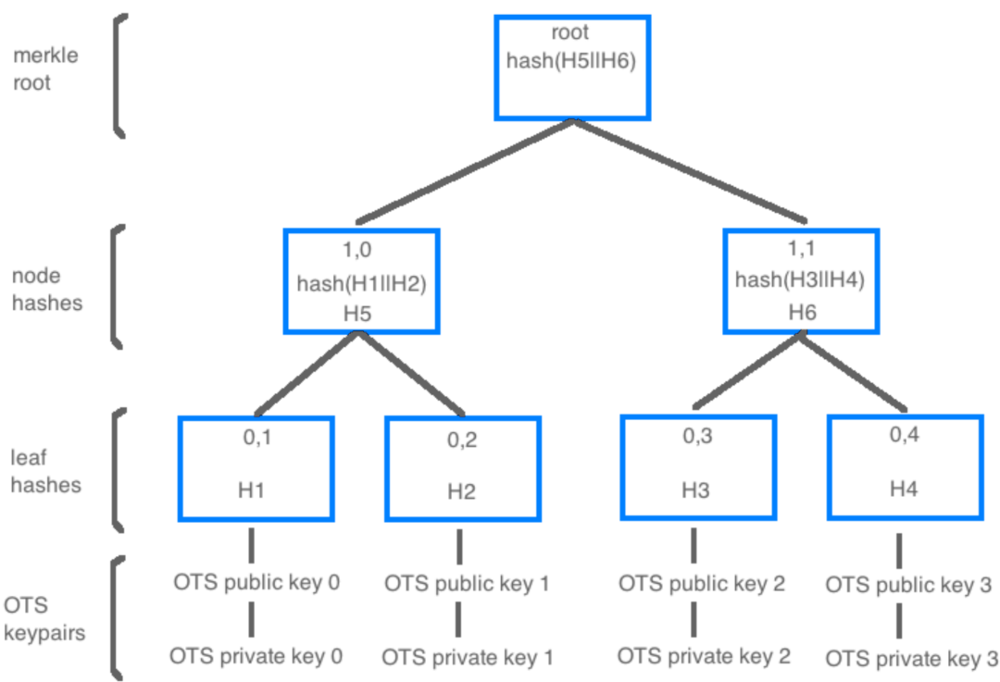

**O**ne **T**ime **S**ignature (**OTS**) key indexes are a fundamental element of the hash based cryptography XMSS, the underlying cryptography that The Quantum Resistant Ledger uses. 

The OTS key index and how it applies to the QRL can be a little confusing and is different from most other cryptocurrencies. Understanding the basics will help prevent any issues later on. 

:::note The most important OTS concepts:
- OTS key indexes can only be used one time
- A default address contains 1,024 OTS key indexes for outgoing transactions
- Once all key indexes are used, no other transactions can be preformed from that address
- Incoming transactions **Do Not** consume OTS key indexes by the receiving address
- OTS key indexes are used to sign transactions on-chain

:::

:::caution
If an OTS key index were to be exposed more than once, the address should be considered compromised and all funds moved to a newly generated address. 
:::

## What is a One Time Signature?

An OTS key index is used to sign data or a message. In the QRL's case, we use them to sign a transaction onto the blockchain.

Each OTS key index can sign only once, as it reveals some information about it's secret key. Not enough data is revealed to compromise the seed key if exposed exactly one time however.

An individual address will contain multiple OTS key indexes (*default of 1024*) all available to sign transactions. This tree height is selected during address creation.

*These OTS key indexes are verifiable and provable to be owned by the master seed as they cannot be generated without the master seed.* 

The experts call this *stateful cryptography* as it is imperative that the state of the exposed keys be kept in order to ensure never to reuse any keys.

## How is it Secure?

One-time signatures (OTS) are called one-time, because the accompanying security reductions only guarantee security under single-message attacks.

The signing process generates cryptographic message data, or a [digital signature](https://en.wikipedia.org/wiki/Digital_signature) that is sent to the blockchain as a transaction, added to a block. 

Only the secret key is able to produce this digital signature, and it can be linked back to the founding address that signed it deterministically.

## How many Transaction can be Made?

There are some limitations on the size an OTS tree can be for practical reasons. The tree height of an address is selected during address creation. This height is important and can not later be changed.

:::danger Track OTS Key use to avoid locking funds!
There is nothing that can be done once funds are locked in an address without keys available to sign a transaction.
:::

Any funds left in an address with all OTS keys used will be lost. These funds must be sent to an address with available OTS keys before all keys are used in the current wallet address.

:::info
There are advanced methods to extend the allowable transactions from a single address seed to an almost infinite transaction count. 

These methods are described in the whitepaper as *Hypertrees*, and documented here under the [slave keys documentation](/build/address/slave-keys)
:::

## Tree Height

By default the QRL wallet application generates wallet addresses with a tree height of 10, generating 1024 available OTS key indexes for signing. This is adjustable, though larger tree's will require some additional time to open a wallet file, as the entire tree must be regenerated each time the address is opened.

| Tree Height | Available Keys | Info |
|--- | --- |--- |
| 8  | 256 | Ledger hardware memory limitations restrict the internal tree to this height |
| 10 | 1,024 | Default wallet height, able to send 2 transactions a day for a year and likely acceptable to most users |
| 12 | 4,096 | Can send 11 transactions a day for a year, or one tx a day for 11 years |
| 14 | 16,384 | Can send 44 transactions a day for a year, or one tx a day for 44 years | |
| 16 | 65,536 | Can send 179 transactions a day for a year, or one tx a day for 179 years | |
| 18 | 262,144 | Can send 700 transactions a day for a year, may take some time to open |

:::info
A typical user will not need an address larger than the default tree height of 10. Larger trees will take longer to initialize as the full tree must be generated each time the address is opened.

If you expect the need for larger transaction counts, generate a larger tree or take a look at the [slave keys system.](/build/address/slave-keys) and usage of the [automatic wallet API](/api/walletd-rest-proxy#automatic-slave-transactions)
:::

## How Does This Apply to the QRL? 

- Each address is composed of multiple OTS key indexes, that are generated from a random seed 
- An OTS key index can be used **exactly one time**, without compromising the entire addresses security
- QRL Address tree height is chosen during the initial address creation and cannot be changed
- The QRL network nodes will reject any transaction that uses a duplicate OTS key index

OTS key indexes are limited as each address has a finite maximum amount of transactions (*outgoing*) that can be sent from any address. Once all keys are used the address will not be able to sign any further transactions. While limiting, it is also what we owe the advanced security and quantum resistance to. 

### QRL's Hash Based System

The security of any hash based system is entirely reliant on the hash function used. The QRL currently supports 3 different cryptographic hash functions for our address scheme (*[SHA2_256](https://en.wikipedia.org/wiki/SHA-2), [SHAKE_128](https://en.wikipedia.org/wiki/SHA-3), [SHAKE256](https://en.wikipedia.org/wiki/SHA-3)*), all currently [considered to be secure](https://en.wikipedia.org/wiki/Secure_Hash_Algorithms). 

:::tip
 The QRL has deployed [Crypto-Agility](https://en.wikipedia.org/wiki/Cryptographic_agility) within our systems to allow easy migration from cryptographic functions should something happen. We like to think with a *future secure* mindset around here after all!
:::

Taking this secure hash function and combining it with the hierarchical structure of a Merkle tree we are able to generate a grouping, or tree, of OTS keys all linked back to one master seed creating a multi use QRL address. 

Even more these OTS keys can be extended using one of the OTS keys to sign an entirely new Merkle tree of OTS keys into the address, extending the amount of signed transactions an address can produce.

### Merkle Trees and The QRL

Each QRL address is a [Merkle Tree](https://en.wikipedia.org/wiki/Merkle_tree) of XMSS OTS keys, each able to sign once. The amount of keys an address can use is determined during address creation and cannot later be changed. If additional OTS keys are needed an additional address will need to be created and funds transferred to the new address prior to running out of OTS keys.

To achieve usable functionality while maintaining security these Merkle trees are limited to minimum and maximum tree heights.

### Extensible Merkle Trees

After multiple cryptographic reviews and audits the QRL, through some clever math, is able to generate additional Merkle trees using one of the OTS keys from an address as the seed for additional slave OTS key trees.

The ability to create sub-trees and even *sub-sub* trees extends the amount of outgoing transactions, intrinsically creating a never ending address of post-quantum secure OTS keys all deterministically linked back to a single secret seed (master) key. 

:::info
Extensible Merkle Trees, or slave keys, are an advanced function of the project. The typical user will not need to worry about slave tree keys.
:::

