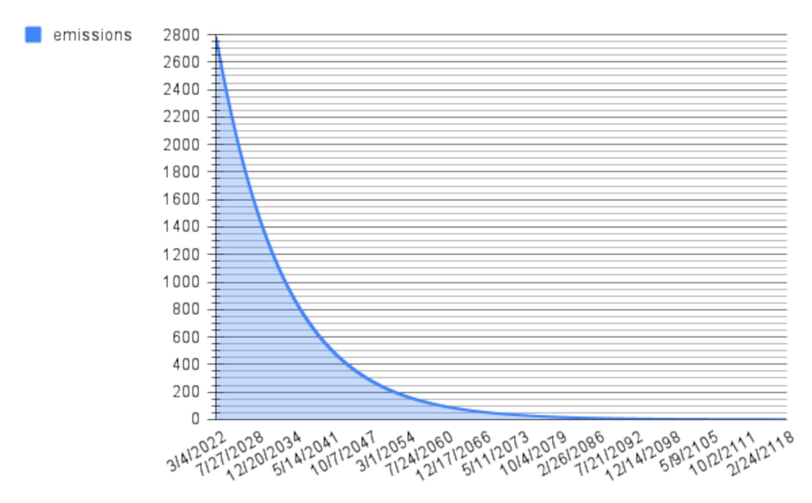
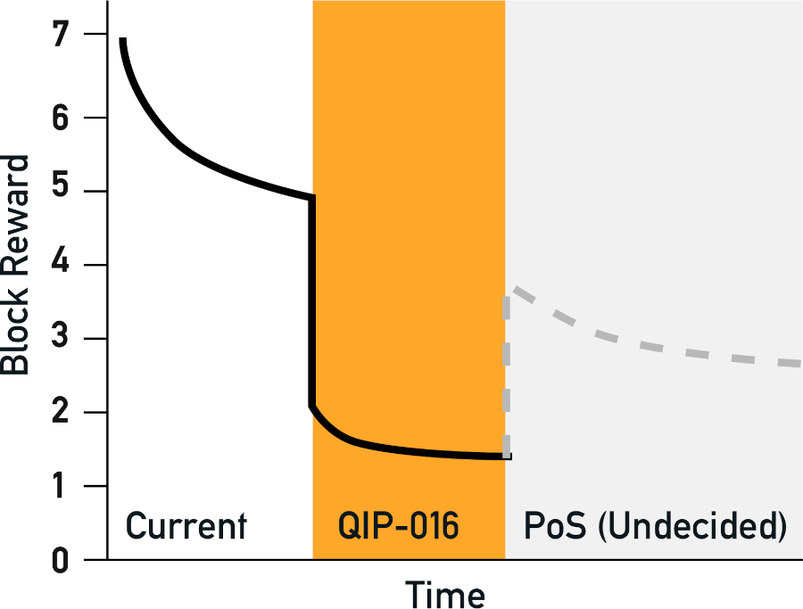

QRL emissions, or the emission rate, refers to the slow release of the total circulating supply of quanta to miners over time. The decrease in the amount given as a reward for mining a block is the emission rate.

The QRL blockchain is mined using computers running custom mining software, each block in the chain returns a reward to the miner who mints a new coin accepted by the network. The rate that these coins are distributed is defined in the **emission standard** and is set to exponentially decay (reduce) over time as the chain progresses.

In simple terms, each new block will pay the miner a little less than the previous block.

The reason behind this emission and the block reward is to provide incentive to run the software, using computation power and energy from the miners computer.

:::info

The QRL uses a mining algorithm that is specialized to be run on standard computers, prioritizing the CPU over GPU or specialized hardware like FPGA's and ASICS. This makes it possible for a larger subset of users to participate in the rewards and increases the distributed nature of the project.

See the documentation on [QRL mining](/use/mining) and the [QRandomX mining algorithm](/build/mining/qrandomx) 
:::  

#### Approximate Daily $quanta$ Emissions Curve

### QRL Emission Standards

:::note From the [QRL Whitepaper](whitepaper) section 8: Cryptocurrency design parameters

#### 8.6 Coin emission schedule

A defining feature of bitcoin is the scarcity and fixed upper limit to issuance of the underlying monetary token. QRL will follow bitcoin in this regard with a fixed upper limit to the coin supply of $105 \cdot 10^6$ $quanta$. A smoothly exponential decay in the block-reward is favored up to the hard ceiling of coin supply. This will eliminate the volatility associated with the bitcoin ’halving’ phenomenon.

The total coin supply, $x$ = $105 \cdot 10^6$, minus coins created at the genesis block, $y$, will exponentially reduce from $Z_0$ downwards forever. The decay curve assumes the distribution of rewards for approximately $200$ years (until $2218$AD, $105189120$ blocks generated at an approximate rate of $1$ block every $60$ seconds).

The remaining coin supply at block $t$,  $Z_t$, may be calculated with:

$Z_t = Z_0e^{-\lambda t}$

The coefficient, $\lambda$, is calculated from: $\lambda = \frac{lnZ_0}{t}$. Where $t$, is the total number of blocks in the emission schedule until the final $quanta$. The block reward, $b$ is calculated for each block with:

$b=Z_{t-1}-Z_t$

:::

## QIP 16

The QRL emission schedule, or amount of quanta generated with each block mined, was updated in QIP-16 (*QRL Improvement Proposal*) through a public on-chain vote to reduce the total reward each block paid out by a factor of 60%. 

You can read more about the [QIP process here](build/qip/overview), and review the history of this QIP in the GitHub repository.

