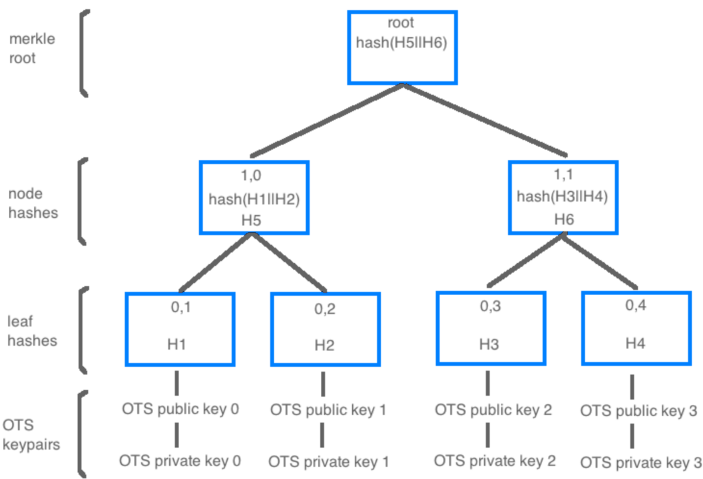
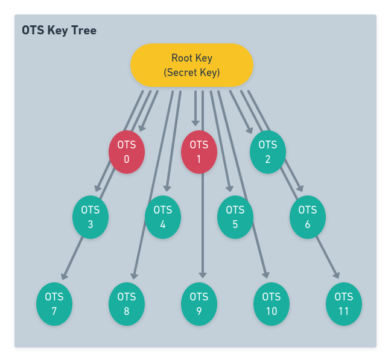

:::caution DOCUMENT STATUS 
This document is in: <b>{frontMatter.docstatus}</b> status and needs additional input!
:::

**O**ne **T**ime **S**ignature (**OTS**) keys are a fundamental element of hash based cryptography like [XMSS](basics/cryptography/xmss), the underlying cryptography that The Quantum Resistant Ledger uses. 

An OTS key is used to sign a message, or in the QRL's case, to sign a transaction. Each OTS can sign only once as it reveals some information about the secret key, not enough to compromise the secret key if only exposed one time however. 

The signing process generates cryptographic message data, or [digital signature](https://en.wikipedia.org/wiki/Digital_signature) that is sent to the blockchain as a transaction, added to a block. Only a secret key is able to produce this digital signature and it can only be linked back to the founding address that signed it.

:::tip
 The QRL has deployed [Crypto-Agility](https://en.wikipedia.org/wiki/Cryptographic_agility) within our systems to allow easy migration from cryptographic functions should something happen. We do like to think with a future secure mindset around here after all!
:::

## OTS Breakdown

The OTS key and how it applies to the QRL can be a little confusing and is different from most of the cryptocurrency world. Understanding the basics will help prevent any issues later on. 

The most important thing to take away is once all keys are used, no other transactions can be preformed from that address. If there are funds remaining in the wallet address and no keys to sign a transaction the funds will be locked forever. These funds must be sent to an address with available OTS keys remaining before all keys are used.

### QRL's Hash Based System

The security of any hash based system is entirely reliant on the hash function used. The QRL currently supports 3 different cryptographic hash functions for our address scheme (*[SHA2_256](https://en.wikipedia.org/wiki/SHA-2), [SHAKE_128](https://en.wikipedia.org/wiki/SHA-3), [SHAKE256](https://en.wikipedia.org/wiki/SHA-3)*), all currently [considered to be secure](https://en.wikipedia.org/wiki/Secure_Hash_Algorithms). 

Taking this secure hash function and combining it with the hierarchical structure of a merkle tree we are able to generate a grouping, or tree, of OTS keys all linked back to one master seed creating a multi use QRL address. 

Even more these OTS keys can be extended using one of the OTS keys to sign an entirely new Merkle tree of OTS keys into the address, extending the amount of signed transactions an address can produce.

### Merkle Trees and The QRL

Each QRL address is a [Merkle Tree](https://en.wikipedia.org/wiki/Merkle_tree) of XMSS OTS keys, each able to sign once. The amount of keys an address can use is determined during address creation and cannot later be changed. If additional OTS keys are needed an additional address will need to be created and funds transferred to the new address prior to running out of OTS keys.

 

These OTS keys are verifiable and provable to be owned by the master seed as they cannot be generated without. To achieve usable functionality while maintaining security these merkle trees are limited to minimum and maximum tree heights.

## How Does This Apply to the QRL? 

- Each address is composed of multiple OTS keys, that are generated from a random seed created. 
- An OTS key can be used **exactly one time**, without compromising the entire addresses security. 
- QRL Address tree height is chosen during the initial address creation and cannot be changed.

OTS keys are a limiting as each address has a finite maximum amount of transactions (*outgoing*) that can be sent from any address. Once all keys are used the address will not be able to sign any further transactions. While limiting, it is also what we owe the advanced security to. 

When generating an address, most user interfaces will give an option of tree height.  

### Extensible Merkle Trees

Through some clever math, and after multiple cryptographic reviews and audits the QRL is able to generate additional merkle trees, using one of the OTS keys from an address as the seed for additional OTS keys.

This ability to create sub-trees and even sub-sub trees extends the amount of outgoing transactions and intrinsically creates a never ending address of post-quantum secure OTS keys all linked back to a single secret seed (master) key. 

:::info
The QRL calls these slave trees and for the typical user they will never be used or seen. To learn more about the extendable addresses
:::

 premise that each key will be used only once time, and never reused which would expose too much of the underlying secret key. 

The experts call this [stateful cryptography](basics/cryptography/stateful) as it is imperative that the state of the exposed keys be kept in order to ensure never to reuse any keys.

:::note
If an OTS key were to be exposed more than once, the address should be considered compromised and all funds moved to a new address. 
:::

These keys are 

Basic overview of the OTS keys and the importance to quantum resistant cryptography

## What is a One Time Key?

## How is it Secure?

## How many Transaction can be Made?

## More