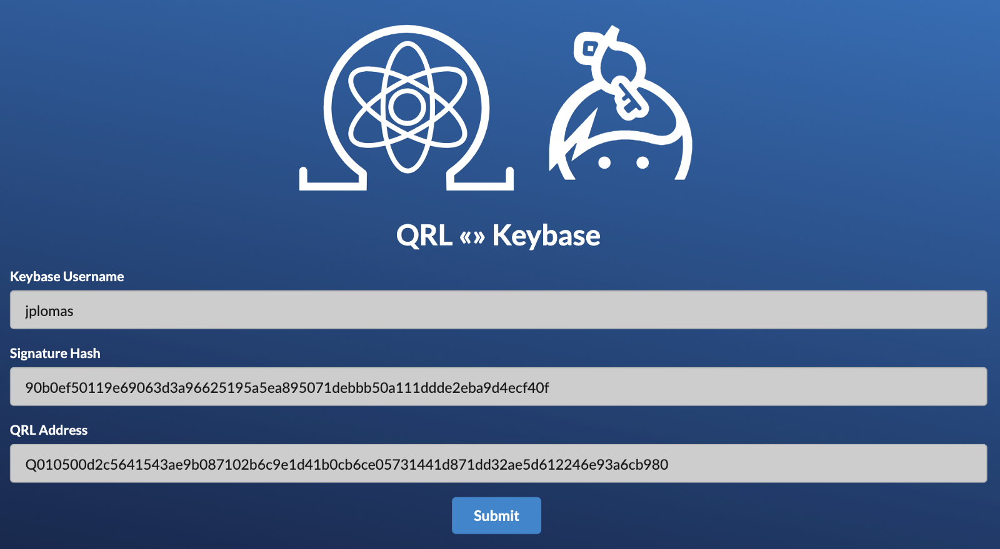
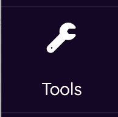
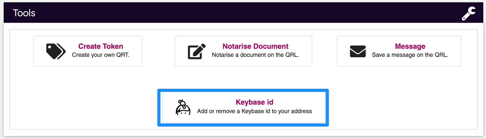
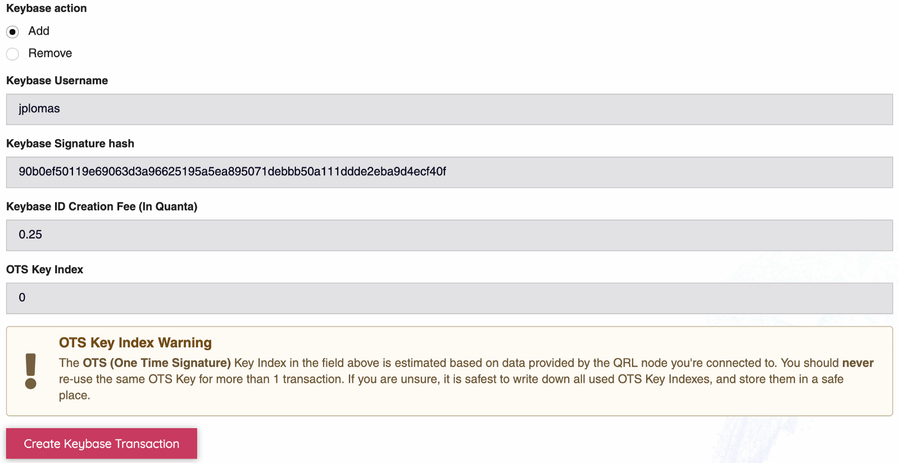
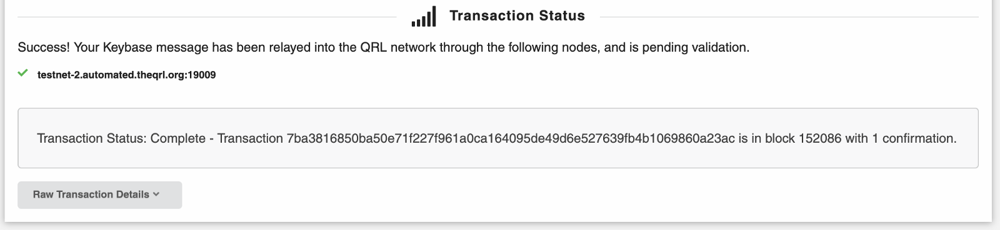
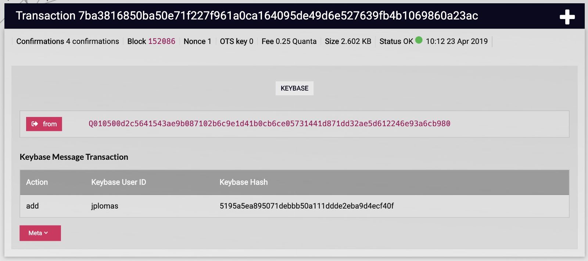
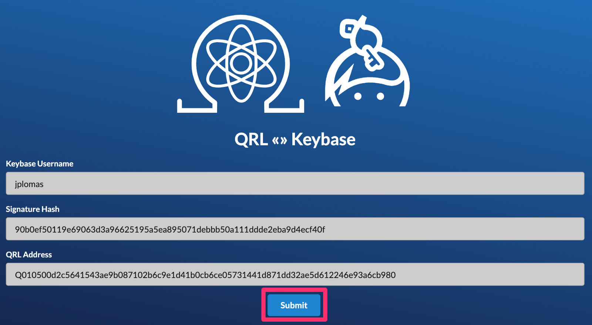

:::info
While still operational, the Keybase ecosystem is undergoing a change of management and at this point it's unclear which direction the team over there is going. Please DYOR before building into this integration. 

Contact info@theqrl.org with any questions or concerns that you may have.
:::

We’re big fans of what Keybase are doing here at the Quantum Resistant Ledger. Innovation and security are a big part of what we do and we are delighted to announce that you can add your QRL address to your Keybase identity.

## Keybase

[Keybase](https://keybase.io) is a catalog of connected identities that utilizes cryptographic Proofs to link profiles.

## Adding QRL address to Keybase

To add your QRL address to your Keybase profile, in the Keybase app click on the *Add more identities* button, and enter your QRL address. When you click the *Authorize* button you’ll be presented with a page like this:

This contains your Signature Hash, a cryptographic Proof, that needs recording in the QRL blockchain using our message transaction type. 

The easiest way to achieve this is using the new Keybase tools section of the QRL web wallet at [wallet.theqrl.org](https://wallet.theqrl.org) or the desktop version downloaded from [https://theqrl.org](https://theqrl.org) or [Github](https://github.com/theQRL/qrl-wallet)

Tools icon in the wallet sidebar

Enter your keybase username, paste the Keybase signature hash into the box, and click *Create Keybase Transaction*. When the transaction is complete, you’ll see confirmation:

Looking on the [Explorer](https://explorer.theqrl.org) you’ll see a record of your Keybase message transaction:

Once this is visible in the Explorer, you’re good to go back to the QRL/Keybase link page and click *Submit:*

Congrats, you have now linked your QRL address to your [keybase.io](https://Keybase.io) profile cryptographically. 