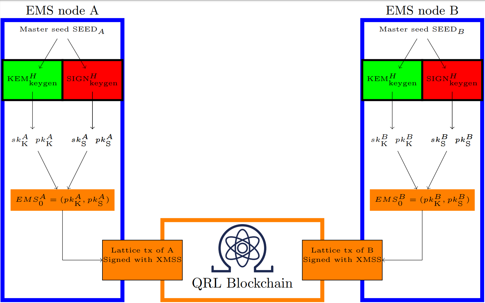

:::caution DOCUMENT STATUS 
This document is in: <b>{frontMatter.docstatus}</b> status and needs additional input!
:::

:::tip CRYSTALS
The "Cryptographic Suite for Algebraic Lattices" (CRYSTALS) encompasses two cryptographic primitives: [Kyber](https://pq-crystals.org/kyber/index.shtml), an IND-CCA2-secure key-encapsulation mechanism (KEM); and [Dilithium](https://pq-crystals.org/dilithium/index.shtml), a strongly EUF-CMA-secure digital signature algorithm. Both algorithms are based on hard problems over module lattices, are designed to withstand attacks by large quantum computers, and have been submitted to the [NIST post-quantum cryptography project](https://csrc.nist.gov/Projects/Post-Quantum-Cryptography).

*source [pq-crystals.org](https://pq-crystals.org)*

:::

