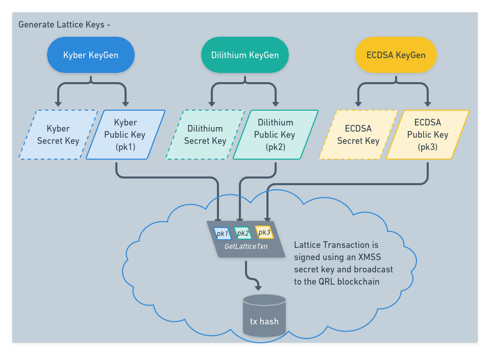

:::caution DOCUMENT STATUS 
This document is in: <b>{frontMatter.docstatus}</b> status and needs additional input!
:::

:::tip [FROM THE EMS WHITEPAPER](https://github.com/theQRL/ephemeral/blob/master/EMS_whitepaper_v1.pdf)
*EMS is a peer-to-peer broadcast messaging upgrade, where messages will be optionally relayed by QRL nodes that choose to route the traffic. It is a data messaging layer which is agnostic to the chain, but which extends the functionality of the network in new and interesting ways. Apps and services will be able to interact with EMS by means of a user friendly API, enabling asynchronous, authenticated end-to-end encrypted data communication between QRL nodes via the network.*

*These properties are achieved by utilizing quantum resistant public key encryption and stateless digital signatures. For maximal security, the quantum resistant algorithms will be combined with existing pre-quantum schemes, that have proven to be secure against normal computers for decades: a hybrid mode. To derive the keys for encryption and signatures, only the master seed of the wallet is used to derive the EMS key-pairs. Public keys are securely stored via XMSS on the QRL blockchain, by means of a “lattice transaction”. By deploying this functionality, the QRL blockchain can also serve as a standalone public-key infrastructure by any third-party application.*
:::

## Overview

:::info
While the full implementation is not functional at this point, a bunch of the functions have been worked into the QRL Node codebase. This document will cover the overall idea and concept based on the initial whitepaper, what is implemented to date, and what still needs to be worked out. 
If you are interested in getting involved Reach out to the team or join us in our [general chat on Discord](https://theqrl.org/discord)
::: 

The ephemeral message system utilizes the Crystals library to generate public and private Kyber and Dilithium key pairs, as well as an ECDSA key pair. 

These public keys are signed using a quantum secure XMSS One Time Signature (OTS) from a QRL address and broadcast onto the distributed QRL blockchain. This transaction and related QRL address are then used as a quantum resistant key-store moving forward

Using this key-store to encrypt and verify data we can establish a quantum secure, ephemeral messaging system to securely share data between two parties. Anytime someone needs to reference these lattice keys they only need the QRL address, or the transaction hash to recover them from the blockchain. The power of immutability!

### General Requirements

There are a few things that are required for EMS to function.

- QRL Address with an available OTS key to broadcast the Lattice Transaction
- Secret Lattice Keys that have been broadcast using the QRL address
- The transaction Hash from the lattice transaction
- A transaction hash from another user with the same requirements setup

## Intended EMS flow

At this point EMS is not fully implemented however there are the base building blocks (EMS Stub) are included in code with a small update required to fully implement. Additionally an early whitepaper was released which covers the general idea and cryptography behind the initial concept.

The potential opportunities that this type if system can provide are almost limitless. Utilizing post quantum secure cryptography to secure data exchange while masking the exchange behind a truly ephemeral data layer can allow new decentralized communication systems to develop. 

### Step 1 - Setup

Each member of an ephemeral chat requires lattice keys with the public key pairs broadcast on the QRL blockchain. We will use these keys to encrypt and sign data that we send between users, verifying authenticity of the message using publicly available quantum secure information.

- Both users generate a new XMSS address used to sign and broadcast the lattice keys individually in private. *(wallet.json)*
- Both users generate new Kyber and Dilithium keys in private, and broadcast their public key pairs in a lattice transaction on the QRL blockchain. *(lattice.json)*
  - This creates the key-store on-chain linked through a QRL address (XmSS Merkle Tree) and a transaction hash.

With both users in control of their private XMSS and lattice keys, they can create a shared salt and generate AES keys used to encrypt/decrypt data between each other.

### Step 2 - Key Salt Generation

- Alice gets Bob's lattice `tx_id` and pulls Bob's public lattice keys from the blockchain. *(pub-lattice.json)*
  - *Look into ways this initial share can happen as securely as possible* 
- Alice generates some random data (salt)
  - This salt is used to create new AES keys that both users will share 
- Alice encrypts the salt using her Kyber private key and Bob's public key
- Alice sends the encrypted salt, her public lattice keys to Bob. 
  - **Need to use an encrypted ephemeral message to send this data**

Alice has created a new AES key file that she can use to securely encrypt data knowing that the only one that can decrypt the data must share these keys. 

### Step 3 - Key Regeneration

- Bob, using the matching private Kyber keys from the lattice transaction and the on-chain public keys Alice has shared, decrypts the salt Alice sent
- Using this salt, Bob re-creates the shared AES key list identically to Alice's Key list

### Step 4 - Ephemeral Message

> Needs development

- Using the shared AES list to open a channel, 

- Alice and Bob agree on a key index, or position in the AES key file, to open a message channel with
  - Message data is encrypted using Kyber keys? Or AES?
  - TTL time to live and TTB time to broadcast are set
  - The AES key is used for the message channel

The message is sent across the p2p network through nodes that have enabled EMS communication. This special message type will auto-magically be sent to any node listening. 

If a user has the appropriate keys, and looks, they will receive the message. Anyone else viewing will only see garbage, intended for no one.

Crypto magic!