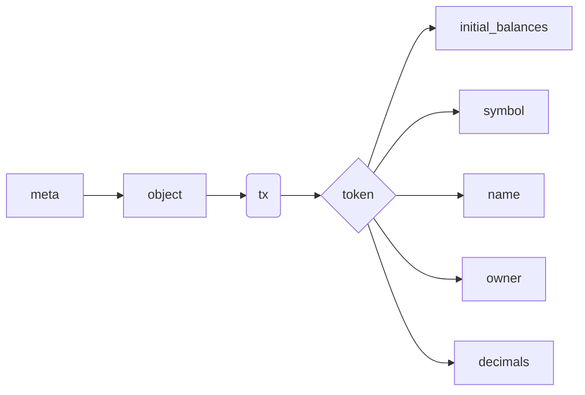

Token information is searched similar to any other transaction in [the QRL Block Explorer](https://explorer.theqrl.org). Instead of searching by the token name, search for the token using the `create_token_tx` transaction hash or `token_tx` transaction hash.

:::info
See the [transaction lookup documentation](/use/tools/explorer/transaction-lookup) for more information on the transaction search function. 
:::

General information about the transaction is presented, along with the token name and address that created, and the address that holds the initial token balance.

Detailed information about the token transaction can be found in the `meta` information tab below the overall summary. 

This detailed information can be found in the data:

