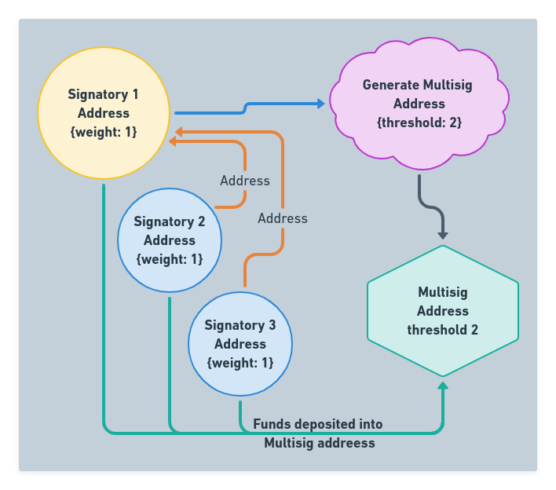

:::caution DOCUMENT STATUS 
This document is in: <b>{frontMatter.docstatus}</b> status and needs additional input!

### HELP NEEDED

- Graphics showing multi-sig overall flow, relationships and weights

:::

## Required Info

Here are the various pieces of required information needed to generate a Multisig Address.

:::info Required Data For Multisig Address
| Input | Description | Value | 
| --- | --- | ---- | 
|**Signatory** | Parties to be setup as a signatories | {QRL PUBLIC ADDRESS} |
|**Weight** | Weight for each signatory to use for voting power | {INTEGER} |
|**Threshold to Spend** | Minimum vote threshold required for vote to pass | {INTEGER} |
|**Fee** | Fee for the *multisig-generate* transaction | {0.01} |
|**OTS Key Index**| Next unused OTS key used to sign *multisig-generate* transaction | {INTEGER} |
:::

### Signatory(s)

Each voting party in the multisig address is required to have generated a QRL Address. This address will be associated to the multisig address and used for all further transactions related to the multisig address.

The creator of the multisig address will need to collect all of the public keys for voting members of the multisig address prior to generating a new address. 

### Weight

Each signatory will be assigned a weight during the address creation process. This weight cannot be changed after the multisig address is created. 

This weight determines the voting power the signatory has. 

### Threshold To Spend

### Fee

### OTS Key Index
