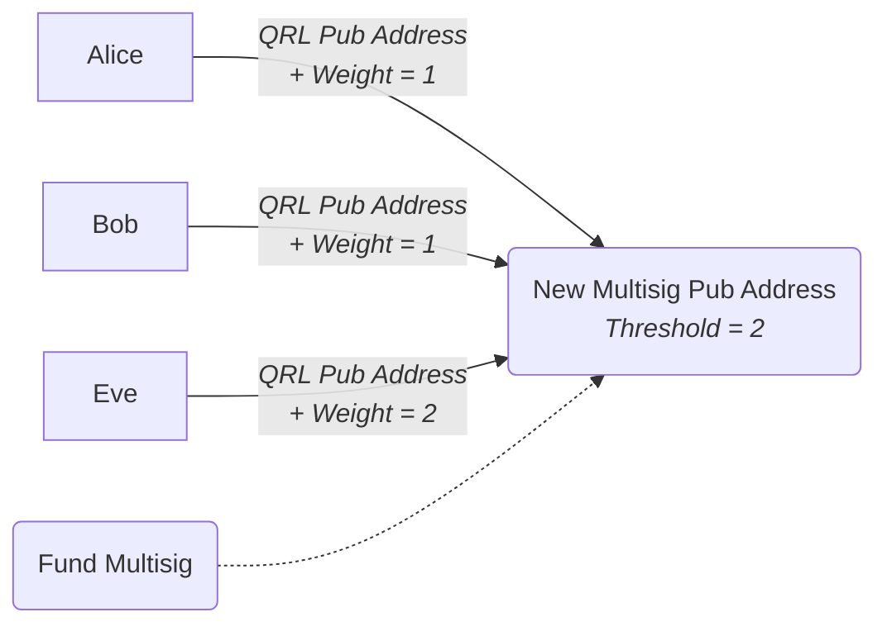

A multisig address is generated using signatory addresses and their respective weight to vote. These addresses are cryptographically associated together with their output being a new multisig address.

This new address can accept a deposit of funds from any QRL address, similar to a normal QRL address. Where the multisig address differs is in how funds are authorized to spend.

Once funds have been transferred into the new multisig address it will require the threshold to be met in order for any outgoing transaction to happen. This ensures that all parties have a say in how these funds are spent.

:::note example multisig address

In this scenario a Multisig address has been created with a threshold of 2, and three parties, Eve, Alice, and Bob.

Alice and Bob have a weight of 1, and Eve has a weight of 2. This allows both Bob and Alice to come to consensus for transferring the funds or allows Eve to act alone to approve the transfer.
:::

## Multi-sig Address Creation

Using the tools tab in the QRL Wallet with an address opened, select the multisig function. This will open a new screen with tabs along the top. Select the Create tab and enter the required information, making sure to include each address intended to have input on the new address.

The initiator of a multisig address does not need to be an authorized party to the new address, you must include __all__ addresses that will be included in the vote and spend proposals during the creation process.

:::info
Once a multisig address has been created the details cannot be changed! Ensure that the correct information is entered initially or create a new address with correct information. 
:::

### Required Info

Here are the various pieces of required information needed to generate a Multisig Address.

| Input | Description | Value | 
| --- | --- | ---- | 
|**Signatory** | Parties to be setup as a signatories | {QRL PUBLIC ADDRESS(S)} |
|**Weight** | Weight for each signatory to use for voting power | {INTEGER} i.e. $1$|
|**Threshold to Spend** | Minimum vote threshold required for vote to pass | {INTEGER} i.e. $2$ |
|**Fee** | Fee for the *multisig-generate* transaction |{INTEGER} i.e. $0.01$ |
|**OTS Key Index**| Next unused OTS key used to sign *multisig-generate* transaction | {INTEGER} i.e. $0$ |

#### Signatory(s)

- Each voting party in the multisig address is required to have a QRL address. 
- This address will be associated to the multisig address and used for all further transactions related to the multisig address.
- The creator, or initiator, of the multisig address will need to collect each signatories public keys prior to generating a new Multisig address.
- A signatory may use their QRL address for additional functions and may be part of multiple Multisig addresses. 
- Funds stored in this personal address are separate from the Multisig address.

#### Weight

- Each signatory will be assigned a weight during the address creation process. 
- This weight cannot be changed after the multisig address is created. 
- The weight determines the voting power the signatory has.
- An addresses weight is directly related to the threshold in regard to how much power an address has over the Multisig funds

#### Threshold To Spend

- The threshold must be met by the sum of votes for a transaction to be sent from a multisig address. 
- This is the addition of all yes votes in the spend proposal, each with their individual thresholds.
- This cannot be changed later.
- Funds will not be sent of the threshold cannot be met.

#### Fee

- The transaction fee for the multisig address creation to be broadcast onto the network

#### OTS Key Index

- An unused OTS key for the initiating address sending the create multisig transaction. 

### New Multisig Address

With all information entered and the transaction sent onto the QRL network, a new address will be presented at the top of the wallet screen. A transaction hash will also be shown that can be used to look up the multisig address generation transaction in the [QRL Block Explorer](https://explorer.theqrl.org). 

This new address looks similar to any other QRL public address, and it's balance can be looked up in the same way. Main difference being that it requires enough signatories to reach the established threshold to transfer any funds held by this address.
