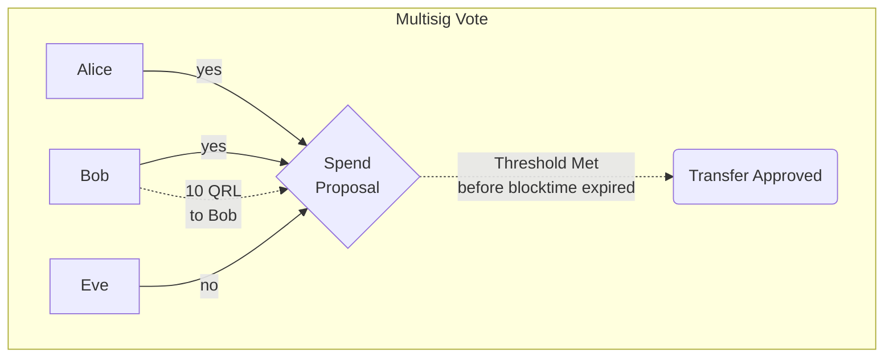

For funds to be transferred from a Multisig address, a successful vote must be initiated. Enough approve vote transactions must be received within the block limit defined in the proposal.

The amount of approve votes to reach the minimum threshold is defined during the initial Multisig address creation. This cannot be changed after the address is created.

There is no notification to the signatories that a vote is needed, and there is no requirement that all signatories need to vote. The only requirement is that enough approve votes are received to initiate the transfer.

## Multisig Vote

To vote on a [Spend Proposal](/use/tools/multisig/spend-proposal), authorized signatories must open their personal addresses that have been associated with the Multisig address using the QRL wallet software.

From within an open wallet, select the "Tools" tab, select "Multisig" and find the tab along the top titles "Vote"

Select the transaction which you intend to vote on from the popup window. If no transactions are shown, either the spend proposal is still pending or the address is not associated with this multisig address. Ensure you have the correct address.

Once the correct transaction is selected, you will be presented with the spend proposal details and 2 options, APPROVE or REJECT. Select the intended vote here and verify the Fee and OTS are correct. 

Confirm and validate the information is correct, then select the "Click To Send" button at the bottom of this page.

This will register the vote onto the chain, and count towards the threshold required to approve.

:::info
If a "Reject" vote is entered and the remaining addresses cannot achieve the minimum threshold the spend proposal will never complete and the funds will not be sent.

You can change a rejected vote to approved up until the expiry block number has passed. making it still possible to approve the spend. This is achieved by sending another vote transaction onto the chain with the APPROVED selection. The threshold still must be met for funds to transfer.
:::

### Approval Revocation

An approval decision may be reversed by sending another vote transaction onto the chain with a REJECTED vote. This will overrule the previous APPROVAL vote from this address, changing the status of the vote.

This can only be done from the same address that initiated the original APPROVAL vote. 

:::caution
If the spend proposal approval threshold has been reached, the funds will be transferred and cannot be revoked from the recipient.

Additionally if the expiry block number for the spend proposal has past, the proposal is no longer valid and cannot be voted on.
:::
 

### Vote Verification

To verify the vote was entered correctly and transmitted onto the blockchain, you can select the transaction hash or search for it in the [QRL Block Explorer](https://explorer.theqrl.org). 
