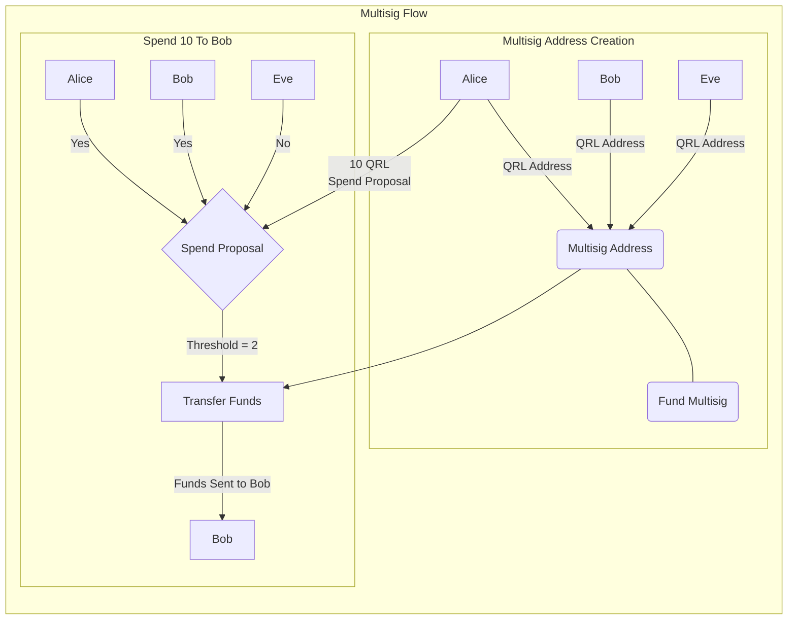
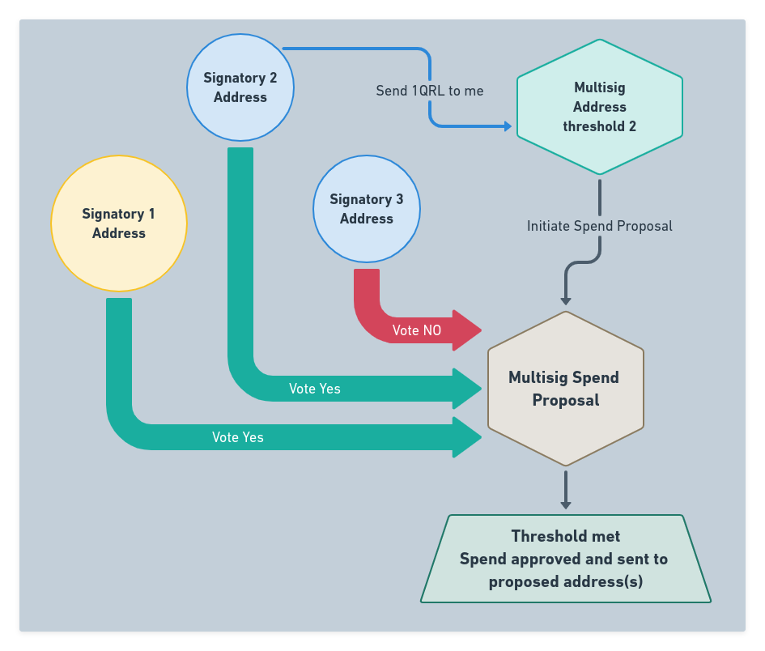

“Multisig” or *multiple signature transactions* require one or more valid signatures to transfer funds from a special QRL address, called a multi-signature address to a destination address. 

Funds held in a multi-signature address cannot be spent without the cryptographic agreement of a specified number of parties. This function lends it self to systems where multiple parties want to have control over shared funds.

:::tip
A multisig address can be setup with a single address, or up to 100 addresses able to take part in a spend transaction. A threshold can be setup where some or all of the valid signing addresses are needed to spend funds.
:::

## Multi-sig Overview

1. Multiple users create individual QRL addresses, and backup their secret keys. Each party must have a QRL address they control. [See the Wallet Documentation](/use/wallet/overview) for more on generating a new address
2. After establishing the users in the multisig agreement one of the users creates a new Multisig address, inputting all of the parties public addresses into the transaction information. This transaction is sent onto the QRL network and is required to generate the new multisig shared address.
3. Funds are then transferred into the new address to be a shared responsibility of the group as established in the initial multisig generation.
4. A single user in the group initiates a **vote transaction** to propose funds are sent to a given address. 
5. Members of the multisig group must vote to approve or deny the transaction. No funds will be transferred until the threshold is met that was established in the initial multisig creation. example, 2 of 3 addresses or 4 of 4 need to vote yes to approve.
6. After the threshold has been met the funds will be sent to the address as outlined in the vote proposal. If the threshold is not met within the given time frame the transaction will not happen, and another vote proposal will need to be initiated.

## Important Concepts

There are a few nuances with multi-signature addresses that are good to know.

- There is a limit of 100 addresses allowed to be signatories in a multisig address
- There is no way to "backup" the multisig address, there is no private key associated to this address
  - Each address that is authorized must be backed up independently by the user 
  - The **Only** way to spend funds deposited to a multisig address is by reaching the set vote threshold through a spend proposal
- A multisig address cannot be a signatory to an additional multisig address (nested multisig addresses) as there is no private key associated to a multisig address
- Each signatory must use OTS keys for initiating a spend proposal as well as any votes on the proposal.
- Votes may be changed up until the threshold has been reached with Approval votes or the block expiration is reached. Once this threshold is met the funds are transferred.

## Definitions 

| Multi-sig Term | Description |
| ---- | ----------- |
| **Transaction** |   An action (*typically spending funds*) on-chain which requires at least one signature from a private key|
| **Multi-Sig** |  *Multi-signature Transaction* - A transaction sent from a defined multi-signature address that require one or more signatures from a group of signatories before being accepted by the network. |
| **Weight** | Each signatory has an associated weight their vote is counted as  |
| **Signatory** |   One of up to 100 addresses allowed to initiate a spend transaction or vote on a multisig spend proposal|
| **Threshold** | The accumulative amount of votes needed to accept a spend proposal |
| **Fee** | The fee required for the transaction to broadcast on the network |
| **OTS** | The *One Time Signature* key used to sign the transaction |
| **Creator** | Address who created the multisig address |
| **Vote** | A vote transaction on a spend proposal |
| **Spend** | A proposal to spend funds allocated to the address, must be initiated by an address associated with the multisig address  |
| **Expiry Block Number** | A block number in the future where, if the threshold is not met, the spend proposal expires without approval |

### Spend Proposal

### OTS Key Usage

OTS keys are used at various stages and from various addresses in the lifetime of a multisig addresses. All transaction on-chain require a valid OTS key and is used from the address sending the transaction, regardless of the transaction type.

- One key is used for creating the multisig address (tx ID) (*creators address*)
- One key is used to create the spend tx (*spend vote initiator address*)
- one key is used for each vote of the multisig (*each signatory that votes*)

## References

- Create a new multisig address
- Deposit funds to a multisig address
- Propose a vote from a multisig address
- Vote on a spend proposal
- Reject a spend proposal
- Multi-sig transaction type 

## Multi-Signature Example Uses

Here are some examples of uses for multisig addresses.

### Joint Account

A family account where either party in the group is authorized to spend from the address. This assumes trust in both parties as either is allowed to propose a spend and approve the transaction.

For each additional member to the example below, add each parties address and set the weight to 1. Leaving the threshold at one means that any one of the signatories can spend funds from the address.

2 party Joint Account setup

| Input | Value | 
| --- | --- |
|**Signatory** | Both party's are setup as a signatory |
|**Weight** | 1 (each) |
|**Threshold to Spend** | 1 |
|**Fee** | 0.01 |
|**OTS Key Index**| {NEXT UNUSED} |

This will use an OTS key from the originating address to broadcast the [multisig create transaction](#).

:::tip
This can also be used to backup funds as all of the addresses authorized to spend can be owned by the same person. Losing private keys or using all available OTS keys can be mitigated with a backup signatory address. 

This comes with the added OTS key usage to spend funds as it requires both a [Spend Proposal](#) and a [Vote](#) on the spend proposal, consuming 2 OTS keys for each transaction.
:::

### Board Of Directors - Majority 

A board or group of people with a minimum quorum needed to approve the spend (greater than 50% of the group). Any member in the group can propose the spend, with 

- An escrow service where 2 of 3 votes are needed to send, however all parties do not have equal weight.
  - Escrow has weight of 2 while both trading parties have weight of 1, requiring the escrow to sign along with either party to spend, allowing positive verification of the trade prior to releasing the funds.
