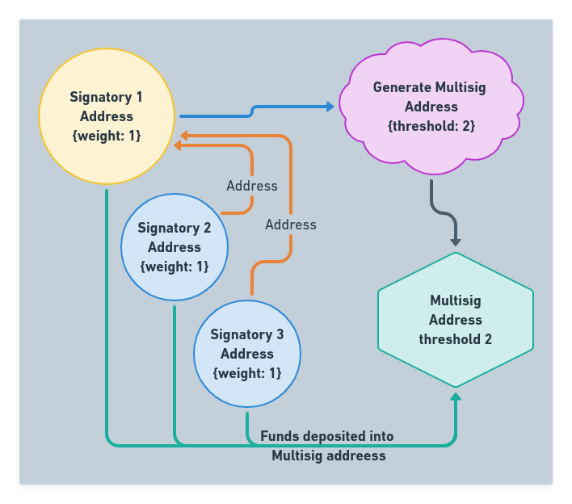

:::caution DOCUMENT STATUS 
This document is in: <b>{frontMatter.docstatus}</b> status and needs additional input!

### HELP NEEDED

- Graphics showing multi-sig overall flow (help!), relationships and weights
- Reference links completed
:::

“Multisig” or *multiple signature transactions* require one or more different valid signatures to transfer funds from a special construct called a multi-signature address to a destination address. The idea being that funds held in a multi-signature address cannot be spent without the cryptographic agreement of a specified number of parties.

A multisig address can be setup with a certain number of addresses able to take part ($n$), of which a specified number ($m$) must provide valid signatures together for a multisig transaction to be valid and spendable. Thus, a multisig address may be said to require $m$ of $n$ signatures.

## Multi-Signature Example Uses

Here are some examples of uses for multi-sig addresses.

### Joint Account

A family account where either party in the group is authorized to spend from the address. This assumes trust in both parties as either is allowed to propose a spend and approve the transaction.

For each additional member to the example below, add each parties address and set the weight to 1. Leaving the threshold at one means that any one of the signatories can spend funds from teh address.

2 party Joint Account setup

| Input | Value | 
| --- | --- |
|**Signatory** | Both party's are setup as a signatory |
|**Weight** | 1 (each) |
|**Threshold to Spend** | 1 |
|**Fee** | 0.01 |
|**OTS Key Index**| {NEXT UNUSED} |

This will use an OTS key from the originating address to broadcast the [multisig create transaction](#).

:::tip
This can also be used to backup funds as all of the addresses authorized to spend can be owned by the same person. Losing private keys or using all available OTS keys can be mitigated with a backup signatory address. 

This comes with the added OTS key usage to spend funds as it requires both a [Spend Proposal](#) and a [Vote](#) on the spend proposal, consuming 2 OTS keys for each transaction.
:::

### Board Of Directors - Majority 

A board or group of people with a minimum quorum needed to approve the spend (greater than 50% of the group). Any member in the group can propose the spend, with 

- An escrow service where 2 of 3 votes are needed to send, however all parties do not have equal weight.
  - Escrow has weight of 2 while both trading parties have weight of 1, requiring the escrow to sign along with either party to spend, allowing positive verification of the trade prior to releasing the funds.

## Overview

General overview of the multi-sig process on the QRL blockchain. This is a high level overview of the process and all of the elements involved. For in depth documentation on creating a multi-sig address or sending multi-sig transactions see the [References](#references) section or browse through the menu.

### Definitions 

| Multi-sig Term | Description |
| ---- | ----------- |
| **Transaction** |   An action (*typically spending funds*) on-chain which requires one signature from a private key|
| **Multi-Sig** |  *Multi-signature Transaction* - A transaction sent from a defined multi-signature address that require one or more signatures from a group of signatories before being accepted by the network. |
| **Weight** | Each signatory has an associated weight their vote is counted as  |
| **Signatory** |   Up to 100 addresses allowed to initiate a spend, or vote on a multi-sig spend proposal with weight associated for their vote|
| **Threshold** | The accumulative amount of weighted votes needed to accept a spend proposal |
| **Fee** | The fee required for the transaction to broadcast on the network |
| **OTS** | The *One Time Signature* key used to sign the transaction |
| **Creator** | Address who created the multi-sig address |
| **Vote** | A vote transaction on a spend proposal |
| **Spend** | A proposal to spend funds allocated to the address, must be initiated by an address associated with the multisig address  |
| **Expiry Block Number** | A block number in the future where, if the threshold is not met, the spend proposal expires without approval |

### Important Information

There are a few nuances with multi-signature addresses that are good to know.

- There is a limit of 100 addresses allowed to be associated as signatories to a multisig address
- There is no way to "backup" the multi-sig address, there is no private key to this address
- The **Only** way to spend funds deposited to a multisig address is by reaching the set vote threshold through a spend proposal
- A multisig address cannot be a signatory to an additional multisig address. There is not private key associated to the multisig address
- Each signatory must use OTS keys for initiating a spend proposal as well as any votes on the proposal. 

### Generating A multisig Address

A multisig address is generated using signatory addresses and their respective weight to vote. These addresses are cryptographically associated together with their output being a new multisig address.

This address can accept the deposit if funds from any other QRL address similar to a normal QRL address. Where the multisig address differs is in how funds are authorized to spend.

Any spend transaction must reach the threshold to spend in the time frame associated with the spend proposal. Once the threshold is met the spend transaction is processed and funds are transferred from the multisig address.

:::info
For directions on creating a multisig address see the [Generate Multisig Address step by step guide](/tools/multisig/multisig-generate).
:::

### Spend Proposal

### Vote Transaction

### OTS Key Usage

OTS keys are used at various stages and from various addresses in the lifetime of a multi-sig addresses. All transaction on-chain require a valid OTS key and is used from the address sending the transaction, regardless of the transaction type.

- One key is used for creating the multi-sig address (tx ID) (*creators address*)
- One key is used to create the spend tx (*spend vote initiator address*)
- one key is used for each vote of the multi-sig (*each signatory that votes*)

## References

- Create a new multi-sig address
- Deposit funds to a multi-sig address
- Propose a vote from a multi-sig address
- Vote on a spend proposal
- Reject a spend proposal
- Multi-sig transaction type 

