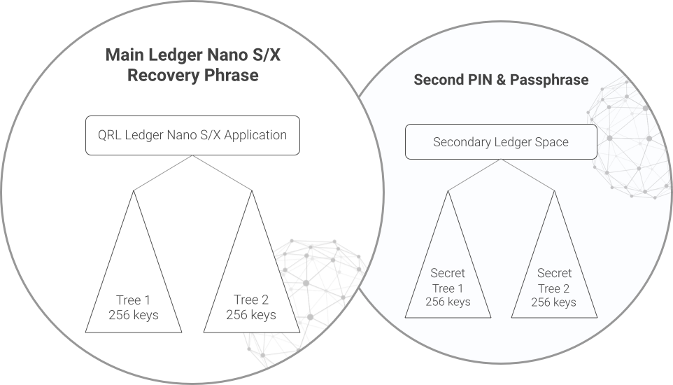

:::caution DOCUMENT STATUS 
This document is in: <b>{frontMatter.docstatus}</b> status and needs additional input!
:::

### Plausible Deniability

One of the most exciting features to roll out with this latest release is the ability to secure your funds from the *"$5 wrench attack"*. This new feature creates a secondary passphrase to open your Ledger device with. 

This second account space allows another 2 QRL XMSS trees or *Addresses* to be created on the Ledger. To access the new account space on your Ledger you will enter the new passphrase you setup when you first power up the Ledger. 

This will add an additional word to the 24 word mnemonic phrase, creating 2 word lists. The first being the typical 24 word Ledger recovery key, the second being the same 24 word phrase plus the additional word setup during configuration.

To read more on the setup and configuration of the second account space see [this article from the Ledger team](https://support.ledger.com/hc/en-us/articles/115005214529-Advanced-passphrase-security)

This feature is optional and there is no way to tell from the Ledger if you have configured this extra space. Plausibly deniable and fully recoverable secure funds!

To setup the second address space, follow [The official ledger guide](https://support.ledger.com/hc/en-us/articles/115005214529-Advanced-passphrase-security). After you have secured the additional mnemonic word for the second space follow this guide again to initialize the 3rd and 4th QRL addresses.
