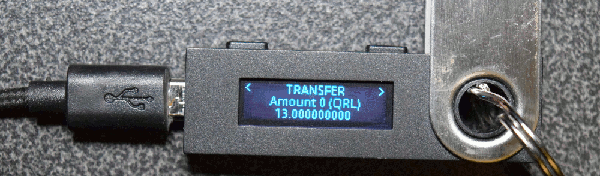
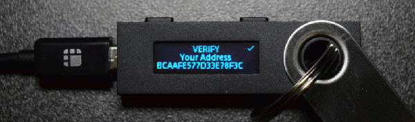

:::caution DOCUMENT STATUS 
This document is in: <b>{frontMatter.docstatus}</b> status and needs additional input!
:::

### Send QRL

With the wallet unlocked, you can now send QRL.

To send QRL there are four fields you need to fill in:

| Field |  Description  |
|:-----|:--| 
| **Recipient Address** | A valid QRL address |
| **Amount** | How much QRL to send |
| **Fee** | How much you are paying to make this transaction |
| **OTS Key Index** | Enter an unused OTS Key *should auto-populate*|

Make sure everything is correct and click the confirm button. You will get another confirmation of your transaction details.

If you are happy with the transaction details, click the **Sign with Ledger** Button.

A window will appear prompting you to confirm the transaction details on your Ledger Nano device.

On your Ledger Nano device, you can press **View transaction** to verify the From and To addresses, Amount(s) and Fee.

When you've confirmed these details, proceed to press **Sign transaction**.

Signing will take a few seconds. When complete, you will see the following back on the QRL Wallet.

To complete the transaction into the QRL Network, click the **Send transaction** button.

You will see a progress tracker while your transaction is mined into a block.

When the transaction is confirmed in the network, your Transaction History will automatically update to reflect your transaction. You can validate this using the [Block Explorer](https://explorer.theqrl.org)

### Receive QRL

You should **always** verify the address shown in the [QRL Web Wallet](https://wallet.theqrl.org/) matches the address shown on your Ledger Nano device. To confirm your address, click the **Click to Verify** button on the receive tab of the wallet. 

Your QRL address will appear on your computer, and on your Ledger Nano device.

Once you've confirmed your address on both devices, you can send your QRL address to whomever you are receiving coins from.

:::note 
In the event you find the addresses do not match, you should immediately reach out to the QRL Team to report the issue @ [security@theqrl.org](mailto://security@theqrl.org) This could occur in the event a malicious actor has taken control of the QRL Web Wallet. 
:::
